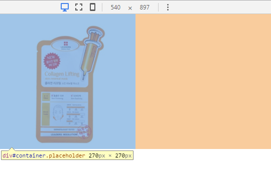
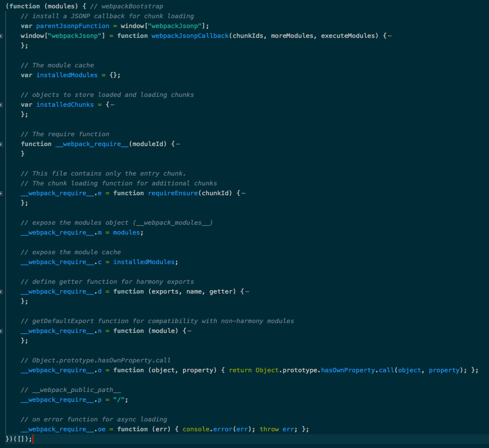

# Vue 语法入门
Vue 各种语法 入门讲解

从零开始掌握大型互联网公司NodeJS实际使用

[【视频地址】Vue2.5开发去哪儿网App 从零基础入门到实战项目](https://coding.imooc.com/class/203.html)

本笔记对应项目的[源码 《去哪儿app》](https://github.com/946629031/Travel)

课程出品时间：2017.x ~ 2018.4

看视频整理要点笔记：

[2020千锋Vue全套教程全开源（强烈推荐）【youtube 视频课程】](https://www.youtube.com/watch?v=MwuOyaOd_ZQ&list=PLwDQt7s1o9J57JQNXG7UooKI3Kpzw9fkj)

----
## 补充
- ### 移动端适配方案：手淘的 lib-flexible px2rem-loader
    - [基于vue-cli配置移动端自适应](http://hjingren.cn/2017/06/16/%E5%9F%BA%E4%BA%8Evue-cli%E9%85%8D%E7%BD%AE%E7%A7%BB%E5%8A%A8%E7%AB%AF%E8%87%AA%E9%80%82%E5%BA%94/)
    - [解决vue移动端适配问题 - 【掘金】](https://juejin.im/post/5c0fd830f265da61506450a3)
    - [vue移动端h5适配解决方案（rem or vw） - 【掘金】](https://juejin.im/post/5d54c80bf265da03ae786e9b)
- [stylus @media 媒体查询适配方案 - 【stackoverrun】](https://stackoverrun.com/cn/q/3512850)
    - This is what worked for me.
        ```
        medium = 'screen and (min-width: 768px)'
        large = 'screen and (min-width: 992px)'
        xlarge = 'screen and (min-width: 1200px)'

        .box
            background: #000
            @media medium
                background: #111
            @media large
                background: #222
            @media xlarge
                background: #333
        ```
    
----

# 正文开始

**目录**
- [第2章 Vue 起步](#第1章-导学)
    - [2-2 hello world](#2-2-hello-world)
    - [2-3 开发TodoList（v-model、v-for、v-on）](#2-3-开发todolistv-modelv-forv-on)
    - [2-4 MVVM模式](#2-4-mvvm模式)
    - [2-5 前端组件化](#2-5-前端组件化)
    - [2-6 父组件传值给子组件](#2-6-父组件传值给子组件)
    - [2-7 子组件传值给父组件](#2-7-子组件传值给父组件)
- [第3章 Vue 基础精讲](#第3章-Vue-基础精讲)
    - [3-1 Vue实例](#3-1-Vue实例)
    - [3-2 Vue实例生命周期](#3-2-Vue实例生命周期)
    - [3-3 Vue的模版语法](#3-3-Vue的模版语法)
    - [3-4 计算属性,方法与侦听器](#3-4-计算属性,方法与侦听器)
    - [3-5 计算属性的 getter 和 setter](#3-5-计算属性的-getter-和-setter)
    - [3-6 Vue中的样式绑定](#3-6-Vue中的样式绑定)
    - [3-7 Vue中的条件渲染](#3-7-Vue中的条件渲染)
    - [3-8 Vue中的列表渲染](#3-8-Vue中的列表渲染)
    - [3-9 Vue中的set方法](#3-9-Vue中的set方法)
- [第4章 深入理解 Vue 组件](#第4章-深入理解-Vue-组件)
    - [4-1 使用组件的细节点](#4-1-使用组件的细节点)
        - [is=""]()
        - [子组件的 data，必须是 **函数返回值**]()
        - [ref Vue中如何操作DOM](#4-1-3-问题3---ref-Vue中如何操作DOM)
    - [4-2 父子组件间的数据传递](#4-2-父子组件间的数据传递)
        - [4-2-1 父组件 如何向 子组件 传递数据](#4-2-1-父组件-如何向-子组件-传递数据)
        - [单向数据流](#单向数据流)
        - [4-2-2 子组件 如何向 父组件 传递数据](#4-2-2-子组件-如何向-父组件-传递数据)
    - [4-3 组件参数校验与非 props 特性](#4-3-组件参数校验与非-props-特性)
    - [4-4 给组件绑定原生事件](#4-4-给组件绑定原生事件)
    - [4-5 非父子组件间的传值](#4-5-非父子组件间的传值)
    - [4-6 在Vue中使用插槽 slot](#4-6-在Vue中使用插槽-slot)
    - [4-7 作用域插槽](#4-7-作用域插槽)
    - [4-8 动态组件与 v-once 指令](#4-8-动态组件与-v-once-指令)
- [第5章 Vue 中的动画特效](#第5章-Vue-中的动画特效)
    - [5-1 Vue动画 - Vue中CSS动画原理](#5-1-Vue动画---Vue中CSS动画原理)
        - [过渡动画原理](#过渡动画原理)
    - [5-2 在Vue中使用 animate.css 库](#5-2-在Vue中使用-animate.css-库)
    - [5-3 在Vue中同时使用过渡和动画](#5-3-在Vue中同时使用过渡和动画)
        - [如何同时使用 transition 和 css3 keyframes 动画](#3.如何在Vue中同时使用过渡和动画？同时使用-transition-和-css3-keyframes-动画)
        - [定义动画时长](#4.定义动画时长)
    - [5-4 Vue中的 Js 动画与 Velocity.js 的结合](#5-4-Vue中的-Js-动画与-Velocity.js-的结合)
        - [Transiton 动画js钩子](#3.Transiton-动画js钩子)
        - [Velocity.js 如何使用？](#4.Velocity.js)
    - [5-5 Vue中多个元素或组件的过渡](#5-5-Vue中多个元素或组件的过渡)
        - [Transition 过渡模式](#3.Transition-过渡模式)
        - [多个元素的过渡](#2.多个元素的过渡)
        - [多个组件的过渡](#3.多个组件的过渡)
        - [用动态组件的过渡](#4.用动态组件的过渡)
    - [5-6 Vue中的列表过渡](#5-6-Vue中的列表过渡)
        - [列表过渡原理](#列表过渡原理)
    - [5-7 Vue中的动画封装](#5-7-Vue中的动画封装)
    - [5-8 本章小节](#5-8-本章小节)
- [第6章 Vue 项目预热](#第6章-Vue-项目预热)
    - [6-1 Vue项目预热 - 环境配置](#6-1-Vue项目预热---环境配置)
    - [6-2 Vue项目预热 - 项目代码介绍](#6-2-Vue项目预热---项目代码介绍)
    - [6-3 Vue项目预热 - 单文件组件与Vue中的路由](#6-3-Vue项目预热---单文件组件与Vue中的路由)
    - [6-4 Vue项目预热 - 单页应用VS多页应用](#6-4-Vue项目预热---单页应用VS多页应用)
    - [6-5 Vue项目预热 - 项目代码初始化](#6-5-Vue项目预热---项目代码初始化)
        - [1.限制缩放](#1限制缩放)
        - [2.重置样式](#2重置样式)
        - [3.1px像素边框的问题](#31px像素边框的问题)
        - [4.移动端 300毫秒 点击延迟问题](#4移动端-300毫秒-点击延迟问题)
- [第7章 项目实战 - 旅游网站首页开发](#第7章-项目实战---旅游网站首页开发)
    - [7-1 Vue项目首页 - header区域开发](#7-1-Vue项目首页---header区域开发)
    - [7-2 Vue项目首页 - iconfont 的使用和代码优化和代码优化](#7-2-Vue项目首页---iconfont-的使用和代码优化和代码优化)
        - [7-2-2 在vue中 定义css变量](#7-2-2-在vue中-定义css变量)
        - [7-2-3-3 vue项目中 给目录取别名，例如 @ 代表 src 目录一样](#7-2-3-3-vue项目中-给目录取别名例如--代表-src-目录一样)
    - [7-3 Vue项目首页 - 首页轮播图](#7-3-Vue项目首页---首页轮播图)
        - [7-3-1 在 git 新分支上开发新功能，然后合并](#7-3-1-在-git-新分支上开发新功能然后合并)
        - [7.CSS 利用 `padding-bottom` 实现固定比例的容器 - ( 图片 网速慢 加载时 占位问题 )](#7css-利用-padding-bottom-实现固定比例的容器----轮播图-网速慢-加载时-占位问题-)
        - [8.vue 中 css scoped 穿透问题](#8vue-中-css-scoped-穿透问题)
        - [7-3-3 git 新分支上开发新完后，怎么合并到 master 主分支上？](#7-3-3-git-新分支上开发新完后怎么合并到-master-主分支上)
    - [7-4 Vue项目首页 - 图标区域页面布局](#7-4-Vue项目首页---图标区域页面布局)
        - [7-4-2 纯css 固定比例伸缩 容器 - 适配任意屏幕](#7-4-2-纯css-固定比例伸缩-容器---适配任意屏幕)
    - [7-5 Vue项目首页 - 图标区域逻辑实现](#7-5-Vue项目首页---图标区域逻辑实现)
        - [7-5-2 css函数 mixins](#7-5-2-css函数-mixins)
    - [7-6 Vue项目首页 - 热销推荐组件开发](#7-6-Vue项目首页---热销推荐组件开发)
        - [7-6-1 flex 的部分问题](#7-6-1-flex-的部分问题)
    - [7-7 Vue项目首页 - 开发周末游组件](#7-7-Vue项目首页---开发周末游组件)
    - [7-8 Vue项目首页 - 使用 axios 发送 ajax 请求](#7-8-Vue项目首页---使用-axios-发送-ajax-请求)
    - [7-9 Vue项目首页 - 首页父子组组件间传值](#7-9-Vue项目首页---首页父子组组件间传值)
      - [7-9-4 swiper默认显示最后一张图片的问题](#7-9-4-swiper轮播图默认显示最后一张图片的问题)
- [第8章 项目实战 - 旅游网站 <城市列表页> 开发](#第8章-项目实战---旅游网站-城市列表页-开发)
    - [8-1 路由配置](#8-1-Vue项目-城市选择页---路由配置)
    - [8-2 搜索框布局](#8-2-Vue项目-城市选择页---搜索框布局)
    - [8-3 列表布局](#8-3-Vue项目-城市选择页---列表布局)
    - [8-4 BetterScroll 的使用和字母表布局](#8-4-Vue项目-城市选择页---BetterScroll-的使用和字母表布局)
    - [8-5 页面的动态数据渲染](#8-5-Vue项目-城市选择页---页面的动态数据渲染)
    - [8-6 兄弟组件数据传递](#8-6-Vue项目-城市选择页---兄弟组件数据传递)
    - [8-7 列表性能优化](#8-7-Vue项目-城市选择页---列表性能优化)
        - [8-7-1 问题1 计算性能优化](#8-7-1-问题1-计算性能优化)
        - [8-7-2 问题2 函数节流](#8-7-2-问题2-函数节流)
        - [8-7-3 问题3 手机端真机测试时 touchmove 右边字母表的时候，整个页面跟着移动](#8-7-3-问题3-手机端真机测试时-touchmove-右边字母表的时候，整个页面跟着移动)
    - [8-8 搜索逻辑实现](#8-8-Vue项目-城市选择页---搜索逻辑实现)
    - [8-9 Vuex实现数据共享](#8-9-Vue项目-城市选择页---Vuex实现数据共享)
        - [8-9-4 使用 Vuex](#8-9-4-使用-Vuex)
          - [如何读取 vuex store 中的数据？](#5.如何读取-vuex-store-中的数据？)
          - [如何改变 vuex 中 state 的数据？](#6.如何改变-vuex-中-state-的数据？)
          - [简化版 改变 vuex 中 state 的数据](#7.简化版-改变-vuex-中-state-的数据)
          - [8-9-5 使用 Vue Router](#8-9-5-使用-Vue-Router)
    - [8-10 Vuex的高级使用及localStorage](#8-10-Vue项目-城市选择页---Vuex的高级使用及localStorage)
        - [Vuex 中的 localStorage](#8-10-2-Vuex-中的-localStorage)
        - [Vuex 的 代码拆分](#8-10-3-Vuex-的-代码拆分)
        - [Vuex的高级使用 ...mapState](#8-10-4-Vuex的高级使用-...mapState)
        - [Vuex的高级使用 ...mapMutations](#8-10-5-Vuex的高级使用-...mapMutations)
        - [Vuex 中的 Getter](#8-10-6-Vuex-中的-Getter)
        - [Vuex 中的 Module](#8-10-7-Vuex-中的-Module)
    - [8-11 使用keep-alive优化网页性能](#8-11-Vue项目-城市选择页---使用keep-alive优化网页性能)
        - [keep-alive 如何使用](#8-11-3-使用-keep-alive-优化)
        - [带参数发起请求 Ajax](#8-11-4-带参数发起请求-Ajax)
        - [生命周期函数 activated](#8-11-5-生命周期函数-activated)
- [第9章 项目实战 - 旅游网站 <详情页> 开发](#第9章-项目实战---旅游网站-详情页-开发)
    - [9-1 动态路由和banner布局](#9-1-Vue项目详情页---动态路由和banner布局)
    - [9-2 公用图片画廊组件拆分](#9-2-Vue项目详情页---公用图片画廊组件拆分)
        - [swiper组件显示错误问题](#9-2-5-swiper组件显示错误问题)
    - [9-3 实现Header渐隐渐显效果](#9-3-Vue项目详情页---实现Header渐隐渐显效果)
    - [9-4 对全局事件的解绑](#9-4-Vue项目详情页---对全局事件的解绑)
    - [9-5 使用递归组件实现详情页列表](#9-5-Vue项目详情页---使用递归组件实现详情页列表)
    - [9-6 动态获取详情页面数据](#9-6-Vue项目详情页---动态获取详情页面数据)
        - [如何实现动态路由，并获取路由参数？](#9-6-3-如何实现动态路由，并获取路由参数？)
        - [keep-alive 的 exclude 方法](#方法二：keep-alive-的-exclude-方法)
        - [思考组件中 name 的值有什么作用？](#9-6-5-思考组件中-name-的值有什么作用？)
    - [9-7 在项目中加入基础动画](#9-7-Vue项目详情页---在项目中加入基础动画)
- [第10章 实战项目 - 项目的联调，测试与发布上线](#第10章-实战项目---项目的联调，测试与发布上线)
    - [10-1 Vue项目的联调测试上线 - 项目前后端联调](#10-1-Vue项目的联调测试上线---项目前后端联调)
    - [10-2 Vue项目的联调测试上线 - 真机测试](#10-2-Vue项目的联调测试上线---真机测试)
    - [10-3 Vue项目的联调测试上线 - 打包上线](#10-3-Vue项目的联调测试上线---打包上线)
    - [10-4 Vue项目的联调测试上线 - 异步组件实现按需加载](#10-4-Vue项目的联调测试上线---异步组件实现按需加载)
    - [10-5 Vue项目的联调测试上线 - 课程总结与后续学习指南](#10-5-Vue项目的联调测试上线---课程总结与后续学习指南)

----


## Vue 和 React 相同点
- 利用虚拟 DOM 实现快速渲染
- 轻量级 (对比 angluar)
- 响应式组件
- 服务器端渲染 - SSR (server side rander)
- 易于集成路由工具，打包工具以及状态管理工具
- 优秀的支持和社区


## 什么是虚拟DOM ?
- 什么是 DOM ？
    - DOM 是文档对象模型
    - 可以简单理解为，存放在磁盘中的文件，如 ```.html``` 文件
- 为什么需要虚拟 DOM ？
    - 在过去，我们做开发，都是直接操作 DOM ？
    - 如：改变节点，名字，改变节点文本
    - 缺点：直接操作 DOM 是 **非常耗费资源、非常昂贵的**
- ### 虚拟 DOM
    - 在 JS 内存里面，构建一个类似于 DOM 的对象
    - 通过 JS 定义一个 Object，用这个 Object 来模拟 DOM，**拼装数据**
    - 拼装完后，把这个整体做一个解析渲染，最后 把这个 Object 一次性的插入到 DOM 里面去
    - 这就形成了一个虚拟 DOM
- 优点
    - 由于基本都在内存中操作，这整个过程是非常快、非常省资源的

## 前端JS框架
- Jquery
    - 主要是针对 DOM 操作的函数库
- 传统的 MVC 框架
    - Model 和 View 解耦
    - Controller 控制 DOM
        - Controller 是核心控制器，一切用户的行为，都会通过 Controller 来进行触发、渲染视图
- 基于 MV* 模式的 Vue 框架
    - 
    - Model 绑定 View - (双向数据绑定)
    - 没有控制器概念
    - 数据驱动，状态管理，组件化 (核心思想)
        - 因此，在 MV* 模式下，不会操作 DOM, 不会操作 class
        - 更多的去关注我们的数据，通过改变变量 来控制视图


## 第2章 Vue 起步
- ### 2-2 hello world
```html
<!DOCTYPE html>
<html lang="en">
<head>
    <meta charset="UTF-8">
    <meta name="viewport" content="width=device-width, initial-scale=1.0">
    <meta http-equiv="X-UA-Compatible" content="ie=edge">
    <title>Document</title>
    <script src='https://cdnjs.cloudflare.com/ajax/libs/vue/2.6.10/vue.js'></script>
</head>
<body>
    <div id="app">{{message}}</div>
    <script>
        var app = new Vue({
            el: '#app',
            data: {
                message: 'hello world'
            }
        })

        // 2s后 将'hello world' 改为 'bye world'
        setTimeout(function(){
            app.$data.message = 'bye world'
        }, 2000)
    </script>
</body>
</html>
```

- ### 2-3 开发TodoList（v-model、v-for、v-on）
    - 数据双向绑定
        - 这个案例里
            - v-model='inputValue'，的意思是
            - 将该input 的数据与 Vue实例中 app.$data.inputValue 绑定
        - 只要 该input 值改变，app.$data.inputValue 也会跟着改变
        - 验证方法：
            - 在控制台里app.$data.inputValue = '123...', 则该input 值也同步变成了 '123...'
            - 或者，在该input里输入'666', 则 Vue实例中 app.$data.inputValue 也等于 '666'
```html
<!DOCTYPE html>
<html lang="en">
<head>
    <meta charset="UTF-8">
    <meta name="viewport" content="width=device-width, initial-scale=1.0">
    <meta http-equiv="X-UA-Compatible" content="ie=edge">
    <title>Document</title>
    <script src='https://cdnjs.cloudflare.com/ajax/libs/vue/2.6.10/vue.js'></script>
</head>
<body>
    <div id="app">
        <input type="text" v-model='inputValue'>
        <button v-on:click="handleBtnClick">提交</button>
        <ul>
            <li v-for="item in list">{{item}}</li>
        </ul>
    </div>
    <script>
        var app = new Vue({
            el: '#app',
            data: {
                list: ['第一课内容','第二课内容','2333'],
                inputValue: ''
            },
            methods: {
                handleBtnClick: function(){
                    this.list.push(this.inputValue)
                    this.inputValue = ''
                }
            }
        })
    </script>
</body>
</html>
```

- ### 2-4 MVVM模式
    - 在 MVP / MVC 模式下
        - 名词解释
            - Model - 数据层
            - Control - 控制层
            - View - 视图层
        - 在这种模式下，Control / Presenter 层，其实有大量的代码都是在操作 DOM，而恰好这种直接操作 DOM 的模式，是非常耗费资源的

    

    - 在 MVVM 模式下
        - 我们不需要关注 VM 层是怎么实现的，因为这个 Vue 已经帮我们实现了
        - 我们只需要关注，Model 数据层、View 视图层 即可
        - MVVM 这种模式下 最重的一层 是 Model 层
            - 以前，我们使用 jquery 开发时候，我们是面向 DOM 做开发
            - 现在，我们使用 MVVM 这种模式开发的时候，我们是 **面向 Model 数据层 做开发**
    - 在 Vue 中
        - Model - 就是 Vue 实例中的 data
        - View - 就是 html 文件中的 html 结构
        - vue 实例中的 function 都是在对数据进行操作
        - VM 层 - 当数据变化的时候，View 层自动跟着变化，这 VM 层是 Vue 帮我们实现的

- ### 2-5 前端组件化
    

    - 看上面的例子
    - 如果没有组件化，我们需要把这个页面的所有逻辑都写在 这个页面上，如果这个页面的逻辑非常的多，那之后**维护起来就会很困难**
    - **组件化**
        - 
        - 合理拆分组件，我们可以把一个大型的项目，像拼积木一样拼接起来
        - 一个大型的项目可能非常的复杂，拆分成组件之后，就会变得非常的精巧
        - 每一个组件的**维护就会相对更容易些，降低维护成本**


- ### 2-6 父组件传值给子组件
    - 下面我们 使用组件改造TodoList
    - 在 [2-3](#2-3-开发todolistv-modelv-forv-on) 中，里面的 List 是通过 li 标签来循环的
    - 现在，我们要把 li 标签变成一个组件，来看看应该怎么做
    ```html
    <div id="app">
        <input type="text" v-model='inputValue'>
        <button v-on:click="handleBtnClick">提交</button>
        <ul>
            <!-- <li v-for="item in list">{{item}}</li> -->

            <todo-item v-bind:content="item" v-for="item in list"></todo-item>
        </ul>
    </div>

    <script>
        Vue.component('TodoItem', {
            props: ['content'],
            template: "<li>{{content}}</li>"
        })

        var app = new Vue({
            el: '#app',
            data: {
                list: ['第一课内容','第二课内容','2333'],
                inputValue: ''
            },
            methods: {
                handleBtnClick: function(){
                    this.list.push(this.inputValue)
                    this.inputValue = ''
                }
            }
        })
    </script>
    ```

    - ```Vue.component()``` - 全局组件注册方法
        ```html
        Vue.component('TodoItem', {
            props: ['content'],
            template: "<li>{{content}}</li>"
        })
        ```
    - #### 通过 ```v-bind``` 传递内容给子组件 ( 父组件传值给子组件 )
        - 1.```v-for="item in list"``` list 数组的个数决定循环出多少个 item
        - 2.```v-bind:content="item"``` 将 ```item``` 赋值 给 ```content```
        - 3.在子组件注册的地方，通过 ```props: ['content'],``` 接收 ```content``` 变量
        - 4.最后，在 ```template: "<li>{{content}}</li>"``` 通过插值表达式插入 组件内容中

    - 局部组件注册方法
        - 1.注册局部组件
            ```js
                var TodoItem = {
                    props: ['content'],
                    template: "<li>{{content}}</li>"
                }
            ```
        - 2.在 Vue 实例中，接收该 局部组件
            ```js
            var app = new Vue({
                el: '#app',
                components: {
                    TodoItem: TodoItem
                }
            })
            ```
        ```html
        <div id="app">
            <input type="text" v-model='inputValue'>
            <button v-on:click="handleBtnClick">提交</button>
            <ul>
                <todo-item v-bind:content="item" v-for="item in list"></todo-item>
            </ul>
        </div>

        <script>
            var TodoItem = {
                props: ['content'],
                template: "<li>{{content}}</li>"
            }

            var app = new Vue({
                el: '#app',
                components: {
                    TodoItem: TodoItem
                },
                data: {
                    list: ['第一课内容','第二课内容','2333'],
                    inputValue: ''
                },
                methods: {
                    handleBtnClick: function(){
                        this.list.push(this.inputValue)
                        this.inputValue = ''
                    }
                }
            })
        </script>
        ```

- ### 2-7 子组件传值给父组件
    - [上一节](#通过-v-bind-传递内容给子组件--父组件传值给子组件-)，我们讲解了，父组件如何传值给子组件
    - 那么，子组件如何传值给父组件呢？
    - 我们先来看，如何实现这样的一个功能
        - 在我们点击 TodoList 中的每一项时，就把该项删除掉
        - 这时候，就涉及到 子组件向父组件传值的问题了

    > ```@click="handleBtnClick"``` 是 ```v-on:click="handleBtnClick"``` 的简写<br>
    > ```:content="item"``` 是 ```v-bind:content="item"``` 的简写

    - 数据放在父组件里 ( ```app.$data.list``` )，父组件决定子组件显示多少个
    - 所以删除子组件的时候，我们点击子组件，子组件把绑定的内容传给父组件，让父组件去改变数据，父组件的数据改变了，子组件就会消失
    
    - #### 子组件如何传值给父组件呢？
        - 1.子组件传值，我们可以通过 ```this.$emit("delete")``` 的方式来向外触发事件
            ```js
            var TodoItem = {
                template: "<li>content</li>",
                methods: {
                    handleItemClick: function(){
                        this.$emit('delete', this.index)    // 触发 delete 事件的同时，将 参数 this.index 带出去
                    }
                }
            }
            ```
        - 2.在子组件上，监听 delete 事件， ```<todo-item @delete="handleItemDelete"></todo-item>```
            - 一但监听到 ```delete``` 事件，就会执行父组件里 ```handleItemDelete``` 方法
        - 3.在父组件里定义 handleItemDelete 方法
            ```js
            var app = new Vue({
                el: '#app',
                methods: {
                    handleItemDelete: function(index){
                        this.list.splice(index, 1)
                    }
                }
            })
            ```
    - 完整代码
    ```html
    <script src='https://cdnjs.cloudflare.com/ajax/libs/vue/2.6.10/vue.js'></script>
    <div id="app">
        <input type="text" v-model='inputValue'>
        <button v-on:click="handleBtnClick">提交</button>
        <ul>
            <todo-item v-bind:content="item" 
                        v-bind:index="index"
                        v-for="(item, index) in list" 
                        @delete="handleItemDelete"></todo-item>
        </ul>
    </div>
    <script>
        var TodoItem = {
            props: ['content', 'index'],
            template: "<li @click='handleItemClick'>{{content}}</li>",
            methods: {
                handleItemClick: function(){
                    this.$emit('delete', this.index)    // 触发 delete 事件的同时，将 参数 this.index 带出去
                }
            }
        }

        var app = new Vue({
            el: '#app',
            components: {
                TodoItem: TodoItem
            },
            data: {
                list: ['第一课内容','第二课内容','2333'],
                inputValue: ''
            },
            methods: {
                handleBtnClick: function(){
                    this.list.push(this.inputValue)
                    this.inputValue = ''
                },
                handleItemDelete: function(index){
                    this.list.splice(index, 1)
                }
            }
        })
    </script>
    ```

    
## 第3章 Vue 基础精讲
- ### 3-1 Vue实例
    ```js
    var vm = new Vue({
        el: '#app',
        data: {
            message: 'hello'
        }
    })
    ```
    - ```vm.$data.message```
    - 凡是已 $ 开头的符号，都是指 Vue 实例的 **实例属性/实例方法**

- ### 3-2 Vue实例生命周期
    
    - 生命周期函数，就是 Vue 实例在某一个时间点会自动执行的函数
    ```html
    <script src='https://cdnjs.cloudflare.com/ajax/libs/vue/2.6.10/vue.js'></script>
    <div id="app"></div>
    <script>
        var vm = new Vue({
            el: '#app',
            template: '<div>{{message}}</div>',
            data: {
                message: 'hello world'
            },
            beforeCreate: function(){
                console.log('beforeCreate')
            },
            created: function(){
                console.log('created')
            },
            beforeMount: function(){
                console.log(this.$el)
                console.log('beforeMount')
            },
            mounted: function(){
                console.log(this.$el)
                console.log('mounted')
            },
            beforeDestroy: function(){          // vm.$destroy()
                console.log('beforeDestroy')
            },
            destroyed: function(){
                console.log('destroyed')
            },
            beforeUpdate: function(){           // 当改变 vm.$data 里面的数据时
                console.log('beforeUpdate')
            },
            updated: function(){
                console.log('updated')
            }
        })
    </script>
    ```

- ### 3-3 Vue的模版语法
    ```html
    <script src='https://cdnjs.cloudflare.com/ajax/libs/vue/2.6.10/vue.js'></script>

    <div id="app">
        {{msg}}
        <div v-text='msg'></div>
        <div v-html='msg'></div>
    </div>
    <script>
        var vm = new Vue({
            el: '#app',
            data: {
                msg: '<h1>Dell</h1>'
            }
        })
    </script>
    ```
    - 执行结果
    
    - 凡是 像 ```v-text='msg'```  ```v-html='msg'``` 以 v-什么 开头的指令，后面引号内都是 跟JS表达式


- ### 3-4 计算属性,方法与侦听器
    - 需求：根据给定的元数据 ```firstName, lastName```，在页面中自动生成 ```fullName``` ( fullName = firstName + lastName)。并且，如果元数据改变，fullName 也跟着改变

    - 实现方法一
        ```html
        <div id="app">
            {{firstName + ' ' + lastName}}
        </div>
        <script>
            var vm = new Vue({
                el: '#app',
                data: {
                    firstName: 'Dell',
                    lastName: 'Lee'
                }
            })
        </script>
        ```
        - 分析：这种方式虽然能实现，但是，在你的模板里面却包含了逻辑，一般情况下，我们不希望在模版里面 写表达式，而是直接展示结果就好
    - 实现方法二 - computed
        ```html
        <div id="app">
            {{fullName}}
        </div>
        <script>
            var vm = new Vue({
                el: '#app',
                data: {
                    firstName: 'Dell',
                    lastName: 'Lee'
                },
                // 计算属性
                computed: {
                    fullName: function(){
                        return this.firstName + ' ' + this.lastName
                    }
                }
            })
        </script>
        ```
        - #### 计算属性缓存
            - computed 计算属性 是有缓存的，只要他依赖的变量不改变，系统就会一直用他已经计算好的缓存，来提高性能
    - 实现方法三 - methods
        ```html
        <div id="app">
            {{fullName()}}
            {{age}}
        </div>
        <script>
            var vm = new Vue({
                el: '#app',
                data: {
                    firstName: 'Dell',
                    lastName: 'Lee',
                    age: 27
                },
                methods: {
                    fullName: function(){
                        console.log('计算了一次')
                        return this.firstName + ' ' + this.lastName
                    }
                }
            })
        </script>
        ```
        - 分析：这种方式虽然也能实现需求，但是这种方式是没有缓存的，如果我改变 ```age: 27``` 页面被重新渲染，则 methods 也被重新执行了一次，而不是像 computed 一样继续读取缓存
        - **很明显 methods 的方法实现，没有 computed 的性能好**

    - 实现方法四 - watch
        ```html
        <div id="app">
            {{fullName}}
            {{age}}
        </div>
        <script>
            var vm = new Vue({
                el: '#app',
                data: {
                    firstName: 'Dell',
                    lastName: 'Lee',
                    fullName: 'Dell Lee',
                    age: 27
                },
                watch: {
                    firstName: function(){
                        console.log('计算了一次')
                        this.fullName = this.firstName + ' ' + this.lastName
                    },
                    lastName: function(){
                        console.log('计算了一次')
                        this.fullName = this.firstName + ' ' + this.lastName
                    }
                }
            })
        </script>
        ```
        - 分析：虽然 watch 这种方式也能实现需求，但是却造成了代码冗余，所以还是 computed 比较好
    - 总结：如果一个功能，可以通过 watch, methods, computed 这三种方法实现，那么优先使用 computed 来实现

- ### 3-5 计算属性的 getter 和 setter
    - 计算属性默认只有 getter 
        - 默认写法
            ```js
            var vm = new Vue({
                el: '#app',
                data: {
                    firstName: 'Dell',
                    lastName: 'Lee'
                },
                computed: {
                    fullName: function(){
                        return this.firstName + ' ' + this.lastName
                    }
                }
            })
            ```
        - 完整写法
            ```js
            var vm = new Vue({
                el: '#app',
                data: {
                    firstName: 'Dell',
                    lastName: 'Lee'
                },
                computed: {
                    fullName: {
                        // getter
                        get: function(){
                            return this.firstName + ' ' + this.lastName
                        }
                    }
                }
            })
            ```
        - 这两种写法是完全一模一样的
    - 计算属性中的 setter
        ```html
        <script src='https://cdnjs.cloudflare.com/ajax/libs/vue/2.6.10/vue.js'></script>

        <div id="app">
            {{fullName}}
        </div>
        <script>
            var vm = new Vue({
                el: '#app',
                data: {
                    firstName: 'Dell',
                    lastName: 'Lee'
                },
                computed: {
                    fullName: {
                        // getter 当读取 fullName值 的时候，执行 getter function
                        get: function(){
                            return this.firstName + ' ' + this.lastName
                        },
                        // setter 当设置 fullName值 的时候，执行 setter function
                        set: function(value){
                            let arr = value.split(' ');
                            this.firstName = arr[0];
                            this.lastName = arr[1];
                        }
                    }
                }
            })
        </script>
        ```
        - 当改变 fullName ( vm.fullName = 'Mike Wang' ), 即执行 setter function 时
        - setter function 里的 ```this.firstName``` 和 ```this.lastName``` 都被改变了
        - 而 firstName 和 lastName 又是 getter funciton 的依赖变量
        - 所以，引发了 getter function 重新执行，更新缓存
        - 最后，得到的结果重新渲染到页面上

- ### 3-6 Vue中的样式绑定
    - Vue 中如何绑定 class?
        - 需求：点击一下 toggle 字体颜色
    - #### 绑定方式一 - 对象语法
        ```html
        <style> .red{ color: red;} </style>
        <script src='https://cdnjs.cloudflare.com/ajax/libs/vue/2.6.10/vue.js'></script>
    
        <div id="app">
            <div v-bind:class="{red: isActivated}" @click="handleClick">hello</div>
        </div>
        <script>
            var app = new Vue({
                el: '#app',
                data: {
                    isActivated: false
                },
                methods: {
                    handleClick: function(){
                        this.isActivated = !this.isActivated
                    }
                }
            })
        </script>
        ```
        - 绑定class
        ```html
        <script src='https://cdnjs.cloudflare.com/ajax/libs/vue/2.6.10/vue.js'></script>
        
        <div id="app">
            <div v-bind:class="{}">hello</div>
        </div>
        <script>
            var app = new Vue({
                el: '#app'
            })
        </script>
        ```
    
    - #### 绑定方式二 - 数组语法
        ```html
        <style> .activated{ color: red;} </style>
        <script src='https://cdnjs.cloudflare.com/ajax/libs/vue/2.6.10/vue.js'></script>
    
        <div id="app">
            <div v-bind:class="[activated, bold]" @click="handleClick">hello</div>
        </div>
        <script>
            var app = new Vue({
                el: '#app',
                data: {
                    activated: '',
                    bold: 'bold'
                },
                methods: {
                    handleClick: function(){
                        this.activated = this.activated === 'activated' ? '' : 'activated'
                    }
                }
            })
        </script>
        ```
    - #### 绑定方式三 - 绑定内联样式 style - 对象语法
        ```html
        <style> .activated{ color: red;} </style>
        <script src='https://cdnjs.cloudflare.com/ajax/libs/vue/2.6.10/vue.js'></script>
    
        <div id="app">
            <div v-bind:style="styleObj" @click="handleClick">hello</div>
        </div>
        <script>
            var app = new Vue({
                el: '#app',
                data: {
                    styleObj: {
                        color: 'black',
                        display: 'block'
                    }
                },
                methods: {
                    handleClick: function(){
                        this.styleObj.color = this.styleObj.color === 'red' ? 'black' : 'red'
                    }
                }
            })
        </script>
        ```
    - #### 绑定方式四 - 绑定内联样式 style - 数组语法
        ```html
        <style> .activated{ color: red;} </style>
        <script src='https://cdnjs.cloudflare.com/ajax/libs/vue/2.6.10/vue.js'></script>
        
        <div id="app">
            <div v-bind:style="[styleObj, {fontSize: '20px'}]" @click="handleClick">hello</div>
        </div>
        <script>
            var app = new Vue({
                el: '#app',
                data: {
                    styleObj: {
                        color: 'black',
                        display: 'block'
                    }
                },
                methods: {
                    handleClick: function(){
                        this.styleObj.color = this.styleObj.color === 'red' ? 'black' : 'red'
                    }
                }
            })
        </script>
        ```
        - 注意： v-bind:style="[styleObj, {fontSize: '20px'}]"
        - 由于这里不能写：{font-size: '20px'}
        - 所以 要写成：{fontSize: '20px'}

- ### 3-7 Vue中的条件渲染
    - 条件渲染 v-if
        ```html
        <script src='https://cdnjs.cloudflare.com/ajax/libs/vue/2.6.10/vue.js'></script>
        
        <div id="app">
            <div v-if="show">{{message}}</div>
        </div>
        <script>
            var app = new Vue({
                el: '#app',
                data: {
                    show: false,
                    message: 'hello world'
                }
            })
        </script>
        ```
        - 这里，```<div v-if="show">{{message}}</div>``` 这个标签的渲染与否，是由 ```show``` 决定的
            - ```show: false``` 为不渲染
            - ```show: true``` 为渲染

    - 条件渲染 v-show
        ```html
        <script src='https://cdnjs.cloudflare.com/ajax/libs/vue/2.6.10/vue.js'></script>
    
        <div id="app">
            <div v-if="show" data-test="v-if">{{message}}</div>
            <div v-show="show" data-test="v-show">{{message}}</div>
        </div>
        <script>
            var app = new Vue({
                el: '#app',
                data: {
                    show: false,
                    message: 'hello world'
                }
            })
        </script>
        ```
    - 总结：
        - ```v-if``` 和 ```v-show``` 都能控制元素是否显示
        - 但是，```v-if``` 为 false 时，该标签压根不存在于 DOM 之上了
        - 而，```v-show``` 为 false 时，该标签存在于 DOM 之上，只是 ```display: none;``` 了而已
        - 而且，```v-show``` 的性能更优，因为 ```v-if``` 是直接操作 DOM 的

    - 条件渲染 v-if v-else-if v-else
        ```html
        <script src='https://cdnjs.cloudflare.com/ajax/libs/vue/2.6.10/vue.js'></script>
        
        <div id="app">
            <div v-if="show === 'a'">This is A</div>
            <div v-else-if="show === 'b'">This is B</div>
            <div v-else>This is Others</div>
        </div>
        <script>
            var app = new Vue({
                el: '#app',
                data: {
                    show: 'a'
                }
            })
        </script>
        ```
    - Vue 中的key值
        - 用 key 管理可复用的元素
        - Vue 会尽可能高效地渲染元素，通常会复用已有元素而不是从头开始渲染。
        - 存在的问题：
            ```html
            <script src='https://cdnjs.cloudflare.com/ajax/libs/vue/2.6.10/vue.js'></script>
    
            <div id="app">
                <div v-if="show">
                    用户名：<input />
                </div>
                <div v-else>
                    邮箱名：<input />
                </div>
            </div>
            <script>
                var app = new Vue({
                    el: '#app',
                    data: {
                        show: true
                    }
                })
            </script>
            ```
            - 如上面这个例子，当我们 在 input 中输入内容，如 "123" 时
            - 我们将 ```app.show = false``` 改为了 false 时，我们的预期：显示 v-else 的内容，并清空 input 框
            - 但是，我们实际得到的结果：显示了 "邮箱名："，但是 input 框没有清空
            - 那么，如果解决这个问题呢？
        - 解决问题
            ```html
            <script src='https://cdnjs.cloudflare.com/ajax/libs/vue/2.6.10/vue.js'></script>
    
            <div id="app">
                <div v-if="show">
                    用户名：<input key="username"/>
                </div>
                <div v-else>
                    邮箱名：<input key="password"/>
                </div>
            </div>
            <script>
                var app = new Vue({
                    el: '#app',
                    data: {
                        show: true
                    }
                })
            </script>
            ```
            - 当你给 **标签** 加上 **key值** 后
            - vue 就会对比 key值 是否相同，只有相同的 key值 的标签，才会被复用
            - tips: key值 的内容可以随便取
- ### 3-8 Vue中的列表渲染
    - 1.在使用 key值 的时候，每个循环项上最好都带一个 key值，来提高性能
        - 如何性能能达到最优呢？
            - **key值 要唯一，同时不要使用 index 作为 key值**
            - 虽然使用 index 昨晚 key值，也不会报错，但是性能没有那么好
        ```html
        <script src='https://cdnjs.cloudflare.com/ajax/libs/vue/2.6.10/vue.js'></script>
        
        <div id="app">
            <div v-for="(item, index) of list" :key="item.id">
                {{item.text}} --- {{index}}
            </div>
        </div>
        <script>
            var app = new Vue({
                el: '#app',
                data: {
                    list: [{
                            id: '231123',
                            text: 'hello'
                        },{
                            id: '231124',
                            text: 'Dell'
                        },{
                            id: '231125',
                            text: 'Lee'
                        }
                    ]
                }
            })
        </script>
        ```
    - 2.数组的变异方法
        - 不能通过下标的方式来改变数组内容，这样不会更新到页面上
            - 如：```app.list[4] = {id: '001', text: '2'}```
        - 要通过 **数组变异方法** 来改变数组内容，这样才能更新到页面上
            - 如：```app.list.push({id: '001', text: '2'})```
            - **数组变异方法**：push, pop, shift, unshift, splice, sort, reverse
    - 3.除了通过数组变异方法 可以改变页面上的内容，还可以通过**改变数组的引用**，来更新页面上的内容
        - 改变数组的引用 即 重新赋值
        - 如：
            ```js
            app.list = [{
                            id: '231123',
                            text: 'hello'
                        },{
                            id: '2311241111',
                            text: 'Dellxxxxx'
                        },{
                            id: '231125',
                            text: 'Lee'
                        }
                    ]
            ```
    - 4.循环中的 template 占位符
        - 先看存在的问题
            ```html
            <script src='https://cdnjs.cloudflare.com/ajax/libs/vue/2.6.10/vue.js'></script>
    
            <div id="app">
                <div v-for="(item, index) of list" :key="item.id">
                    <div>
                        {{item.text}} --- {{index}}
                    </div>
                    <span>{{item.text}}</span>
                </div>
            </div>
            <script>
                var app = new Vue({
                    el: '#app',
                    data: {
                        list: [{
                                id: '231123',
                                text: 'hello'
                            },{
                                id: '231124',
                                text: 'Dell'
                            },{
                                id: '231125',
                                text: 'Lee'
                            }
                        ]
                    }
                })
            </script>
            ```
        - 渲染结果 
            - 
        - 渲染结果，每个循环项里，都被一个 div 标签包裹着
        - 但是，如果我不希望，循环项被这一个多余的标签包裹着，怎么办呢？
        ```html
        <script src='https://cdnjs.cloudflare.com/ajax/libs/vue/2.6.10/vue.js'></script>
        
        <div id="app">
            <template v-for="(item, index) of list" :key="item.id">
                <div>
                    {{item.text}} --- {{index}}
                </div>
                <span>{{item.text}}</span>
            </template>
        </div>
        <script>
            var app = new Vue({
                el: '#app',
                data: {
                    list: [{
                            id: '231123',
                            text: 'hello'
                        },{
                            id: '231124',
                            text: 'Dell'
                        },{
                            id: '231125',
                            text: 'Lee'
                        }
                    ]
                }
            })
        </script>
        ```
        - 渲染结果 
        - 把包裹的 div 改成 template 即可，其中 template 只是占位符，不会被渲染到页面上
    - 5.对象循环
        ```html
        <script src='https://cdnjs.cloudflare.com/ajax/libs/vue/2.6.10/vue.js'></script>
        
        <div id="app">
            <div v-for="(item, key, index) of userInfo">
                {{item}} -- {{key}} -- {{index}}
            </div>
        </div>
        <script>
            var app = new Vue({
                el: '#app',
                data: {
                    userInfo: {
                        name: "Dell",
                        age: 28,
                        gander: "male",
                        salary: "secret"
                    }
                }
            })
        </script>
        ```
        - 1.修改对象已有的信息，```app.userInfo.name = 'Dell Lee'```, 这种方法是可以修改的
        - 2.新增对象内容
            - ```app.userInfo.address = 'Beijing'```, 这种方法虽然不会报错，但是新增内容没有被更新到页面上
            - 通过修改对象的引用 - 重新赋值
                ```js
                app.userInfo = {
                        name: "Dell",
                        age: 28,
                        gander: "male",
                        salary: "secret",
                        address: "Beijing"
                    }
                ```
                - 通过重新赋值的方法，会被自动更新到页面上
        
- ### 3-9 Vue中的set方法
    - #### 1.对象的 set方法
        - 存在的问题
            - 在上一节[3-8 Vue中的列表渲染](#3-8-Vue中的列表渲染) 中, 我们提到，如果要修改 Object 对象的内容，只能通过 重新赋值 (修改引用) 的方法
            - 其实，还可以通过 ```Vue.set()``` 方法，来修改 Object 对象的内容
        - ```Vue.set()``` 例子
            ```html
            <script src='https://cdnjs.cloudflare.com/ajax/libs/vue/2.6.10/vue.js'></script>
            
            <div id="app">
                <div v-for="(item, key, index) of userInfo">
                    {{item}} -- {{key}} -- {{index}}
                </div>
            </div>
            <script>
                var app = new Vue({
                    el: '#app',
                    data: {
                        userInfo: {
                            name: "Dell",
                            age: 28,
                            gander: "male",
                            salary: "secret"
                        }
                    }
                })
            </script>
            ```
        - ```Vue.set()``` 全局方法
            - 然后在 控制台里输入 ```Vue.set(app.userInfo, 'address', 'beijing')```
            - 对象内容新增成功，页面也同时更新
        - ```app.$set()``` 实例方法
            - ```app.$set(app.userInfo, 'address', 'beijing')```
            - 对象内容新增成功，页面也同时更新
            - ```Vue.set()``` 和 ```app.$set()``` 是完全一模一样的
    
    - #### 2.数组的 set方法
        ```html
        <script src='https://cdnjs.cloudflare.com/ajax/libs/vue/2.6.10/vue.js'></script>
    
        <div id="app">
            <div v-for="(item, index) of userInfo">
                {{item}}
            </div>
        </div>
        <script>
            var app = new Vue({
                el: '#app',
                data: {
                    userInfo: [0,1,2,3,4]
                }
            })
        </script>
        ```
        - ```app.$set(app.userInfo, 1, 5)```, 实例方法
            - 数组内容新增成功，页面也同时更新  
        - ```Vue.set(app.userInfo, 1, 5)```, 全局方法
            - 数组内容新增成功，页面也同时更新

## 第4章 深入理解 Vue 组件
- ### 4-1 使用组件的细节点
    - #### 4-1-1 问题1 - is=""
        - 1.存在问题
            ```html
            <script src='https://cdnjs.cloudflare.com/ajax/libs/vue/2.6.10/vue.js'></script>
        
            <div id="app">
                <table>
                    <tbody>
                        <row></row>
                        <row></row>
                        <row></row>
                    </tbody>
                </table>
            </div>
            <script>
                Vue.component('row', {
                    template: '<tr><td>this is a row</td></tr>'
                })

                var vm = new Vue({
                    el: '#app'
                })
            </script>
            ```
            - 

            - 原本我们的预期：row子组件，被包含于 tbody 中
            - 但是我们得到的：row子组件，跑到 tbody 外面去了
        - 2.如何解决这个问题？ is=""
            - H5规范 规定，tbody 里只能写 tr
            - 然后，我们使用 ```is="row"``` 使其绑定 子组件即可
            ```html
            <script src='https://cdnjs.cloudflare.com/ajax/libs/vue/2.6.10/vue.js'></script>
        
            <div id="app">
                <table>
                    <tbody>
                        <tr is="row"></tr>
                        <tr is="row"></tr>
                        <tr is="row"></tr>
                    </tbody>
                </table>
            </div>
            <script>
                Vue.component('row', {
                    template: '<tr><td>this is a row</td></tr>'
                })

                var vm = new Vue({
                    el: '#app'
                })
            </script>
            ```
            - 
            - 同理，以下标签 里面，如果要放子组件，也是同理
                ```html
                <ul>
                    <li is="row"></li>
                    <li is="row"></li>
                    <li is="row"></li>
                </ul>
                ```
                ```html
                <ol>
                    <li is="row"></li>
                    <li is="row"></li>
                    <li is="row"></li>
                </ol>
                ```
                ```html
                <select>
                    <option is="row"></option>
                    <option is="row"></option>
                    <option is="row"></option>
                </select>
                ```
    - #### 4-1-2 问题2 - 子组件的 data，必须是 **函数返回值**
        - 1.先看代码
        ```html
        <script src='https://cdnjs.cloudflare.com/ajax/libs/vue/2.6.10/vue.js'></script>

        <div id="app">
            <table>
                <tbody>
                    <tr is="row"></tr>
                    <tr is="row"></tr>
                    <tr is="row"></tr>
                </tbody>
            </table>
        </div>
        <script>
            Vue.component('row', {
                data: {
                    content: 'this is a row'
                },
                template: '<tr><td>{{content}}</td></tr>'
            })

            var vm = new Vue({
                el: '#app'
            })
        </script>
        ```
        - 2.报错 ```[Vue warn]: The "data" option should be a function that returns a per-instance value in component definitions.```
            - data 应该是一个 function 
            - 而不是
                ```js
                Vue.component('row', {
                    data: {
                        content: 'this is a row'
                    },
                    template: '<tr><td>{{content}}</td></tr>'
                })
                ```
        - 3.原因
            - 1.在根组件里 ```new Vue({})``` , 如果定义 ```data: {}``` 这样不会任何的问题
            - 2.但是，如果你在非根组件 ( 子组件 ) 里，定义 data 时，就不能这样定义了。子组件里定义 data 时，要求data 必须是 **函数的返回值**
                ```js
                Vue.component('row', {
                    data: function(){
                        return {
                            content: 'this is a row'
                        }
                    },
                    template: '<tr><td>{{content}}</td></tr>'
                })
                ```
            - 3.之所以这么设计，是因为
                - 一个子组件 不会像 根组件只会被调用一次，子组件可能会被调用多次。
                - 那么，每一个子组件的数据，我不希望他 和其他子组件产生冲突, 希望他是**独立的数据**
                - 通过 **函数返回值** 的方式，就可以做到，每个子组件拥有独立的数据存储
        - 4.正确的完整代码
        ```html
        <script src='https://cdnjs.cloudflare.com/ajax/libs/vue/2.6.10/vue.js'></script>

        <div id="app">
            <table>
                <tbody>
                    <tr is="row"></tr>
                    <tr is="row"></tr>
                    <tr is="row"></tr>
                </tbody>
            </table>
        </div>
        <script>
            Vue.component('row', {
                data: function(){
                    return {
                        content: 'this is a row'
                    }
                },
                template: '<tr><td>{{content}}</td></tr>'
            })

            var vm = new Vue({
                el: '#app'
            })
        </script>
        ```
    - #### 4-1-3 问题3 - ref Vue中如何操作DOM
        - 存在的问题：单靠Vue中的数据绑定这种方式，在某些及其复杂的情况下，是处理不了的。所以，在有些必要的情况下仍然需要操作DOM
        - 1.先看一段代码
            ```html
            <script src='https://cdnjs.cloudflare.com/ajax/libs/vue/2.6.10/vue.js'></script>

            <div id="app">
                <div ref='hello' @click='handleClick'>hello world</div>
            </div>
            <script>
                var vm = new Vue({
                    el: '#app',
                    methods: {
                        handleClick: function(){
                            console.log(this.$refs.hello.innerHTML)
                        }
                    }
                })
            </script>
            ```
            - ref 引用
                - 给该标签，起一个引用的名字，叫做 'hello'
                - ```this.$refs``` 指的是 Vue实例 中所有的引用
                - ```this.$refs.hello``` 获得 名叫 'hello' 的DOM节点
                    - 如果 ref 写在组件上，如 ```<com ref='demo'></com>```，则是获取组件的引用
        - 2.案例2
            - 需求：实现一个计数器，每点击一次 i++，然后把所有的计数器实时计算总和
            ```html
            <script src='https://cdnjs.cloudflare.com/ajax/libs/vue/2.6.10/vue.js'></script>

            <div id="app">
                <counter ref='one' @change='handleChange'></counter>
                <counter ref='two' @change='handleChange'></counter>
                <div>{{total}}</div>
            </div>
            <script>
                Vue.component('counter', {
                    data: function(){
                        return {
                            number: 0
                        }
                    },
                    template: '<div @click="handle">{{number}}</div>',
                    methods: {
                        handle: function(){
                            this.number++;
                            this.$emit('change')
                        }
                    }
                })

                var vm = new Vue({
                    el: '#app',
                    data: {
                        total: 0
                    },
                    methods: {
                        handleChange: function(){
                            this.total = this.$refs.one.number + this.$refs.two.number
                        }
                    }
                })
            </script>
            ```
- ### 4-2 父子组件间的数据传递
    - 现在我们继续实现一个需求：
        - 实现一个计数器，每点击一次 i++，然后把所有的计数器实时计算总和
    - #### 4-2-1 父组件 如何向 子组件 传递数据
        - ##### 父组件通过属性的方式，向子组件传递数据
            - 这种方式传递给子组件的 0 或 1 会变成一个 **字符串**
                ```html
                <div id="app">
                    <counter count='0'></counter>
                    <counter count='1'></counter>
                </div>
                ```

            - 这种方式传递给子组件的 0 或 1 会变成一个 **数字**
                - 加了 : 冒号后，引号里面的内容就变成 **js表达式** 了，而不是一个字符串了
                ```html
                <div id="app">
                    <counter :count='0'></counter>
                    <counter :count='1'></counter>
                </div>
                ```
        - ##### 然后 子组件 通过 props 接收数据
            ```html
            <script src='https://cdnjs.cloudflare.com/ajax/libs/vue/2.6.10/vue.js'></script>

            <div id="app">
                <counter count='2'></counter>
                <counter count='1'></counter>
            </div>
            <script>
                let counter = {
                    props: ['count'],
                    template: '<div>{{count}}</div>'
                }

                var vm = new Vue({
                    el: '#app',
                    components: {
                        counter: counter
                    }
                })
            </script>
            ```
        - ##### 单向数据流
            - 先看问题
                ```html
                <script src='https://cdnjs.cloudflare.com/ajax/libs/vue/2.6.10/vue.js'></script>

                <div id="app">
                    <counter count='2'></counter>
                    <counter count='1'></counter>
                </div>
                <script>
                    let counter = {
                        props: ['count'],
                        template: '<div @click="handleClick">{{count}}</div>',
                        methods: {
                            handleClick: function(){
                                this.count ++
                            }
                        }
                    }

                    var vm = new Vue({
                        el: '#app',
                        components: {
                            counter: counter
                        }
                    })
                </script>
                ```
            - 这样写，虽然能实现点击就 i++ 的功能，但是 控制台会报错
                - [Vue warn]: Avoid mutating a prop directly since the value will be overwritten whenever the parent component re-renders. Instead, use a data or computed property based on the prop's value. Prop being mutated: "count"
                - 意思是说，你**子组件 不要直接修改 父组件传递过来的数据**
                - 因为，如果父组件传递过来的 是非基础类型的数据，而是引用类型的数据，如 {}
                    - 你在子组件里改变了数据的内容，而这个数据有可能 被其他子组件所使用
                    - 这样的话，你的修改 不仅影响了你自己，还有可能影响其他 子组件
                - 那我们又确实要改变 父组件传过来的数据，改怎么办呢？
                    - 在子组件里，写个变量 接收一下
                ```html
                <script src='https://cdnjs.cloudflare.com/ajax/libs/vue/2.6.10/vue.js'></script>

                <div id="app">
                    <counter count='2'></counter>
                    <counter count='1'></counter>
                </div>
                <script>
                    let counter = {
                        props: ['count'],
                        data: function(){
                            return {
                                number: this.count  // 写个变量 接收一下 父组件传过来的数据
                            }
                        },
                        template: '<div @click="handleClick">{{number}}</div>',
                        methods: {
                            handleClick: function(){
                                this.number ++
                            }
                        }
                    }

                    var vm = new Vue({
                        el: '#app',
                        components: {
                            counter: counter
                        }
                    })
                </script>
                ```
    - #### 4-2-2 子组件 如何向 父组件 传递数据
        - 1.子组件向外触发事件的方式，向外传递数据
            ```js
            this.$emit('change', 2)    // 向外触发一个change事件，并且可以携带多个参数
            ```
        - 2.父组件监听该事件
            ```html
            <div id="app">
                <counter count='2' @change='handleChange'></counter>
                <counter count='1'></counter>
            </div>
            ```
            - 一但监听到 change 事件，我就执行 handleChange 方法
        - 3.在父组件里 接收参数
            ```js
            methods: {
                handleChange: function(number){
                    console.log(number)
                }
            }
            ```
        - 完整代码
            ```html
            <script src='https://cdnjs.cloudflare.com/ajax/libs/vue/2.6.10/vue.js'></script>

            <div id="app">
                <counter count='0' @change='handleChange'></counter>
                <counter count='0' @change='handleChange'></counter>
                <div>{{total}}</div>
            </div>
            <script>
                let counter = {
                    props: ['count'],
                    data: function(){
                        return {
                            number: this.count
                        }
                    },
                    template: '<div @click="handleClick">{{number}}</div>',
                    methods: {
                        handleClick: function(){
                            this.number ++;
                            this.$emit('change', 1, this.number)    // 向外触发一个change事件，并且可以携带多个参数
                        }
                    }
                }

                var vm = new Vue({
                    el: '#app',
                    data: {
                        total: 0
                    },
                    components: {
                        counter: counter
                    },
                    methods: {
                        handleChange: function(step, number){
                            this.total += step
                            console.log(number)
                        }
                    }
                })
            </script>
            ```
- ### 4-3 组件参数校验与非 props 特性
    - 1.组件参数校验
        ```html
        <script src='https://cdnjs.cloudflare.com/ajax/libs/vue/2.6.10/vue.js'></script>

        <div id="app">
            <child parent-msg='hello world'></child>
        </div>
        <script>
            Vue.component('child', {
                props: {
                    parentMsg: null,	// null 代表不验证类别
                    propA: Number,	  // 限定数字
                    propB: [String, Number],	// 多重条件可用 [] 隔开
                    propC: {
                        type: String,
                        require: true	// 为true时，意思是必须要传，不传就报错
                    },
                    propD: {
                        // 数字类型，且有预设值
                        type: Number,
                        default: 100
                    },
                    propE: {
                        // Object 类型，代表可接受的是对象或者数组
                        type: Object,
                        default: function(){
                            return {
                                message: 'hello'
                            }
                        }
                    },
                    propF: {
                        // 自定义的条件验证
                        validator: function(value){
                            return value > 10
                        }
                    }
                },
                template: '<div>{{parentMsg}}</div>'
            })

            var vm = new Vue({
                el: '#app',
            })
        </script>
        ```
    - 2.非 props 特性
        - #### 什么是 props 特性？
            ```html
            <div id="app">
                <child content='hello world'></child>
            </div>
            <script>
                Vue.component('child', {
                    props: ['content'],
                    template: '<div>{{content}}</div>'
                })

                var vm = new Vue({
                    el: '#app'
                })
            </script>
            ```
            - 1.props 特性1 - 不显示在 DOM 上
                - 1.你在 html 中写了 ```content='hello world'```
                - 2.但是，由于你在子组件上 props 接收了 content
                - 3.所以， ```content='hello world'``` 不会在最终渲染完后 显示在　DOM 上
            - 2.props 特性2
                - 当你 ```props: ['content']``` 接收了 content 以后
                - 你就可以直接在 ```template: '<div>{{content}}</div>'``` 中使用该值了
        - #### 什么是 非 props 特性？
            ```html
            <div id="app">
                <child content='hello world'></child>
            </div>
            <script>
                Vue.component('child', {
                    // props: ['content'],
                    template: '<div>{{content}}</div>'
                })

                var vm = new Vue({
                    el: '#app'
                })
            </script>
            ```
            - 当你父组件传递属性 ```content='hello world'``` 的时候
            - 你没有用 ```props: ['content']``` 去接收
            - 非 props 特性1：
                - 这时候，```content='hello world'``` 就会被渲染显示在  最终的 DOM 上
            - 非 props 特性2：
                - 而且，在 ```template: '<div>{{content}}</div>'``` 这里也没法用，因为没有接收
                
- ### 4-4 给组件绑定原生事件
    - 存在的问题
        ```html
        <script src='https://cdnjs.cloudflare.com/ajax/libs/vue/2.6.10/vue.js'></script>

        <div id="app">
            <div @click='clickx'>div</div>
            <child @click='clickx'></child>
        </div>
        <script>
            Vue.component('child', {
                template: '<div>child</div>'
            })

            var vm = new Vue({
                el: '#app',
                methods: {
                    clickx: function(){
                        alert(12)
                    }
                }
            })
        </script>
        ```
        - 执行代码发现
            - 绑在原生节点上的 ```<div @click='clickx'>div</div>``` 事件可以被正常触发
            - 但是，同一个事件，绑在组件上 却**不能触发**
    - 分析
        - 当我给组件绑定一个事件的时候，```<child @click='clickx'></child>```，这个 click 实际上是一个自定义的事件
        - 如果你要触发 组件上的自定义事件，就要这样
            - 1.先触发子组件的 div 上的 ```@click="handleChildClick"``` 事件 
            - 2.handleChildClick 再去向外触发这个自定义的 click 事件 ```this.$emit('click')```
            ```html
            <script src='https://cdnjs.cloudflare.com/ajax/libs/vue/2.6.10/vue.js'></script>

            <div id="app">
                <div @click='clickxx'>div</div>
                <child @click='clickxx'></child>
            </div>
            <script>
                Vue.component('child', {
                    template: '<div @click="handleChildClick">child</div>',
                    methods: {
                        handleChildClick: function(){
                            alert('handleChildClick')
                            this.$emit('click')
                        }
                    }
                })

                var vm = new Vue({
                    el: '#app',
                    methods: {
                        clickxx: function(){
                            alert(12)
                        }
                    }
                })
            </script>
            ```
    - #### 总结 - 给组件绑定原生事件
        - 你会发现，用上面的方法来实现该功能，会显得非常复杂
        - 所以，我们要用更简洁的方法， **给组件绑定原生事件**
        - 给绑在组件上的原生事件后，加个 ```.native``` 即可
        ```html
        <script src='https://cdnjs.cloudflare.com/ajax/libs/vue/2.6.10/vue.js'></script>

        <div id="app">
            <div @click='clickx'>div</div>
            <child @click.native='clickx'></child>
        </div>
        <script>
            Vue.component('child', {
                template: '<div>child</div>'
            })

            var vm = new Vue({
                el: '#app',
                methods: {
                    clickx: function(){
                        alert(12)
                    }
                }
            })
        </script>
        ```
- ### 4-5 非父子组件间的传值
    - 存在的问题
    - 
    - 如上图所示
        - 根据我们前面学习的内容，父子组件间传值，是可以实现的
            - 父传子，通过 ```props```
            - 子传父，通过 ```this.$emit()```
        - 但是，如果我们要实现 ```1 跟 3``` 或者 ```3 跟 3``` 之间的传值，该怎么办呢？
            - 显然，如果通过一层层往上传，然后再一层层往下传，这种方式虽然可以实现，但是非常复杂，这不是个好的解决方案
    - 解决方法
        - 1.借助 Vuex
        - 2.发布订阅模式 ( Bus / 总线机制 / 观察者模式 )
    - 解决方法 - Bus
        ```html
        <script src='https://cdnjs.cloudflare.com/ajax/libs/vue/2.6.10/vue.js'></script>

        <div id="app">
            <child content='Dell'></child>
            <child content='Lee'></child>
        </div>
        <script>
            Vue.component('child', {
                props: {
                    content: String
                },
                template: '<div>{{content}}</div>'
            })

            var vm = new Vue({
                el: '#app',
                methods: {
                    clickxx: function(){
                        alert(12)
                    }
                }
            })
        </script>
        ```
        - 看上面的代码，如何才能实现这样一个功能？
            - 当我点击 Dell 的时候，其他的都变成 Dell
            - 当我点击 Lee 的时候，其他的都变成 Lee
        - 分析
            - 如果要实现这个功能，那么就意味着，他们之间不是 父子组件的关系，而是兄弟组件的关系
            - 如何才能实现，非父子组件间的传值问题呢？
        - 1.```Vue.prototype.bus = new Vue()```
            - 第一步，我先创建一个 vue实例，然后挂载到 Vue 这个类的 prototype 上，并且取名为 bus
                - 这样做的话，后面，不管我使用哪一个 vue实例，上面都会有 bus 这个属性
        - 2.在子组件上绑定点击事件
            ```js
            template: '<div @click="handleClick">{{content}}</div>',
			methods: {
				handleClick: function(){
					alert(this.content)
				}
			}
            ```
        - 3.接下来，我要把我的内容，传递给另外一个组件，该怎么传？
            - ```this.bus.$emit('change', this.content)```
            - 在自己这个组件上，向自己 vue实例 的bus 上触发 change事件，并且带去一个 this.content 参数
            ```js
            template: '<div @click="handleClick">{{content}}</div>',
			methods: {
				handleClick: function(){
					this.bus.$emit('change', this.content)
				}
			}
            ```
        - 4.我这个组件触发事件，另外的组件是不是应该监听呀？
            - 监听事件
            ```js
            mounted: function(){
				this.bus.$on('change', function(msg){
					alert(msg)
				})
			}
            ```
            - 到当前这一步的完整代码
            ```html
            <script src='https://cdnjs.cloudflare.com/ajax/libs/vue/2.6.10/vue.js'></script>

            <div id="app">
                <child content='Dell'></child>
                <child content='Lee'></child>
            </div>
            <script>
                Vue.prototype.bus = new Vue()

                Vue.component('child', {
                    props: {
                        content: String
                    },
                    template: '<div @click="handleClick">{{content}}</div>',
                    methods: {
                        handleClick: function(){
                            this.bus.$emit('change', this.content)
                        }
                    },
                    mounted: function(){
                        this.bus.$on('change', function(msg){
                            alert(msg)
                        })
                    }
                })

                var vm = new Vue({
                    el: '#app'
                })
            </script>
            ```
            - 当你点击子组件的时候，之所以 ```alert(msg)``` 被弹出两次，是因为有两个组件都在监听
        - 5.第五步，监听并接收到 msg 后，是不是应该 把自己的内容都改成 msg 呢？
            ```js
            mounted: function(){
				this.bus.$on('change', function(msg){
					this.content = msg  // 如果你这样写
				})
			}
            ```
            - 如果你这样写，你会发现，你修改不了
            - 原因：function 里面的 this 作用域发生了变化
            ```js
            mounted: function(){
				var this_ = this;  // 将 this 保存一份
				this.bus.$on('change', function(msg){
					this_.content = msg
				})
			}
            ```
            - 这样写了之后，你会发现，功能就实现了
                - 当我点击 Dell 的时候，其他的都变成 Dell
                - 当我点击 Lee 的时候，其他的都变成 Lee
        - 6.但是，真的实现了吗？
            - 打开控制台后，你会发现，Vue 报了警告
            - [Vue warn]: Avoid mutating a prop directly since the value will be overwritten whenever the parent component re-renders. Instead, use a data or computed property based on the prop's value. Prop being mutated: "content"
            - 报错原因，违反了 **单向数据流** 的原则
            - 解决办法，在组件中，新建一个变量，接收该变量就行
            ```js
            Vue.component('child', {
                data: function(){
                    return {
                        selfContent: this.content
                    }
                },
                props: {
                    content: String
                }
            })
            ```
    - 最终完整代码
        ```html
        <script src='https://cdnjs.cloudflare.com/ajax/libs/vue/2.6.10/vue.js'></script>

        <div id="app">
            <child content='Dell'></child>
            <child content='Lee'></child>
        </div>
        <script>
            Vue.prototype.bus = new Vue()

            Vue.component('child', {
                data: function(){
                    return {
                        selfContent: this.content
                    }
                },
                props: {
                    content: String
                },
                template: '<div @click="handleClick">{{selfContent}}</div>',
                methods: {
                    handleClick: function(){
                        this.bus.$emit('change', this.selfContent)
                    }
                },
                mounted: function(){
                    var this_ = this;  // 将 this 保存一份
                    this.bus.$on('change', function(msg){
                        this_.selfContent = msg
                    })
                }
            })

            var vm = new Vue({
                el: '#app'
            })
        </script>
        ```
- ### 4-6 在Vue中使用插槽 slot
    - 存在的问题
        - 先来看这段代码
            ```html
            <script src='https://cdnjs.cloudflare.com/ajax/libs/vue/2.6.10/vue.js'></script>

            <div id="app">
                <child></child>
            </div>
            <script>
                Vue.component('child', {
                    template: '<div><p>hello</p></div>'
                })

                var vm = new Vue({
                    el: '#app'
                })
            </script>
            ```
        - 现在有这么一个问题
            - 现在子组件内，除了展示 ```<p>hello</p>``` 以外
            - **我还需要展示一段内容，但是这段内容不是我子组件所决定的，而是父组件传递过来的**
        - 尝试解决问题
            - 按照我们过去的方法，可能会想到这样
            ```html
            <script src='https://cdnjs.cloudflare.com/ajax/libs/vue/2.6.10/vue.js'></script>

            <div id="app">
                <child content='<p>Dell</p>'></child>
            </div>
            <script>
                Vue.component('child', {
                    props: ['content'],
                    template: `<div>
                                    <p>hello</p>
                                    <div v-html='this.content'></div>
                            </div>`
                })

                var vm = new Vue({
                    el: '#app'
                })
            </script>
            ```
            - 分析
                - 虽然这样 好像能解决问题了
                - 问题1：
                    - 但是 ```<p>Dell</p>``` 的外层多了一个 div 标签
                        - 有的同学会想到这样 ```<template v-html='this.content'></template>```
                        - 把 div 改成 template 模板占位符
                        - 但是执行结果发现，这样并不能实现功能
                        - 所以，还是得多包一层 div ```<div v-html='this.content'></div>```
                - 问题2：
                    - 当你这样传递的内容很少的时候还行
                    - 如果传递的内容很多的时候，就会变成这样
                        ```html
                        <div id="app">
                            <child content='<p>Dell</p><p>Dell</p><p>Dell</p><p>Dell</p><p>Dell</p><p>Dell</p><p>Dell</p><p>Dell</p><p>Dell</p>'></child>
                        </div>
                        ```
                    - 就会代码变得非常难以阅读
    - 插槽 slot
        - 什么是 插槽 slot？
            - 由于 上面案例中 的解决方法存在的问题，所以 我们引入了 **插槽slot** 的概念
            - 用于 **父组件 将要传递的 DOM内容 给到子组件的** 优雅解决方案
        - 插槽 slot 的使用方法
            - 第一步
                - 在子组件的标签之间，写入 DOM内容，如 ```<p>Dell</p>```
                ```html
                <div id="app">
                    <child>
                        <p>Dell</p>
                    </child>
                </div>
                ```
            - 第二步
                - 在子组件的 template 中，用 ```<slot></slot>``` 标签接收内容即可
                ```html
                Vue.component('child', {
                    template: `<div>
                                    <slot></slot>
                                    <p>hello</p>
                            </div>`
                })
                ```
            - 完整代码
                ```html
                <script src='https://cdnjs.cloudflare.com/ajax/libs/vue/2.6.10/vue.js'></script>

                <div id="app">
                    <child>
                        <p>Dell</p>
                    </child>
                </div>
                <script>
                    Vue.component('child', {
                        template: `<div>
                                        <slot></slot>
                                        <p>hello</p>
                                </div>`
                    })

                    var vm = new Vue({
                        el: '#app'
                    })
                </script>
                ```
        - 插槽 slot 的一些特性
            - 特性1 - 默认值
                - 当你 父组件不传入任何内容的时候，在子组件的 slot插槽可以定义默认内容，如 ```<slot>默认内容</slot>```
                - 这样子的话，就会显示插槽内的默认内容
                ```html
                <script src='https://cdnjs.cloudflare.com/ajax/libs/vue/2.6.10/vue.js'></script>

                <div id="app">
                    <child></child>
                </div>
                <script>
                    Vue.component('child', {
                        template: `<div>
                                        <slot>默认内容</slot>
                                        <p>hello</p>
                                </div>`
                    })

                    var vm = new Vue({
                        el: '#app'
                    })
                </script>
                ```
            - 特性2 - **具名插槽**
                - 具名插槽
                    - 给插槽取名字，然后根据名字取用插槽内容
                ```html
                <script src='https://cdnjs.cloudflare.com/ajax/libs/vue/2.6.10/vue.js'></script>

                <div id="app">
                    <child>
                        <div class="headerx" slot="header">header</div>
                        <div class="footerx" slot="footer">footer</div>
                    </child>
                </div>
                <script>
                    Vue.component('child', {
                        template: `<div>
                                        <slot name="header">默认内容</slot>
                                        <p>hello</p>
                                        <slot name="footer"></slot>
                                </div>`
                    })

                    var vm = new Vue({
                        el: '#app'
                    })
                </script>
                ```
- ### 4-7 作用域插槽
    - 什么是作用域插槽？
        - **作用域插槽**：能够让插槽内容能够访问子组件中才有的数据。
    - 先来看一段代码
        ```html
        <script src='https://cdnjs.cloudflare.com/ajax/libs/vue/2.6.10/vue.js'></script>

        <div id="app">
            <child></child>
        </div>
        <script>
            Vue.component('child', {
                data: function(){
                    return {
                        list: [1,2,3,4]
                    }
                },
                template: `<div>
                            <ul>
                                <li v-for='item of list'>{{item}}</li>
                            </ul>
                        </div>`
            })

            var vm = new Vue({
                el: '#app' 
            })
        </script>
        ```
    - 存在的问题
        - 如上代码，如果我需要的不一定是以 ```<li></li>``` 为标签包裹的
        - 要什么标签包裹，我要在父组件来确定，你子组件只需要把数据传给父组件就好
        - 如果是这种需求，该怎么实现呢？
    - 这时候，就需要用到 **作用域插槽**
        - **作用域插槽 的执行逻辑**
            - 父组件调用子组件的时候，传递了一个插槽
            - 这个插槽叫做 **作用域插槽**
                - 1.从子组件 传递数据 到父组件，```<slot v-for='item of list' :msg=item></slot>```
                - 2.作用域插槽必须以 ```<template></template>``` 开头结尾
                - 3.从子组件接收的数据都放在 props 里面，```slot-scope='props'``` 这个名字可以随意取
                - 4.你还应该告诉子组件，你接收的 props 应该怎么展示，这里以 ```<li>{{props.msg}}</li>``` 的方式展示
        ```html
        <script src='https://cdnjs.cloudflare.com/ajax/libs/vue/2.6.10/vue.js'></script>

        <div id="app">
            <child>
                <template slot-scope='props'>
                    <li>{{props.msg}}</li>
                </template>
            </child>
        </div>
        <script>
            Vue.component('child', {
                data: function(){
                    return {
                        list: [1,2,3,4]
                    }
                },
                template: `<div>
                            <ul>
                                <slot v-for='item of list' :msg=item></slot>
                            </ul>
                        </div>`
            })

            var vm = new Vue({
                el: '#app' 
            })
        </script>
        ```
- ### 4-8 动态组件与 v-once 指令
    - 先来看下面这段代码, 实现一个 toggle 切换 组件的功能
        ```html
        <script src='https://cdnjs.cloudflare.com/ajax/libs/vue/2.6.10/vue.js'></script>

        <div id="app">
            <child-one v-if='type === "child-one"'></child-one>
            <child-two v-if='type === "child-two"'></child-two>
            <button @click='handleClick'>toggle</button>
        </div>
        <script>
            Vue.component('child-one', {
                template: '<div>child-one</div>'
            })

            Vue.component('child-two', {
                template: '<div>child-two</div>'
            })

            var vm = new Vue({
                el: '#app',
                data: {
                    type: 'child-one'
                },
                methods: {
                    handleClick: function(){
                        this.type = this.type === 'child-one' ? 'child-two' : 'child-one'
                    }
                }
            })
        </script>
        ```
    - 那么，除了上面这张方法，有没有更优雅的方法呢？
    - 有的，**动态组件**
    - 动态组件逻辑
        - 1.```<component></component>``` 是 Vue 的 动态组件 保留关键字
        - 2.动态组件会根据 ```:is=''``` 里面的数据，来动态变化
            - 如 ```:is='child-one'```，动态组件就显示 child-one 组件
            - 如 ```:is='child-two'```，动态组件就显示 child-two 组件
    ```html
    <script src='https://cdnjs.cloudflare.com/ajax/libs/vue/2.6.10/vue.js'></script>

    <div id="app">
        <component :is='type'></component>
        <!-- <child-one v-if='type === "child-one"'></child-one>
        <child-two v-if='type === "child-two"'></child-two> -->
        <button @click='handleClick'>toggle</button>
    </div>
    <script>
        Vue.component('child-one', {
            template: '<div>child-one</div>'
        })

        Vue.component('child-two', {
            template: '<div>child-two</div>'
        })

        var vm = new Vue({
            el: '#app',
            data: {
                type: 'child-one'
            },
            methods: {
                handleClick: function(){
                    this.type = this.type === 'child-one' ? 'child-two' : 'child-one'
                }
            }
        })
    </script>
    ```
    - v-once
        - 你可以在根元素上添加 v-once 特性以确保这些内容只计算一次然后缓存起来
            - 优点：会缓存起来，提高性能
        - 尽量少用
        - 缺点：使用 v-once 但也会出现一些问题，具体查看 [官方文档](https://cn.vuejs.org/v2/guide/components-edge-cases.html#%E9%80%9A%E8%BF%87-v-once-%E5%88%9B%E5%BB%BA%E4%BD%8E%E5%BC%80%E9%94%80%E7%9A%84%E9%9D%99%E6%80%81%E7%BB%84%E4%BB%B6)
            - 再说一次，试着不要过度使用这个模式。当你需要渲染大量静态内容时，极少数的情况下它会给你带来便利，除非你非常留意渲染变慢了，不然它完全是没有必要的——再加上它在后期会带来很多困惑。例如，设想另一个开发者并不熟悉 v-once 或漏看了它在模板中，他们可能会花很多个小时去找出模板为什么无法正确更新。

## 第5章 Vue 中的动画特效
- ### 5-1 Vue动画 - Vue中CSS动画原理
    - 1.本节目标
        - 讲解CSS动画，及 CSS动画原理
    - 2.我们先来写一段简单的基础代码
        - 实现一个 点击按钮，显示隐藏 hello world 的效果
        ```html
        <script src='https://cdnjs.cloudflare.com/ajax/libs/vue/2.6.10/vue.js'></script>

        <div id="root">
            <div v-if='show'>hello world</div>
            <button @click='handleClick'>按钮</button>
        </div>
        <script>
            var app = new Vue({
                el: '#root',
                data: {
                    show: true
                },
                methods: {
                    handleClick: function(){
                        this.show = !this.show
                    }
                }
            })
        </script>
        ```
    - 3.我希望的 动画效果
        - 当我点击显示隐藏的时候，会有一个 渐隐渐现 的动画过渡效果
        - 1.包裹一个 ```<transition>``` 标签
            - ```<transition>``` 的意思是，它包裹的内容里面 **会执行动画效果**
            - ```<transition name='fade'>```  给这个动画 取名字，这里 取名字为 fade (名字可以随便取)
        ```html
        <script src='https://cdnjs.cloudflare.com/ajax/libs/vue/2.6.10/vue.js'></script>

        <div id="root">
            <transition name='fade'>
                <div v-if='show'>hello world</div>
            </transition>
            <button @click='handleClick'>按钮</button>
        </div>
        <script>
            var app = new Vue({
                el: '#root',
                data: {
                    show: true
                },
                methods: {
                    handleClick: function(){
                        this.show = !this.show
                    }
                }
            })
        </script>
        ```
    - #### 过渡动画原理
        - 当一个元素 被 ```<transition>``` 包裹了之后
            - Vue会自动分析 元素的 css样式，然后构建一个 动画流程
            - Vue动画 的原理，就是通过改变标签中的 class 来实现的
                - 被 ```<transition>``` 包裹了之后，它会往内部的 div 上 增加/删除 Class 名字，从而来实现动画效果
        - **进入动画**
            - 
            - 1.Vue会自动帮你构建一个 **结束动画的动画流程**，如上图
            - 2.在 **进入动画** 执行的过程中
                - 在第一帧时，Vue会帮你增加
                    - ```fade-enter``` class
                    - ```fade-enter-to``` class
                - 在第二帧时，Vue会帮你
                    - 去掉 ~~```fade-enter```~~ class
                    - 然后 增加 ```fade-enter-to``` class
                - 在最后这一帧，Vue 会做两件事情
                    - 去掉 ~~```fade-enter-active```~~ class
                    - 去掉 ~~```fade-enter-to```~~ class
            - 3.规律总结
                - ```v-enter-active``` 贯穿始终，动画过程一直存在
                - ```v-enter``` 和 ```v-enter-to``` 互斥，有他没我，有我没他
                    - ```v-enter``` 只在第一帧
                    - ```v-enter-to``` 除了第一帧，都存在
        - **离开动画**
            - 
            - 1.Vue会自动帮你构建一个 **结束动画的动画流程**，如上图
            - 2.当开始执行**结束动画** 的时候
                - 在第一帧时，Vue会帮你增加
                    - ```fade-leave``` class
                    - ```fade-leave-actvie``` class
                - 在第二帧时，Vue会帮你
                    - 增加 ```fade-leave-to``` class
                    - 去掉 ~~```fade-leave```~~ class
                - 在最后这一帧，Vue 会做两件事情
                    - 去掉 ~~```fade-leave-active```~~ class
                    - 去掉 ~~```fade-leave-to```~~ class
            - 3.规律总结
                - ```v-leave-active``` 贯穿始终
                - ```v-leave``` 和 ```v-leave-to``` 互斥，有他没我，有我没他
                    - ```v-leave``` 只在第一帧
                    - ```v-leave-to``` 除了第一帧，都存在
    - 4.如何理解 动画原理？
        - 动画过程
            - 1.在动画即将被执行的一瞬间，它会往内部的 div 上增加两个 Class 名字，分别是 ```fade-enter``` 和 ```fade-enter-active```
            - 2.当第一帧动画执行结束，执行到第二帧的时候，Vue 会帮你做两件事情
                - 去掉 ~~```fade-enter```~~ class
                - 然后 增加 ```fade-enter-to``` class
                - 然后一直执行下去
            - 3.当执行到 结束的这一帧，Vue 会做两件事情
                - 去掉 ~~```fade-enter-active```~~ class
                - 去掉 ~~```fade-enter-to```~~ class
        - 先看代码
            ```html
            <script src='https://cdnjs.cloudflare.com/ajax/libs/vue/2.6.10/vue.js'></script>

            <style>
            .fade-enter {
              opacity: 0
            }
            .fade-enter-active {
              transition: opacity 3s
            }
            </style>
            <div id="root">
                <transition name='fade'>
                    <div v-if='show'>hello world</div>
                </transition>
                <button @click='handleClick'>按钮</button>
            </div>
            <script>
                var app = new Vue({
                    el: '#root',
                    data: {
                        show: true
                    },
                    methods: {
                        handleClick: function(){
                            this.show = !this.show
                        }
                    }
                })
            </script>
            ```
        - 在上面代码中，加入了 ```<style>``` 之后，再点击按钮 显示隐藏 div 时候，你会发现 就会有一个 透明度 的过渡动画了
        - 这个 ```<style>``` 里面的代码是什么意思呢？
            - 在第一帧的时候，默认设置 ```opacity: 0```
            - 在第二帧开始
                - 由于在第二帧的时候 ```.fade-enter``` class 被移除了
                - ```opacity: 1``` 被默认设置成了 1
                - 所以，```opacity``` 就发生了 从 ```opacity: 0``` 到 ```opacity: 1``` 的变化
                - 但是这个效果不是立即执行完的，而是要在 ```transition: opacity 3s``` 中逐步完成，一直到最后一帧
    - 5.离开动画，显示/隐藏 渐隐渐现 的完整代码
        - 在第一帧的时候，默认设置 ```opacity: 1```
        - 在第二帧的时候，就被设置为 ```opacity: 0```，但是这个变化过程 不是立即执行完的，而是在 3s内 逐步执行完
        - 在离开动画的整个过程中，```.v-leave-active``` 始终监听 ```opacity``` ，如果 ```opacity``` 发生变化，那么就要求这个 变化过程为 3s
        ```html
        <script src='https://cdnjs.cloudflare.com/ajax/libs/vue/2.6.10/vue.js'></script>

        <style>
        .v-enter {
          opacity: 0
        }
        .v-enter-active {
          transition: opacity 3s
        }
        .v-leave-to {
          opacity: 0
        }
        .v-leave-active {
          transition: opacity 3s
        }
        </style>
        <div id="root">
            <transition>
                <div v-if='show'>hello world</div>
            </transition>
            <button @click='handleClick'>按钮</button>
        </div>
        <script>
            var app = new Vue({
                el: '#root',
                data: {
                    show: true
                },
                methods: {
                    handleClick: function(){
                        this.show = !this.show
                    }
                }
            })
        </script>
        ```
    - 6.为什么 ```.fade-enter``` ```.fade-enter-active``` 都是以 fade 开头？
        - 因为 我们前面 ```<transition name='fade'>``` 给这个 transition 取名为 fade
        - 如果你没有取名
            ```html
            <transition>
                <div v-if='show'>hello world</div>
            </transition>
            ```
            - 那么 他的class 就应该为
            ```html
            <style>
            .v-enter {
              opacity: 0
            }
            .v-enter-active {
              transition: opacity 3s
            }
            </style>
            ```
    - 7.触发 transition 的三种方式
        ```html
        <transition>
            <div v-if='show'>hello world</div>
        </transition>
        ```
        ```html
        <transition>
            <div v-show='show'>hello world</div>
        </transition>
        ```
        ```html
        <transition>
            <动态组件></动态组件>
        </transition>
        ```


- ### 5-2 在Vue中使用 animate.css 库
    - 本节目标：讲解如何使用 animate.css 这个库
    - #### 1.先来看，如何在Vue中使用 keyframes 动画
        - 在上一节课的代码中，加入 keyframes
        ```html
        <script src='https://cdnjs.cloudflare.com/ajax/libs/vue/2.6.10/vue.js'></script>

        <style>
            @keyframes bounce-in {
                0% {
                    transform: scale(0);
                }
                50%{
                    transform: scale(1.5);
                }
                100% {
                    transform: scale(1)
                }
            }
            .fade-enter-active {
                transform-origin: left center;
                animation: bounce-in 1s;
            }
            .fade-leave-active {
                transform-origin: left center;
                animation: bounce-in 1s reverse;
            }
        </style>
        <div id="root">
            <transition name='fade'>
                <div v-if='show'>hello world</div>
            </transition>
            <button @click='handleClick'>按钮</button>
        </div>
        <script>
            var app = new Vue({
                el: '#root',
                data: {
                    show: true
                },
                methods: {
                    handleClick: function(){
                        this.show = !this.show
                    }
                }
            })
        </script>
        ```
    - 2.动画中自定义class名
        - 1.存在的问题
            - 在下面这段代码中
                - 因为 ```<transition name='fade'>``` 中 取名为 fade
                - 所以就要用 ```.fade-enter-active``` ```.fade-leave-active``` 这两个class名
            - 那么，我们到底能不能自定义这两个class名呢？
            ```html
            <style>
                .fade-enter-active {
                    transform-origin: left center;
                    animation: bounce-in 1s;
                }
                .fade-leave-active {
                    transform-origin: left center;
                    animation: bounce-in 1s reverse;
                }
            </style>
            <div id="root">
                <transition name='fade'>
                    <div v-if='show'>hello world</div>
                </transition>
                <button @click='handleClick'>按钮</button>
            </div>
            ```
        - 2.动画中自定义class名
            - 通过下面这种方式自定义 class名，最终的效果跟 上面的代码是一样的
            ```html
            <style>
                .active {
                    transform-origin: left center;
                    animation: bounce-in 1s;
                }
                .leave {
                    transform-origin: left center;
                    animation: bounce-in 1s reverse;
                }
            </style>
            <div id="root">
                <transition
                  name='fade'
                  enter-active-class='active'
                  leave-active-class='leave'
                >
                    <div v-if='show'>hello world</div>
                </transition>
                <button @click='handleClick'>按钮</button>
            </div>
    - #### 3.在Vue中使用 animate.css 库
        - 1.什么是 animate.css 库？
            - [Animate.css 官网](https://daneden.github.io/animate.css/)
            - animate.css 提供了非常多的动画效果
            - animate.css 跟 @keyframes 实际上就是一个东西，animate.css 是 @keyframes 的一个封装结果
        - 2.如何安装 animate.css
            ```npm i animate.css```
        - 3.如何使用 animate.css
            - 注意，如果你要使用 animate.css 这个动画库，需要注意以下几点
                - 1.必须使用 ```enter-active-class  leave-active-class``` 这种自定义 class 名
                - 2.class 上一定要 写上 animated
                - 3.然后在写上 对应 动画名的 class
            ```html
            <script src='https://cdnjs.cloudflare.com/ajax/libs/vue/2.6.10/vue.js'></script>
            <link rel="stylesheet" href="./animate.min.css">
            
            <div id="root">
                <transition
                    name='fade'
                    enter-active-class='animated swing'
                    leave-active-class='animated shake'
                >
                    <div v-if='show'>
                        hellow
                    </div>
                </transition>
                <button @click='handleClick'>按钮</button>
            </div>
            <script>
                var app = new Vue({
                    el: '#root',
                    data: {
                        show: true
                    },
                    methods: {
                        handleClick: function(){
                            this.show = !this.show
                        }
                    }
                })
            </script>
            ```

- ### 5-3 在Vue中同时使用过渡和动画
    - 1.存在的问题
        - 打开 [上一节中的代码](#3.在Vue中使用-animate.css-库)
        - 在浏览器中运行后，你会发现
        - **第一次打开页面时候 动画并没有执行**
    - 2.第一次打开页面时候 动画并不执行的问题
        - 思路
            - 1.添加 appear 
                - 意思是 第一次出现的时候 也要执行动画
            - 2.```appear-active-class='animated swing'```
                - 要执行什么动画呢？ ```appear-active-class``` 决定的
        ```html
        <script src='https://cdnjs.cloudflare.com/ajax/libs/vue/2.6.10/vue.js'></script>
        <link rel="stylesheet" href="./animate.min.css">

        <div id="root">
            <transition
                name='fade'
                appear
                enter-active-class='animated swing'
                leave-active-class='animated shake'
                appear-active-class='animated swing'
            >
                <div v-if='show'>
                    hellow
                </div>
            </transition>
            <button @click='handleClick'>按钮</button>
        </div>
        <script>
            var app = new Vue({
                el: '#root',
                data: {
                    show: true
                },
                methods: {
                    handleClick: function(){
                        this.show = !this.show
                    }
                }
            })
        </script>
        ```
    - #### 3.如何在Vue中同时使用过渡和动画？同时使用 transition 和 css3 keyframes 动画
        - 思路
            - 将 过渡和动画 结合起来
                ```
                enter-active-class='animated swing fade-enter-active'
                leave-active-class='animated shake fade-leave-active'
                ```
            - 2.然后定义 css3 动画
                ```html
                <style>
                    .fade-enter, .fade-leave-to{
                        opacity: 0;
                    }
                    .fade-enter-active, .fade-leave-active{
                        transition: opacity 3s;
                    }
                </style>
                ```
        ```html
        <script src='https://cdnjs.cloudflare.com/ajax/libs/vue/2.6.10/vue.js'></script>
        <link rel="stylesheet" href="./animate.min.css">

        <style>
            .fade-enter, .fade-leave-to{
                opacity: 0;
            }
            .fade-enter-active, .fade-leave-active{
                transition: opacity 3s;
            }
        </style>
        <div id="root">
            <transition
                name='fade'
                appear
                enter-active-class='animated swing fade-enter-active'
                leave-active-class='animated shake fade-leave-active'
                appear-active-class='animated swing'
            >
                <div v-if='show'>
                    hellow
                </div>
            </transition>
            <button @click='handleClick'>按钮</button>
        </div>
        <script>
            var app = new Vue({
                el: '#root',
                data: {
                    show: true
                },
                methods: {
                    handleClick: function(){
                        this.show = !this.show
                    }
                }
            })
        </script>
        ```
    - #### 4.定义动画时长
        - 上面代码存在的问题：这个动画时长 到底是多少 秒呢？
            - ```transition: opacity 3s``` transition 被定义为 3s
            - 而 swing 动画 在 animate.css 中被定义为 1s
            - 那么，它的结果 动画执行到底是多少秒？
        - 由于 Vue 也搞不清楚，所以要 **手动定义动画时长**
        - 1.第一种方法，```type='transiton'```
            - 意思是 以 transiton 的时间为准
            ```html
            <transition
                type='transiton'
                name='fade'
                appear
                enter-active-class='animated swing fade-enter-active'
                leave-active-class='animated shake fade-leave-active'
                appear-active-class='animated swing'
            >
                <div v-if='show'>
                    hellow
                </div>
            </transition>
            ```
        - 2.第二种方法，自定义动画时长，```:duration='10000'```
            - 其中 10000 指的是 10000 毫秒
            ```html
            <transition
                :duration='10000'
                name='fade'
                appear
                enter-active-class='animated swing fade-enter-active'
                leave-active-class='animated shake fade-leave-active'
                appear-active-class='animated swing'
            >
                <div v-if='show'>
                    hellow
                </div>
            </transition>
            ```
        - 3.第三种方法，```:duration='{enter: 5000, leave: 10000}'```
            ```html
            <transition
                :duration='{enter: 5000, leave: 10000}
                name='fade'
                appear
                enter-active-class='animated swing fade-enter-active'
                leave-active-class='animated shake fade-leave-active'
                appear-active-class='animated swing'
            >
                <div v-if='show'>
                    hellow
                </div>
            </transition>
            ```


- ### 5-4 Vue中的 Js 动画与 Velocity.js 的结合
    - 1.本节目标：
        - 讲解 JS动画
        - [什么是 Velocity.js ？](#4.Velocity.js)
    - 2.先来看一段代码
        - 我们点击下面 按钮 的时候，可以实现显示/隐藏
        - 存在的问题
            - 过去，我们都是通过 css 来实现动画效果
            - 那么有没有办法通过 js 来实现动画效果呢？
        ```html
        <script src='https://cdnjs.cloudflare.com/ajax/libs/vue/2.6.10/vue.js'></script>
        
        <div id="root">
            <transition name='fade'>
                <div v-show='show'> hello world </div>
            </transition>
            <button @click='handleClick'>按钮</button>
        </div>
        <script>
            var app = new Vue({
                el: '#root',
                data: {
                    show: true
                },
                methods: {
                    handleClick: function(){
                        this.show = !this.show
                    }
                }
            })
        </script>
        ```
    - #### 3.Transiton 动画js钩子
        - [《Vue Transition JavaScript 钩子》 官方文档](https://cn.vuejs.org/v2/guide/transitions.html?#JavaScript-%E9%92%A9%E5%AD%90)
        - 在 ```<transition>``` 中
            - 除了可以写 ```name='fade'```
            - 还可以 绑定 动画js钩子，如 ```@before-enter='handleBeforeEnter'```
        - ##### 动画执行流程
            - 1.```@before-enter='handleBeforeEnter'```
            - 2.```@enter='handleEnter'```
                - ```done()``` 这个回调函数 **非常重要**，当动画执行结束之后  一定要手动调用一下 ```done()``` 这个回调函数，相当于告诉Vue 我的动画已经执行完了
            - 3.当 ```done()``` 被调用之后，就又会触发下一个事件
                - ```@after-enter='handleAfterEnter'```
        - ##### 进入动画js钩子
            ```html
            <script src='https://cdnjs.cloudflare.com/ajax/libs/vue/2.6.10/vue.js'></script>
            
            <div id="root">
                <transition
                    name='fade'
                    @before-enter='handleBeforeEnter'
                    @enter='handleEnter'
                    @after-enter='handleAfterEnter'
                >
                    <div v-show='show'> hello world </div>
                </transition>
                <button @click='handleClick'>按钮</button>
            </div>
            <script>
                var app = new Vue({
                    el: '#root',
                    data: {
                        show: true
                    },
                    methods: {
                        handleClick: function(){
                            this.show = !this.show
                        },
                        handleBeforeEnter: function(el){
                          console.log('BeforeEnter')
                          el.style.color = 'red'
                        },
                        handleEnter: function(el, done){
                            console.log('Enter')
                            setTimeout(() => {
                                el.style.color='green'
                            }, 2000)

                            setTimeout(() => {
                                done()  // done() 这个回调函数非常重要，当动画执行结束之后  一定要手动调用一下 done() 这个回调函数，相当于告诉Vue 我的动画已经执行完了
                            }, 4000)
                        },
                        handleAfterEnter: function(el){
                            console.log('AfterEnter')
                            el.style.color='#000'
                        }
                    }
                })
            </script>
            ```
        - ##### 离开动画js钩子
            - 与进入动画完全一样，只是名称变了而已
            ```html
            <transition
                name='fade'
                @before-leave='handleBeforeLeave'
                @leave='handleLeave'
                @after-leave='handleAfterLeave'
            >
                <div v-show='show'> hello world </div>
            </transition>
            ```
    - #### 4.Velocity.js
        - [Velocity.js 官网](http://velocityjs.org/)
        - [Complete 配置项](http://velocityjs.org/#beginAndComplete)
        - 什么是 Velocity.js ？
            - Velocity.js 是一个 JS动画库
        ```html
        <script src='https://cdnjs.cloudflare.com/ajax/libs/vue/2.6.10/vue.js'></script>
        <!-- <link rel="stylesheet" href="./animate.min.css"> -->
        <script src="./velocity.min.js"></script>
        
        <div id="root">
            <transition
                name='fade'
                @before-enter='handleBeforeEnter'
                @enter='handleEnter'
                @after-enter='handleAfterEnter'

                @before-leave='handleBeforeLeave'
                @leave='handleLeave'
                @after-leave='handleAfterLeave'
            >
                <div v-show='show'> hello world </div>
            </transition>
            <button @click='handleClick'>按钮</button>
        </div>
        <script>
            var app = new Vue({
                el: '#root',
                data: {
                    show: true
                },
                methods: {
                    handleClick: function(){
                        this.show = !this.show
                    },
                    handleBeforeEnter: function(el){
                        console.log('BeforeEnter')
                      el.style.opacity = 0
                    },
                    handleEnter: function(el, done){
                        Velocity(el, {opacity: 1}, {duration: 1000, complete: ()=>{ console.log('Enter'); done }})
                        // 通过 complete 执行回调函数 done()
                    },
                    handleAfterEnter: function(el){
                        console.log('动画执行结束')
                    },


                    handleBeforeLeave: function(el){
                    },
                    handleLeave: function(el, done){
                        // el.style.opacity=0
                        // done()
                        Velocity(el, {opacity: 0}, {duration: 1000, complete: ()=>{ console.log('Enter'); done() }})
                    },
                    handleAfterLeave: function(el){
                    },
                }
            })
        </script>
        ```
        - 这里发现一个BUG
            - 如果是像下面这样的代码，当你多次点击显示隐藏的时候，就显示不了了
            - 但是 你改成上面的代码，都是通过 ```Velocity(el, {opacity: 0})``` 去控制，就不会出现这种问题
            ```js
            var app = new Vue({
                el: '#root',
                data: {
                    show: true
                },
                methods: {
                    handleClick: function(){
                        this.show = !this.show
                    },
                    handleBeforeEnter: function(el){
                        console.log('BeforeEnter')
                      el.style.opacity = 0
                    },
                    handleEnter: function(el, done){
                        Velocity(el, {opacity: 1}, {duration: 1000, complete: ()=>{ console.log('Enter'); done }})
                        // 通过 complete 执行回调函数 done()
                    },
                    handleAfterEnter: function(el){
                        console.log('动画执行结束')
                    }
                }
            })
            ```

- ### 5-5 Vue中多个元素或组件的过渡
    - 1.先来看一段 基础代码
        - 我们点击下面 按钮 的时候，可以实现显示/隐藏
        ```html
        <script src='https://cdnjs.cloudflare.com/ajax/libs/vue/2.6.10/vue.js'></script>
        
        <div id="root">
            <transition name='fade'>
                <div v-if='show'> hello world </div>
            </transition>
            <button @click='handleClick'>按钮</button>
        </div>
        <script>
            var app = new Vue({
                el: '#root',
                data: {
                    show: true
                },
                methods: {
                    handleClick: function(){
                        this.show = !this.show
                    }
                }
            })
        </script>
        ```
    - #### 2.多个元素的过渡
        - [《多个元素的过渡》 Vue 官方文档](https://cn.vuejs.org/v2/guide/transitions.html#%E5%A4%9A%E4%B8%AA%E5%85%83%E7%B4%A0%E7%9A%84%E8%BF%87%E6%B8%A1)
        - 我们点击下面 按钮 的时候，可以实现  **两个 div标签 之间的互相切换**
        - 存在问题
            - 在这个切换的过程中，我希望能加入一个 渐隐渐现 的过渡效果
            - 那么 该如何实现这个 过渡效果呢？
            ```html
            <script src='https://cdnjs.cloudflare.com/ajax/libs/vue/2.6.10/vue.js'></script>
            
            <div id="root">
                <transition>
                    <div v-if='show'> hello world </div>
                    <div v-else> Bye world </div>
                </transition>
                <button @click='handleClick'>按钮</button>
            </div>
            <script>
                var app = new Vue({
                    el: '#root',
                    data: {
                        show: true
                    },
                    methods: {
                        handleClick: function(){
                            this.show = !this.show
                        }
                    }
                })
            </script>
            ```
        - 解决问题
            - 1.按照我们过去学到的知识
                - 应该直接加上 ```.v-enter, .v-leave-to, .v-enter-active, .v-leave-active``` 的class style 就可以了
                ```html
                <script src='https://cdnjs.cloudflare.com/ajax/libs/vue/2.6.10/vue.js'></script>
                <style>
                .v-enter, .v-leave-to{
                  opacity: 0
                }
                .v-enter-active, .v-leave-active{
                  transition: opacity 1s
                }
                </style>
                
                <div id="root">
                    <transition>
                        <div v-if='show'> hello world </div>
                        <div v-else> Bye world </div>
                    </transition>
                    <button @click='handleClick'>按钮</button>
                </div>
                <script>
                    var app = new Vue({
                        el: '#root',
                        data: {
                            show: true
                        },
                        methods: {
                            handleClick: function(){
                                this.show = !this.show
                            }
                        }
                    })
                </script>
                ```
            - 2.但是，当你加上后，你会发现，切换时候 仍然没效果
                - 为什么呢？
                    - 原因是，Vue 会尽量的去复用 DOM
                    - 在这两个 div标签 切换的时候，Vue会尽量的去复用他们
                    - 所以导致了 没有动画效果
                - 解决办法
                    - 为了让 Vue 不去互相复用，就可以使用 **key值**
                    - 这样 就可以实现了 多个元素 直接的过渡动画效果
                ```html
                <script src='https://cdnjs.cloudflare.com/ajax/libs/vue/2.6.10/vue.js'></script>
                <style>
                .v-enter, .v-leave-to{
                  opacity: 0
                }
                .v-enter-active, .v-leave-active{
                  transition: opacity 1s
                }
                </style>
                
                <div id="root">
                    <transition>
                        <div v-if='show' key='hello'> hello world </div>     <!-- 加入 key值 取消复用-->
                        <div v-else key='bye'> Bye world </div>     <!-- 加入 key值 取消复用-->
                    </transition>
                    <button @click='handleClick'>按钮</button>
                </div>
                <script>
                    var app = new Vue({
                        el: '#root',
                        data: {
                            show: true
                        },
                        methods: {
                            handleClick: function(){
                                this.show = !this.show
                            }
                        }
                    })
                </script>
                ```
            - ##### 3.Transition 过渡模式
                - [《过渡模式》 Vue官方文档](https://cn.vuejs.org/v2/guide/transitions.html#%E8%BF%87%E6%B8%A1%E6%A8%A1%E5%BC%8F)
                - 其实，官方还定义了 动画的过渡模式
                    - in-out：新元素先进行过渡，完成之后当前元素过渡离开。
                    - out-in：当前元素先进行过渡，完成之后新元素过渡进入。
                - Transition 过渡模式 用法
                    ```html
                    <transition mode='out-in'>
                        <div v-if='show' key='hello'> hello world </div>
                        <div v-else key='bye'> Bye world </div>
                    </transition>
                    ```
    - #### 3.多个组件的过渡
        - 下面的代码，展示了 如何实现 **多个组件的 Transition动画过渡**
        ```html
        <script src='https://cdnjs.cloudflare.com/ajax/libs/vue/2.6.10/vue.js'></script>
        
        <style>
        .v-enter, .v-leave-to{
            opacity: 0
        }
        .v-enter-active, .v-leave-active{
            transition: opacity 1s
        }
        </style>

        <div id="root">
            <transition mode='out-in'>
                <child v-if='show'></child>
                <child-one v-else></child-one>
            </transition>
            <button @click='handleClick'>按钮</button>
        </div>
        <script>
            Vue.component('child', {
                template: '<div>child</div>'
            })

            Vue.component('child-one', {
                template: '<div>child-one</div>'
            })
            
            var app = new Vue({
                el: '#root',
                data: {
                    show: true
                },
                methods: {
                    handleClick: function(){
                        this.show = !this.show
                    }
                }
            })
        </script>
        ```
    - #### 4.用动态组件的过渡
        - 动态组件的 切换 如何实现过渡动画？  看代码
        ```html
        <script src='https://cdnjs.cloudflare.com/ajax/libs/vue/2.6.10/vue.js'></script>
        
        <style>
        .v-enter, .v-leave-to{
            opacity: 0
        }
        .v-enter-active, .v-leave-active{
            transition: opacity 1s
        }
        </style>

        <div id="root">
            <transition mode='out-in'>
                <component :is='type'></component>
            </transition>
            <button @click='handleClick'>按钮</button>
        </div>
        <script>
            Vue.component('child', {
                template: '<div>child</div>'
            })

            Vue.component('child-one', {
                template: '<div>child-one</div>'
            })
            
            var app = new Vue({
                el: '#root',
                data: {
                    type: 'child'
                },
                methods: {
                    handleClick: function(){
                        this.type = this.type === 'child' ? 'child-one' : 'child'
                    }
                }
            })
        </script>
        ```

- ### 5-6 Vue中的列表过渡
    - 需求：现在有一个列表项，每次点击，需要增加一个数组中的内容，并循环显示到列表中
    - 先看能实现功能的基础代码
        ```html
        <script src='https://cdnjs.cloudflare.com/ajax/libs/vue/2.6.10/vue.js'></script>

        <div id="root">
            <div v-for='item of list' :key='item.id'>{{item.text}}</div>
            <button @click='handleClick'>按钮</button>
        </div>
        <script>
            let count = 0
            
            var app = new Vue({
                el: '#root',
                data: {
                    list: [],
                    count: 0
                },
                methods: {
                    handleClick: function(){
                        this.list.push({
                            id: count++,
                            text: 'hello world'
                        })
                    }
                }
            })
        </script>
        ```
    - 存在的问题
        - 以前，我们只能对 单个元素的隐藏和显示，或者 多个元素之间 来回的切换 做动画效果
        - 现在，我们需要对一个列表，当列表 增加/删除 内容的时候，做动画效果 (列表过渡)
        - 那么 我们该如何实现呢？
    - 解决方法
        - 思路
            - 1.使用 ```<transition-group></transition-group>``` 包裹列表
            - 2.定义 transiton class
                - ```.v-enter, .v-leave-to, .v-enter-active, .v-leave-active```
        - 完整代码
            ```html
            <script src='https://cdnjs.cloudflare.com/ajax/libs/vue/2.6.10/vue.js'></script>

            <style>
                .v-enter, .v-leave-to{
                    opacity: 0;
                }
                .v-enter-active, .v-leave-active{
                    transition: opacity 3s;
                }
            </style>

            <div id="root">
                <transition-group>
                    <div v-for='item of list' :key='item.id'>{{item.text}}</div>
                </transition-group>
                <button @click='handleClick'>按钮</button>
            </div>
            <script>
                let count = 0
                
                var app = new Vue({
                    el: '#root',
                    data: {
                        list: [],
                        count: 0
                    },
                    methods: {
                        handleClick: function(){
                            this.list.push({
                                id: count++,
                                text: 'hello world'
                            })
                        }
                    }
                })
            </script>
            ```
    - #### 列表过渡原理
        ```html
        <transition-group>
            <div v-for='item of list' :key='item.id'>{{item.text}}</div>
        </transition-group>
        ```
        - 实际上相当于
            - 对列表每一项 的外面 都包裹一层 ```<transition></transition>```
            - 每一个单个元素的过渡，Vue 会在对应的时间，对元素 进行增加/删除 class，来实现动画效果
        ```html
        <transition>
            <div>{{item.text}}</div>
        </transition>
        
        <transition>
            <div>{{item.text}}</div>
        </transition>
        
        <transition>
            <div>{{item.text}}</div>
        </transition>
        
        <transition>
            <div>{{item.text}}</div>
        </transition>
        ```

- ### 5-7 Vue中的动画封装
    - 本节目标：讲解如何进行 Vue中的动画封装，让我们的动画变得 **可复用**
    - 先来看一段基础代码
        ```html
        <script src='https://cdnjs.cloudflare.com/ajax/libs/vue/2.6.10/vue.js'></script>

        <style>
            .v-enter, .v-leave-to{
                opacity: 0;
            }
            .v-enter-active, .v-leave-active{
                transition: opacity 1s;
            }
        </style>

        <div id="root">
            <transition>
                <div v-if='show'>hello world</div>
            </transition>
            <button @click='handleClick'>按钮</button>
        </div>
        <script>
            
            var app = new Vue({
                el: '#root',
                data: {
                    show: true
                },
                methods: {
                    handleClick: function(){
                        this.show = !this.show
                    }
                }
            })
        </script>
        ```
    - #### 如何封装动画效果
        - 现在，我希望对上面代码 的动画效果 **进行封装，实现可复用性**
        - 那么该如何封装呢？
        - ##### 1.封装思路
            - 通过 Vue 组件进行封装
            - 然后 通过 ```<slot></slot>``` 插槽，来传递外部 DOM 元素
        - 2.初步封装
            ```html
            <script src='https://cdnjs.cloudflare.com/ajax/libs/vue/2.6.10/vue.js'></script>

            <style>
                .v-enter, .v-leave-to{
                    opacity: 0;
                }
                .v-enter-active, .v-leave-active{
                    transition: opacity 1s;
                }
            </style>

            <div id="root">

                <fade :show='show'>   <!-- 组件调用 -->
                    <div>hello world xx</div>
                </fade>
                <button @click='handleClick'>按钮</button>
            </div>
            <script>
                Vue.component('fade', {
                    props: ['show'],
                    template: `
                        <transition>
                            <slot v-if='show'></slot>
                        </transition>
                    `
                })
                
                var app = new Vue({
                    el: '#root',
                    data: {
                        show: true
                    },
                    methods: {
                        handleClick: function(){
                            this.show = !this.show
                        }
                    }
                })
            </script>
            ```
        - 3.将样式也封装进去
            - 由于上面的 方法，只是把 ```<transition></transition>``` 的内容封装进去了而已。但是 css样式依然在外面
            - 那么我们该如何才能把 css样式也封装进去呢？
                - 我们不用 css动画
                - 转而使用 js动画
                - 所以，外面的 ```<style></style>``` 就不要了
            ```html
            <script src='https://cdnjs.cloudflare.com/ajax/libs/vue/2.6.10/vue.js'></script>

            <div id="root">

                <fade :show='show'>   <!-- 组件调用 -->
                    <div>hello world xx</div>
                </fade>
                <button @click='handleClick'>按钮</button>
            </div>
            <script>
                Vue.component('fade', {
                    props: ['show'],
                    template: `
                        <transition
                            @before-enter='handleBeforeEnter'
                            @enter='handleEnter'
                        >
                            <slot v-if='show'></slot>
                        </transition>
                    `,
                    methods: {
                        handleBeforeEnter: function(el){    // 使用 js动画
                            el.style.color = 'red'
                        },
                        handleEnter: function(el, done){    // 使用 js动画
                            setTimeout(() => {
                                el.style.color = 'green'
                                done()
                            }, 2000)
                        },
                    }
                })
                
                var app = new Vue({
                    el: '#root',
                    data: {
                        show: true
                    },
                    methods: {
                        handleClick: function(){
                            this.show = !this.show
                        }
                    }
                })
            </script>
            ```

- ### 5-8 本章小节
    - 更多更复杂的 过渡效果 扩展知识
        - [《进入/离开 & 列表过渡》  Vue文档](https://cn.vuejs.org/v2/guide/transitions.html)
        - [动态过渡](https://cn.vuejs.org/v2/guide/transitions.html#%E5%8A%A8%E6%80%81%E8%BF%87%E6%B8%A1)
        - [状态过渡](https://cn.vuejs.org/v2/guide/transitioning-state.html)


## 第6章 Vue 项目预热
- ### 6-1 Vue项目预热 - 环境配置
    - 1.安装node
    - 2.链接 git 仓库
        - 1.生成 sshkey
            ```ssh-keygen -t rsa -C "xxxxx@xxxxx.com"```
        - 2.查看公钥
            ```cat ~/.ssh/id_rsa.pub```
        - 3.在github仓库中 - 设置 - SSH公钥中，添加该公钥
    - 3.项目初始化
        ```
        # 全局安装 vue-cli
        $ npm install --global vue-cli

        # 创建一个基于 webpack 模板的新项目
        $ vue init webpack my-project

        # 安装依赖, 走你
        $ cd my-project
        $ npm install
        $ npm run dev
        ```
        - 项目初始化时的 **问题翻译**
            ```
            $ vue init webpack travel

            ? Target directory exists. Continue? (Y/n) yes
            ? Target directory exists. Continue? Yes
            ? Project name (travel)     // 回车默认选择，或者重新输入
            ? Project name travel
            ? Project description (A Vue.js project)
            ? Project description A Vue.js project
            ? Author (username <xxxxxxx@qq.com>)
            ? Author username <xxxxxxx@qq.com>

            ? Vue build runtime standalone
            > Runtime + Compiler: recommended for most users

            ? Install vue-router? (Y/n) y
            ? Install vue-router? Yes
            ? Use ESLint to lint your code? (Y/n) y
            ? Use ESLint to lint your code? Yes
            ? Pick an ESLint preset (Use arrow keys)
            ? Pick an ESLint preset Standard
            ? Set up unit tests (Y/n) n     // 单元测试
            ? Set up unit tests No
            ? Setup e2e tests with Nightwatch? (Y/n) n  // e2e tests 端到端测试又叫功能测试，站在用户视角，使用各种功能
            ? Setup e2e tests with Nightwatch? No
            ? Should we run `npm install` for you after the project has been created? (recom
            ? Should we run `npm install` for you after the project has been created? (recom
            mended) npm
            ```
    - 4.解决eslint在.vue中没有提示的问题
        - .vscode/setting.json
            ```json
            {
                // An array of language ids which should be validated by ESLint
                "eslint.validate": [
                    "javascript",
                    "javascriptreact",
                    {
                        "language": "vue",  // 添加 vue 文件为 eslint 的检测文件
                        "autoFix": true
                    }
                ],
            }
            ```
    - 5.eslint忽略错误
        - 1.忽略JS中某一行错误提示
            在行末添加一下注释，其中 "错误类型" 为eslint提示的报错类型
            ```js
            // eslint-disable-line [错误类型]
            ```
            - 如：
            ```js
            // /src/main.js
            
            import flexible from 'amfe-flexible' // eslint-disable-line
            ```
        - 2.忽略整个文件
            ```js
            /* eslint-disable [错误类型] */
            ```
            - 如：
            ```js
            // /src/main.js

            /* eslint-disable no-new */
            new Vue({
                el: '#app',
                router,
                store,
                components: { App },
                template: '<App/>'
            })
            ```

- ### 6-2 Vue项目预热 - 项目代码介绍
    - [参考链接](http://vuejs-templates.github.io/webpack/structure.html)
    
    ```
    Vue.js 目录结构
    + |- /build             // 项目构建(webpack)相关代码
    + |- /config            // 配置目录，包括端口号等
    + |- /node_modules
    + |- /src
        + |- /assets        // 放置一些图片，如logo等
        + |- /components    // 组件文件，可以不用。
        + |- /router
            |- App.vue
            |- main.js
    + |- /static            // 静态资源目录，如图片、字体等。
    |- .babelrc
    |- .editorconfig
    |- .eslintignore
    |- .eslintrc.js
    |- .gitignore
    |- .postcssrc.js
    |- index.html.json
    |- package-lock.json
    |- package.json
    |- README.md
    ```

- ### 6-3 Vue项目预热 - 单文件组件与Vue中的路由
    - #### 6-3-1 单文件组件
        - App.vue **是整个应用的根组件**
        - 下面这段代码，就是 单文件组件
        - 由三部分组成 template, script, style
        ```html
        // src/App.vue
        <template>
            <div id="app">
                
                <router-view/>
                <!-- 显示的是当前路由地址所对应的内容 -->
            </div>
        </template>

        <script>
            export default {
                name: 'App'
            }
        </script>

        <style>
        #app {
            font-family: 'Avenir', Helvetica, Arial, sans-serif;
            -webkit-font-smoothing: antialiased;
            -moz-osx-font-smoothing: grayscale;
            text-align: center;
            color: #2c3e50;
            margin-top: 60px;
        }
        </style>
        ```

    - #### 6-3-2 Vue中的路由
        - 什么是路由？
            - 路由就是根据网址的不同，返回不同的内容给用户
        - 在 ```src/App.vue``` 文件中，有个 ```<router-view/>``` 标签
        - 我们先回到入口文件 ```src/main.js```
            ```js
            // src/main.js
            import Vue from 'vue'
            import App from './App'
            import router from './router'   // 引入路由配置文件 router/index.js

            Vue.config.productionTip = false

            new Vue({
                el: '#app',
                router,    // 使用 router。这里是es6语法，等于 router: router
                components: { App },
                template: '<App/>'
            })
            ```
        - 再看 **路由配置文件**
            ```js
            // src/router/index.js
            import Vue from 'vue'
            import Router from 'vue-router'
            import HelloWorld from '@/components/HelloWorld'    // @ 指的就是 src 目录

            Vue.use(Router)

            export default new Router({
                routes: [
                    {
                    path: '/',      // 如果访问跟路径
                    name: 'HelloWorld',
                    component: HelloWorld     // 就加载 HelloWorld 组件
                    }
                ]
            })
            ```


- ### 6-4 Vue项目预热 - 单页应用VS多页应用
    - #### 6-4-1 多页应用
        - 每次页面跳转，都返回新的 HTML
        - 优点：首屏时间快，SEO效果好
        - 缺点：页面切换慢
    - #### 6-4-2 单页应用
        - 页面跳转，通过js渲染
        - 优点：页面切换快
        - 缺点：首屏时间稍慢，SEO差 (vue服务器端渲染 可解决SEO问题)
        - 它是如何做到，不请求 HTML，但是页面却会跟着变呢？
            - js 监控 url 变化，切换页面时，通过js 清除页面内容，然后再把 新页面的内容挂载到页面上
            - 这时候，路由不是后端来做了，而是前端来做的
    - Vue 中的 **跳转链接**
        - 在过去，我们都是用 ```<a></a>``` 标签 来做跳转的
        - 但是，在Vue中，由于是单页面应用，所以不能用 ```<a></a>``` 标签
        - 要用 ```<router-link></router-link>```
        ```html
        <template>
            <div>
                <div>home</div>
                <router-link to="/list">列表页</router-link>
            </div>
        </template>

        <script>
        export default {
            name: 'Home'
        }
        </script>

        <style></style>
        ```
        - 但是由于 **单页面组件** 中的 ```<template></template>``` 只能有一个根标签，所以外层还需要包一个 ```<div></div>```

- ### 6-5 Vue项目预热 - 项目代码初始化
    - #### 1.限制缩放
        ```html
        // index.html
        <meta name="viewport" content="width=device-width, initial-scale=1.0, minimum-scale=1.0, maximum-scale=1.0, user-scalable=no">
        ```
    - #### 2.重置样式
        - ```npm i minireset.css```
        - 在入口文件 引入
            ```js
            // src/main.js
            import Vue from 'vue'
            import App from './App'
            import router from './router'
            import 'minireset.css'    // 引入重置样式

            Vue.config.productionTip = false

            new Vue({
                el: '#app',
                router,
                components: { App },
                template: '<App/>'
            })
            ```
        - 此外重置样式还有：normalize.css, reset.css, minireset.css
    - #### 3.1px像素边框的问题
        - 解决方案
            - [border.css](https://blog.csdn.net/qq_36407748/article/details/80958774)
            - [border-1px](https://github.com/yscoder/border-1px)
        - 用法
            ```js
            // src/main.js
            import Vue from 'vue'
            import App from './App'
            import router from './router'
            import 'minireset.css'
            import '@/assets/styles/border.css'     // 在这里直接引入即可

            Vue.config.productionTip = false

            new Vue({
                el: '#app',
                router,
                components: { App },
                template: '<App/>'
            })
            ```
        - 使用方法：
            - 在对于的 html 中，加上 对于的 class 即可
            ```html
            <li class="border-bottom">
                
            </li>
            ```
        - 参考 [《7-6-2 1px 1像素边框 的使用》](#7-6-2-1px-1像素边框-的使用)
    - #### 4.移动端 300毫秒 点击延迟问题
        - 问题：在移动端开发中，在某些机型、某些浏览器，当你使用 click事件 的时候，这个click事件 会延迟 300毫秒 才执行，这样的话用户体验就不是特别好了
        - 解决方案：fastClick
        - 安装 ```npm i fastclick```
        - 使用
            ```js
            // src/main.js
            import Vue from 'vue'
            import App from './App'
            import router from './router'
            import fastClick from 'fastclick'       // 引入
            import 'minireset.css'
            import '@/assets/styles/border.css'

            Vue.config.productionTip = false
            fastClick.attach(document.body)         // 配置使用

            new Vue({
                el: '#app',
                router,
                components: { App },
                template: '<App/>'
            })
            ```

            
## 第7章 项目实战 - 旅游网站首页开发
- ### 7-1 Vue项目首页 - header区域开发
    - 7-1-1 使用 stylus
        - 什么是 stylus ?
            - 类似于 less 或者 Sass, 可以帮助我们在css 中，使用变量、mixin .. 这种东西
        - 安装 stylus ```npm i stylus stylus-loader```
    - 7-1-2 我们先来看一下要做的首页UI设计图
        
    - 7-1-3 首页 header 部分的开发
        - 下面我们来讲，怎么将首页拆分成组件
        ```
        项目目录
        + |- /build
        + |- /config
        + |- /node_modules
        + |- /src
            + |- /assets
            + |- /pages
                + |- /home
                    + |- /components
                        |- Header.vue       // 首页 header 组件
                      |- Home.vue
            + |- /router
              |- App.vue
              |- main.js
        + |- /static
        |- .babelrc
        |- .editorconfig
        |- .eslintignore
        |- .eslintrc.js
        |- .gitignore
        |- .postcssrc.js
        |- index.html
        |- package-lock.json
        |- package.json
        |- README.md
        ```

    ```html
    // /src/pages/home/Home.vue
    <template>
    <div>
        <home-header></home-header>  <!-- 使用 HomeHeader 组件 -->
    </div>
    </template>

    <script>
    import HomeHeader from './components/Header'
    export default {
    name: 'Home',
        components: {
            HomeHeader // 将组件Header，注册到局部组件
        }
    }
    </script>

    <!-- Add "scoped" attribute to limit CSS to this component only -->
    <style scoped>
    </style>
    ```

    ```html
    // /src/pages/home/components/Header.vue
    <template>
    <div class="header">
        <div class="header-left">返回</div>
        <div class="header-input">输入城市/景点/游玩主题</div>
        <div class="header-right">城市</div>
    </div>
    </template>

    <script>
    export default {
        name: 'Home'
    }
    </script>

    <!-- 添加“scoped”属性以仅将CSS限制到此组件 -->
    <style lang="stylus" scoped>
        .header
            display: flex
            line-height: .86rem
            background: #00bcd4
            color: #fff
            font-size: 16px

            .header-left
                width: .64rem
                float: left
            .header-input
                flex: 1
                background: #fff
                height: .64rem
                line-height: .64rem
                margin: .12rem 0 0 .2rem
                border-radius: .1rem
                color: #ccc
            .header-right
                width: 1.24rem
                float: right
    </style>
    ```
    - 7-1-4 遇到的问题
        - #### 如何在手机上预览vue项目
            - 1.修改config文件夹下的index.js文件:
                ```js
                module.exports = {
                    dev: {
                        host: '0.0.0.0' // 原为: host: 'localhost'
                    }
                }
                ```
            - 2.查询本地局域网ip
                - window: ctrl+r输入cmd回车,打开命令提示符,输入ipconfig,查看本地ip 
                - mac：点右上角状态wifi图标，选择更多偏好设置即可看见本机局域网ip


- ### 7-2 Vue项目首页 - iconfont 的使用和代码优化和代码优化
    - #### 7-2-1 iconfont的使用
        - 7-2-1-1 iconfont下载流程
            - 1.选择需要的图标 -> 加入到购物车 -> 点开购物车 -> 将所选图标 添加至项目 -> 打开 [我的项目](https://www.iconfont.cn/manage/index) -> 下载至本地
        - 7-2-1-2 哪些文件有用？
            - 下载解压后，发现有很多文件
            - 我们保留
                - 字体文件  ( .eot .svg .ttf .woff )
                - iconfont.css
        - 7-2-1-3 将 iconfont 放进项目里
            ```
            项目目录
            + |- /build
            + |- /config
            + |- /node_modules
            + |- /src
                + |- /assets
                    + |- /styles
                        + |- /iconfont          // 添加文件夹
                            |- iconfont.eot     // 添加文件
                            |- iconfont.svg
                            |- iconfont.ttf
                            |- iconfont.woff
                            |- iconfont.woff2
                        |- iconfont.css       // 添加文件
                + |- /pages
                + |- /router
                |- App.vue
                |- main.js
            + |- /static
            |- index.html
            |- package.json
            |- README.md
            ```
        - 7-2-1-4 将 iconfont.css 里 字体文件 地址修改正确
            - 如 在各个字体文件前，加 ./iconfont/
            ```css
            @font-face {font-family: "iconfont";
                src: url('./iconfont/iconfont.eot?t=1568849960214'); /* IE9 */
                src: url('./iconfont/iconfont.eot?t=1568849960214#iefix') format('embedded-opentype'), /* IE6-IE8 */
                url('data:application/x-font-woff2;charset=utf-8;base64,....') format('woff2'),
                url('./iconfont/iconfont.woff?t=1568849960214') format('woff'),
                url('./iconfont/iconfont.ttf?t=1568849960214') format('truetype'), /* chrome, firefox, opera, Safari, Android, iOS 4.2+ */
                url('./iconfont/iconfont.svg?t=1568849960214#iconfont') format('svg'); /* iOS 4.1- */
                }

            .iconfont {
                font-family: "iconfont" !important;
                font-size: 16px;
                font-style: normal;
                -webkit-font-smoothing: antialiased;
                -moz-osx-font-smoothing: grayscale;
            }

            /* 以下部分可以直接删除，因为使用 &#xeb99; 这种方法 */
            .iconicon_left:before { content: "\eb99"; }
            .iconicon_search:before { content: "\eb9c"; }
            .iconicon-test:before { content: "\e65c"; }
            ```

        - 7-2-1-5 在vue中引入 iconfont.css
            - ```import '@/assets/styles/iconfont.css' // 引入iconfont```
            ```js
            // src/main.js
            import Vue from 'vue'
            import App from './App'
            import router from './router'
            import fastClick from 'fastclick' // 移动端 300毫秒 点击延迟问题
            import 'minireset.css'
            import '@/assets/styles/border.css' // 1px像素边框的问题
            import '@/assets/styles/iconfont.css' // 引入iconfont

            Vue.config.productionTip = false
            fastClick.attach(document.body) // 配置使用

            /* eslint-disable no-new */
            new Vue({
                el: '#app',
                router,
                components: { App },
                template: '<App/>'
            })
            ```
        - 7-2-1-6 在vue中使用 iconfont 字体图标
            - 1.添加 ```class="iconfont"```
            - 2.在 [iconfont 我的项目](https://www.iconfont.cn/manage/index) 中，鼠标hover图标 即可复制图标代码，如 ```&#xeb99;```
            ```html
            <template>
            <div class="header">
                <div class="header-left">
                    <span class="iconfont">&#xeb99;</span>  // 使用图标
                </div>
                <div class="header-input">输入城市/景点/游玩主题</div>
                <div class="header-right">城市</div>
            </div>
            </template>

            <script>
            export default {
                name: 'Home'
            }
            </script>

            <!-- 添加“scoped”属性以仅将CSS限制到此组件 -->
            <style lang="stylus" scoped>
            </style>
            ```
    - #### 7-2-2 在vue中 定义css变量
        - 7-2-2-1 为什么要定义css变量？
            - 在项目中我们发现，某个css的值被经常使用，如主题色
            - 如果现在过圣诞节、新年... 之类的，需要改变主题色。如果是按照之前的方法一个个都写死了，当你改起来时，你会发现非常想屎，**维护性极差**
            - 这时候，如果把主题色存在一个变量里，只要我把变量改变，整个app主题色就都改变了，这是不是一个一劳永逸的方法呢
        - 7-2-2-2 这里讲解的是 stylus 变量
            ```
            项目目录
            + |- /build
            + |- /config
            + |- /node_modules
            + |- /src
                + |- /assets
                    + |- /styles
                        + |- /iconfont
                        |- iconfont.css
                        |- varibles.styl      // 创建 css变量文件
                + |- /pages
                    + |- /home
                        + |- /components
                            |- Header.vue     // 这里使用 css变量
                        |- Home.vue
                + |- /router
                |- App.vue
                |- main.js
            + |- /static
            |- index.html
            |- package.json
            |- README.md
            ```

            ```css
            /* src/assets/styles/varibles.styl */
            $bgColor = #00bcd4  /* 定义变量 */
            ```
            ```html
            // src/pages/home/components/Header.vue
            <template>
            <div class="header">
                <div class="header-left">
                    <div class="iconfont">&#xeb99;</div>
                </div>
            </div>
            </template>

            <script>
            export default {
                name: 'Home'
            }
            </script>

            <!-- 添加“scoped”属性以仅将CSS限制到此组件 -->
            <style lang="stylus" scoped>
                @import '../../../assets/styles/varibles.styl' // 引入 css变量文件
                .header
                    display: flex
                    line-height: .86rem
                    background: $bgColor // 使用css变量
                    color: #fff
                    font-size: 16px
            </style>
            ```

    - #### 7-2-3 vue项目中 给目录取别名，例如 @ 代表 src 目录一样
        - 7-2-3-1 存在的问题
            - 在上一节中，我们发现
                - ```@import '../../../assets/styles/varibles.styl'```
                - 这里有一句很长的引用
                - 那么有没有更好的办法，可以简化呢？
            - 这时候，我们会想到前面用过的 @ 符号
                - 例如在 《7-2-5 在vue中引入 iconfont.css》 这一节中
                - 我们 ```import '@/assets/styles/border.css'```
                - 就是使用的 @ 符号，来代表 项目中 src 目录
                - 那么，这是怎么实现的呢？
        - 7-2-3-2 在 css 中使用 @ 符号
            - 其实，在 vue 中也是可以直接使用 @ 符号表示 src 目录的，但是要在前面加个 ~ 号，如下
            ```html
            <template>
            <div class="header">
                <div class="header-input">
                    <span class="iconfont">&#xeb9c;</span>
                    输入城市/景点/游玩主题
                </div>
            </div>
            </template>

            <script>
            export default {
                name: 'Home'
            }
            </script>

            <!-- 添加“scoped”属性以仅将CSS限制到此组件 -->
            <style lang="stylus" scoped>
                // @import '../../../assets/styles/varibles.styl' // 引入 css变量文件
                @import '~@/assets/styles/varibles.styl' // ~@ 表示项目目录 src 文件夹
                .header
                    display: flex
                    line-height: .86rem
                    background: $bgColor // 使用css变量
                    color: #fff
                    font-size: 16px
            </style>
            ```
        - #### 7-2-3-3 vue项目中 给目录取别名，例如 @ 代表 src 目录一样
            - 1.我们在开发项目过程中发现，styles 目录也经常被使用
                - 而且在经常使用的过程中，很多时候需要写一串非常长的目录地址，导致非常的繁琐、不利于阅读
                - 那么怎么才能优化他，给 styles目录 起个别名呢？
            - 2.第一步，定义别名
                ```js
                // build/webpack.base.conf.js
                module.exports = {
                    resolve: {
                        extensions: ['.js', '.vue', '.json'],
                        alias: {
                        'vue$': 'vue/dist/vue.esm.js',
                        '@': resolve('src'),    // 这里是定义 @ 表示 src
                        'styles': resolve('src/assets/styles'),    // 依葫芦画瓢，我们这里定义 styles 指向 src/assets/styles 这个目录
                        }
                    }
                }
                ```
                - **注意**：当修改了 webpack 配置项的时候，需要重启服务器，才能生效
            - 3.第二步，使用该别名
                - 下面3种引入 css 的方式都是等价的
                    ```html
                    <template>
                    <div class="header"></div>
                    </template>

                    <script>
                    export default {
                        name: 'Home'
                    }
                    </script>

                    <!-- 添加“scoped”属性以仅将CSS限制到此组件 -->
                    <style lang="stylus" scoped>
                        // @import '../../../assets/styles/varibles.styl' // 引入 css变量文件
                        // @import '~@/assets/styles/varibles.styl' // 引入 css变量文件
                        @import '~styles/varibles.styl' // 引入 css变量文件

                        .header
                            display: flex
                            line-height: .86rem
                            background: $bgColor // 使用css变量
                            color: #fff
                            font-size: 16px
                    </style>
                    ```
                - 在 .js 文件中使用别名
                    ```js
                    // src/main.js
                    import Vue from 'vue'
                    import App from './App'
                    import router from './router'
                    import 'minireset.css'
                    import '@/assets/styles/border.css'     // 使用 @ 别名
                    import 'styles/border.css'     // 使用 styles 别名，等价于上一条语句

                    Vue.config.productionTip = false

                    new Vue({
                        el: '#app',
                        router,
                        components: { App },
                        template: '<App/>'
                    })
                    ```


- ### 7-3 Vue项目首页 - 首页轮播图
    - #### 7-3-1 在 git 新分支上开发新功能，然后合并
        - 背景：为什么？
            - 为什么要在 git 新分支上开发新功能，然后合并？
            - 1.在真正的企业级别开发之中，我们每开发一个功能，实际上是要创建一个 git 分支的
            - 2.然后在分支上开发新功能 ( 或者修复Bug )
            - 3.当我们代码开发完成之后，我们再把 分支上的代码 合并到 master 主分支上
        - 7-3-1-2 怎么新建分支？
            - 1.打开 [github 项目链接](https://github.com/946629031/Travel)
            - 2.在左上方，找到 ```Branch: master``` 按钮
            - 3.点开该按钮，在里面输入 新分支名，然后确认创建即可
        - 7-3-1-3 创建完新分支，下一步呢？
            - 1.将远程仓库的代码 pull 到本地
                ```shell
                $ git pull
                From https://github.com/946629031/Travel
                * [new branch]      index-swiper -> origin/index-swiper
                Already up to date.
                ```
            - 2.切换到新分支下
                ```shell
                $ git checkout index-swiper
                Switched to branch 'index-swiper'
                ```
            - 3.检查各分支状态
                - 如果有修改了，但未提交的文件，```git status``` 后会被标红
                ```shell
                $ git status
                On branch index-swiper
                Your branch is up to date with 'origin/index-swiper'.

                nothing to commit, working tree clean
                ```
            - 4.进入开发模式
                ```shell
                $ npm run dev
                ```
    - #### 7-3-2 轮播图 开发
        - 1.轮播图使用的插件 [vue-awesome-swiper](https://github.com/surmon-china/vue-awesome-swiper)
        - 2.安装插件 ```npm install vue-awesome-swiper@2.6.7 --save```
        - 3.配置
            ```js
            // src/main.js
            import Vue from 'vue'
            import VueAwesomeSwiper from 'vue-awesome-swiper'

            // require styles
            import 'swiper/dist/css/swiper.css'

            Vue.use(VueAwesomeSwiper, /* { default global options } */)
            ```
        - 4.新建 Swiper.vue 文件
            ```
            项目目录
            + |- /build
            + |- /config
            + |- /node_modules
            + |- /src
                + |- /assets
                + |- /pages
                    + |- /home
                        + |- /components
                            |- Header.vue
                            |- Swiper.vue       // 创建 Swiper.vue 文件
                        |- Home.vue
                + |- /router
                |- App.vue
                |- main.js
            + |- /static
            |- index.html
            |- package.json
            |- README.md
            ```
        - 5.Swiper.vue
            ```html
            // src/pages/home/components/Swiper.vue
            <template>
            <swiper :options="swiperOption">
                <swiper-slide>
                    
                </swiper-slide>
                <swiper-slide>
                    
                </swiper-slide>
                <div class="swiper-pagination"  slot="pagination"></div>
            </swiper>
            </template>

            <script>
            export default {
                name: 'HomeSwiper',
                data () {
                    return {
                        swiperOption: {
                            loop: true
                        }
                    }
                }
            }
            </script>

            <style lang="stylus" scoped>
            </style>
            ```
            ```js
            // 对象的扩展
            {
                data () {               // es6 写法
                    return {}
                }
            }

            // 等同于

            {
                data: function () {     // es5 写法
                    return {}
                }
            }
            ```
        - 6.将 Swiper.vue 组件注册到 Home.vue 中，并使用
            ```html
            // src/pages/home/Home.vue
            <template>
            <div>
                <home-header></home-header>
                <home-swiper></home-swiper>  <!-- 使用 HomeSwiper 组件 -->
            </div>
            </template>

            <script>
            import HomeHeader from './components/Header'
            import HomeSwiper from './components/Swiper'
            export default {
            name: 'Home',
                components: {
                    HomeHeader,
                    HomeSwiper // 将组件HomeSwiper，注册到局部组件
                }
            }
            </script>

            <style scoped>
            </style>
            ```
        - ##### 7.CSS 利用 `padding-bottom` 实现固定比例的容器 - ( 轮播图 网速慢 加载时 占位问题 )
            - 问题描述
                - 1.在 Home.vue 中加个 div
                    ```html
                    // src/pages/home/Home.vue
                    <template>
                    <div>
                        <home-header></home-header>
                        <home-swiper></home-swiper>
                        <div>test</div>  <!-- 加个 div -->
                    </div>
                    </template>
                    ```
                - 2.然后在 chrome 控制台 network 右侧 找到 ```no throttling``` 然后选择 ```Slow 3G```
                    - 意思是，让项目在低网速的环境下访问
                - 3.这时候，强制刷新 ```shift + f5```
                    - 你会看到
                        - 起初，```<home-swiper>``` 是不占位的，因为图片没有加载到
                            - 这时候，```<div>test</div>``` 的位置是在 ```<home-swiper>``` 的位置上
                        - 然后，```<home-swiper>``` 里的图片，加载到一半
                            - ```<div>test</div>``` 也往下移动一半
                        - 最后，```<home-swiper>``` 里的图片，加载完全
                            - ```<div>test</div>``` 才回到它应该在位置
                    - **也就是说，从头到尾，随着图片的加载，页面元素的位置是不断发生变化的**
                        - 而这种情况，会让用户感觉到不适
            - 问题解决
                - 参考文章：
                    - [《巧用margin/padding的百分比值实现高度自适应（多用于占位，避免闪烁）》](https://segmentfault.com/a/1190000004231995)
                    - [《CSS 利用 `padding-bottom` 实现固定比例的容器》](https://www.cnblogs.com/Wayou/p/css_keep_ratio_by_padding_bottom.html)
                    - ###### 本文依赖于一个基础却又容易混淆的css知识点：当margin/padding取形式为 ```百分比``` 的值时，无论是left/right，还是 ```top/bottom```，都是以 ```父元素的width``` 为参照物的！
                        - 三个关键点：
                            ```css
                            .parent-box
                                width: 100%                // 相对于 父元素的width
                                height: 0                  // height 要为 0
                                padding-bottom: 26.66%     // 相对于 父元素的width
                                .child
                                    background: red
                            ```
                            - 这样写了之后，```.parent-box``` 父容器的 宽高比 就是固定比例了的
                - 1.因为 轮播图 宽高比是 750:200，所以 200/750 = 26.66%
                - 2.实现 固定比例的容器
                    - 这种方式 实现 **固定比例的容器**，无论 用户屏幕多大，都能完美适配
                    ```html
                    // src/pages/home/components/Swiper.vue
                    <template>
                        <div class="wrapper">
                            <swiper :options="swiperOption">
                                <swiper-slide>
                                    
                                </swiper-slide>
                                <swiper-slide>
                                    
                                </swiper-slide>
                                <div class="swiper-pagination"  slot="pagination"></div>
                            </swiper>
                        </div>
                    </template>

                    <script>
                    export default {
                        name: 'HomeSwiper',
                        data () {
                            return {
                                swiperOption: {
                                    loop: true
                                }
                            }
                        }
                    }
                    </script>

                    <style lang="stylus" scoped>
                        .wrapper
                            overflow: hidden
                            width: 100%                // 相对于 父元素的width
                            height: 0                  // height 要为 0
                            padding-bottom: 26.66%     // 相对于 父元素的width
                    </style>
                    ```
                - 3.另一种写法
                    - 利用 vw 也是可以的，但是可能存在一定的兼容问题
                    ```html
                    <style lang="stylus" scoped>
                        .wrapper
                            width: 100%
                            height: 26.66vw
                    </style>
                    ```
                - 4.最优写法，兼容性最好的
                    - 上述方案只提及如何不依赖容器内容来撑开容器，那么，在撑开容器后，如何给容器添加内容（图片、文本等）呢？
                    - 答案很简单，那就是利用position: absolute;
                    ```css
                    #container {
                        width: 50%;
                        position: relative;
                        background-color: red;
                        overflow: hidden;  //需要触发BFC消除margin折叠的问题
                    }
                    .placeholder:after {
                        content: '';
                        display: block;
                        margin-top: 100%; //margin 百分比相对父元素宽度计算
                    } 
                    img {
                        position: absolute;
                        top: 0;
                        width: 100%;
                    }
                    ```
                    ```html
                    <div id="container" class="placeholder">
                        
                    </div>
                    ```
                    - 效果如下：
                        - 
                    - 参考文章：
                        - [《巧用margin/padding的百分比值实现高度自适应（多用于占位，避免闪烁）》](https://segmentfault.com/a/1190000004231995)
        - ##### 8.vue 中 css scoped 穿透问题
            - 1.轮播图底部的 小白点
                ```html
                // src/pages/home/components/Swiper.vue
                <template>
                <div class="wrapper">
                    <swiper :options="swiperOption">
                    <swiper-slide>
                        
                    </swiper-slide>
                    <swiper-slide>
                        
                    </swiper-slide>
                    <div class="swiper-pagination"  slot="pagination"></div>
                    </swiper>
                </div>
                </template>

                <script>
                export default {
                    name: 'HomeSwiper',
                    data () {
                        return {
                            swiperOption: {
                                pagination: '.swiper-pagination', // 轮播图底部的 小白点
                                loop: true
                            }
                        }
                    }
                }
                </script>

                <style lang="stylus" scoped>
                .wrapper
                    overflow: hidden
                    width: 100%
                    height: 0
                    padding-bottom: 26.66%
                    .swiper-pagination-bullet-active
                        background: #fff    // 这样设置是无效的
                </style>
                ```
            - 2.设置了 轮播图底部的 小白点 后发现，他的点是蓝色的
                - 1.原因是因为 swiper 插件 他的 swiper.css 默认设置为 
                    ```css
                    .swiper-pagination-bullet-active {
                        background: blue;
                    }
                    ```
                - 2.尝试解决
                    ```stylus
                    <style lang="stylus" scoped>
                    .wrapper
                        overflow: hidden
                        width: 100%
                        height: 0
                        padding-bottom: 26.66%
                        .swiper-pagination-bullet-active
                            background: #fff    // 这样设置是无效的
                    </style>
                    ```
                    - 无效的原因：
                        - 1.因为 ```<style lang="stylus" scoped>``` 设定了 scoped (作用域)，该作用域只对 该 .vue 文件有效
                        - 2.而 ```.swiper-pagination-bullet-active``` 是 swiper 插件自动生成的，不在当前的 .vue 文件中
                        - 3.所以 这样设置是无效的
                - 3.解决方法
                    - scoped 样式穿透 以后，就不受 scoped 作用域 的限制了
                    ```stylus
                    <style lang="stylus" scoped>
                        .wrapper >>> .swiper-pagination-bullet-active  // scoped 穿透 写法
                            background: #fff
                        .wrapper
                            overflow: hidden
                            width: 100%
                            height: 0
                            padding-bottom: 26.66%
                    </style>
                    ```
        - 9.把图片数据写在 组件的 data 数据中, 用 v-for 去循环
            ```html
            // src/pages/home/components/Swiper.vue
            <template>
                <div class="wrapper">
                    <swiper :options="swiperOption">
                    <!-- slides -->
                    <swiper-slide v-for="item of swiperList" :key="item.id">
                        
                    </swiper-slide>
                    <!-- Optional controls -->
                    <div class="swiper-pagination"  slot="pagination"></div>
                    </swiper>
                </div>
            </template>

            <script>
            export default {
                name: 'HomeSwiper',
                data () {
                    return {
                    swiperOption: {
                        pagination: '.swiper-pagination', // 轮播图底部的 小白点
                        loop: true
                    },
                    swiperList: [{
                        id: '0001',
                        url: 'http://mp-piao-admincp.qunarzz.com/mp_piao_admin_mp_piao_admin/admin/20199/3ff47fa622d07edad492c2859a5ad32f.jpg_750x200_3df30168.jpg'
                    }, {
                        id: '0002',
                        url: 'http://mp-piao-admincp.qunarzz.com/mp_piao_admin_mp_piao_admin/admin/20199/0fa39f9f5e66189e85b5c6e54278587d.jpg_750x200_86c8f2d8.jpg'
                    }]
                    }
                }
            }
            </script>

            <style lang="stylus" scoped>
            .wrapper >>> .swiper-pagination-bullet-active
                background: #fff
            .wrapper
                overflow: hidden
                width: 100%
                height: 0
                padding-bottom: 26.66%
            </style>
            ```
    - #### 7-3-3 git 新分支上开发新完后，怎么合并到 master 主分支上？
        - 1.把开发完分支的内容 **推送到远程仓库**
            - 由于之前是在 index-swiper 分支上开发的，现在开发完成后，需要做一下收尾工作
                - ```git add .```
                - ```git commit```
                - ```git push```
        - 2.把 分支 合并到 master主分支上
            - ```git checkout master```
            - ```git merge origin/index-swiper```
                - 将 远程仓库origin上的index-swiper分支, merge 到当前的 master branch 上, origin是默认远程仓库名
            - ```git push```


- ### 7-4 Vue项目首页 - 图标区域页面布局
    - 
    - 明确目标
        - 看上图。接下来，我们要做的部分，是轮播图下面这个 icon 部分
    - 7-4-1 创建 开发新功能的 分支，再 pull 到本地
        - [项目 github](https://github.com/946629031/Travel) 上创建分支
        - 拉取新分支到本地
            ```shell
            $ git pull
            From https://github.com/946629031/Travel
            * [new branch]      index-icons -> origin/index-icons
            Already up to date.
            ```
        - 切换到新分支
            ```shell
            $ git checkout index-icons
            Switched to a new branch 'index-icons'
            ```
        - ```npm run dev``` 进入开发模式
    - #### 7-4-2 纯css 固定比例伸缩 容器 - 适配任意屏幕
        - 不管屏幕大小，元素位置都是固定的，自动适配任意屏幕
        - 主要知识点
            - [《css多种 水平垂直 居中方式》](https://blog.csdn.net/qq_41893551/article/details/101073529)
            - [CSS 利用 padding-bottom 实现固定比例的容器 - ( 轮播图 网速慢 加载时 占位问题 )](#7css-利用-padding-bottom-实现固定比例的容器----轮播图-网速慢-加载时-占位问题-)
            - [本文依赖于一个基础却又容易混淆的css知识点：当margin/padding取形式为 百分比 的值时，无论是left/right，还是 top/bottom，都是以 父元素的width 为参照物的！](#本文依赖于一个基础却又容易混淆的css知识点当marginpadding取形式为-百分比-的值时无论是leftright还是-topbottom都是以-父元素的width-为参照物的)
        - 先看效果图
            - 
        ```html
        // src/pages/home/components/Icons.vue
        <template>
            <div class="icons">
            <div class="icon">
                <div class="img-wrapper">
                
                </div>
                <div class="keywords">景点门票</div>
            </div>
            <div class="icon"></div>
            <div class="icon"></div>
            <div class="icon"></div>
            <div class="icon"></div>
            <div class="icon"></div>
            <div class="icon"></div>
            <div class="icon"></div>
            </div>
        </template>

        <script>
        export default {
        name: 'Icons'
        }
        </script>

        <style lang="stylus" scoped>
        .icons
            width: 100%
            height: 0
            padding-bottom: 50%

            .icon
                width: 25%
                padding-bottom: 25%
                height: 0
                float: left
                position: relative
                border: 1px solid #ccc // 分界线
                background: red

                .img-wrapper
                    position: relative
                    padding-bottom: 100%
                    height: 0

                    img
                        width: 60%
                        position:absolute
                        left: 0
                        right: 0
                        top:0
                        bottom: .44rem
                        margin: auto
                
                .keywords
                    font-size: .22rem
                    height: .44rem
                    line-height: .44rem
                    position: absolute
                    top: 65%
                    bottom: 0
                    left: 0
                    right: 0
                    margin: auto
        </style>
        ```
    - 到这里，首页图标区域布局 已完成

- ### 7-5 Vue项目首页 - 图标区域逻辑实现
    - 7-5-1 本节目标
        - 通过上一节 [7-4 首页图标区域布局](#7-4-vue项目首页---图标区域页面布局) 已经完成了 css 的页面布局
        - 接下来，我们要实现的是：
            - 1.根据 首页图标数据 的不同，自动更新页面图标，而不是 写死在页面上的
            - 2.如果图标个数超过8个，可以实现左右拖动，类似于轮播图的效果
    - 主要思路
        - 1.获得的 imgList 数据是一个数组，数组结构为 ```[{}, {}, {}, {}, {}...]```
            - 数组内每一个对象，就是一个 icon
            - 数组内子元素 的个数不确定，可能8个，可能十几个...
            - 但是首页上的 icon 布局，一次最多看到8个
            - 所以，我们需要对 获得的 imgList **数据再处理**，处理成8个一组，8个一组 的形式
            - 然后，在通过 v-for 循环展示到页面上
        - 2.根据 上面分成的 8个一组，8个一组 的数据，再分别放在 轮播图的两个页面上 ```<swiper-slide></swiper-slide>```
    - 代码
        ```html
        <template>
            <div class="icons">
            <swiper>
                <swiper-slide v-for="(page, index) of pages" :key="index">
                <div class="icon" v-for="item of page" :key="item.id">
                    <div class="img-wrapper">
                    
                    </div>
                    <div class="keywords">{{item.name}}</div>
                </div>
                </swiper-slide>
            </swiper>
            </div>
        </template>

        <script>
        export default {
            name: 'Icons',
            data () {
                return {
                    imgList: [{
                        id: '0001',
                        url: 'https://imgs.qunarzz.com/piao/fusion/1803/95/f3dd6c383aeb3b02.png',
                        name: '景点门票'
                    }, {
                        id: '0002',
                        url: 'http://img1.qunarzz.com/piao/fusion/1804/ff/fdf170ee89594b02.png',
                        name: '广州必游'
                    }, {
                        id: '0003',
                        url: 'http://img1.qunarzz.com/piao/fusion/1803/76/eb88861d78fb9902.png',
                        name: '动植物园'
                    }, {
                        id: '0004',
                        url: 'http://mp-piao-admincp.qunarzz.com/mp_piao_admin_mp_piao_admin/admin/20193/a40ee278d67000f2a29d2e20f6a029b3.png',
                        name: '自然风光'
                    }, {
                        id: '0005',
                        url: 'http://img1.qunarzz.com/piao/fusion/1804/5a/13ceb38dcf262f02.png',
                        name: '一日游'
                    }, {
                        id: '0006',
                        url: 'http://img1.qunarzz.com/piao/fusion/1803/3e/86314b2af03b7502.png',
                        name: '水上乐园'
                    }, {
                        id: '0007',
                        url: 'http://img1.qunarzz.com/piao/fusion/1803/50/26ffa31b56646402.png',
                        name: '亲子游'
                    }, {
                        id: '0008',
                        url: 'http://mp-piao-admincp.qunarzz.com/mp_piao_admin_mp_piao_admin/admin/20193/184e261814a5d07a5d3d08cd29cf590d.png',
                        name: '长隆度假区'
                    }, {
                        id: '0009',
                        url: 'http://mp-piao-admincp.qunarzz.com/mp_piao_admin_mp_piao_admin/admin/20193/c032ae43b15a3dac34b5e07bb0e46850.png',
                        name: '广州塔'
                    }, {
                        id: '0010',
                        url: 'http://mp-piao-admincp.qunarzz.com/mp_piao_admin_mp_piao_admin/admin/20194/bda58ffc3016edad84e656e8a94b0321.png',
                        name: '广州融创'
                    }]
                }
            },
            computed: {
                pages () {
                    const pages = []
                    this.imgList.forEach((item, index) => {
                        const page = Math.floor(index / 8)
                        if (!pages[page]) pages[page] = [] // 如果为空
                        pages[page].push(item)
                    })
                    return pages
                }
            },
            mounted () {
                console.log(this.pages)
            }
        }
        </script>

        <style lang="stylus" scoped>
            @import '~styles/varibles.styl';
            .icons >>> .swiper-container
                height 0
                padding-bottom: 50%
            .icon
                width: 25%
                padding-bottom: 25%
                height: 0
                float: left
                position: relative
                .img-wrapper
                    position: relative
                    padding-bottom: 100%
                    height: 0
                    img
                        width: 60%
                        position:absolute
                        left: 0
                        right: 0
                        top:0
                        bottom: .44rem
                        margin: auto
                .keywords
                    font-size: .22rem
                    height: .44rem
                    line-height: .44rem
                    position: absolute
                    top: 65%
                    bottom: 0
                    left: 0
                    right: 0
                    margin: auto
                    color: $darkTextColor
        </style>
        ```
    - #### 7-5-2 css函数 mixins
        - 有时候我们需要：一行字，如果超出规定长度，就显示省略号，如：'广州热门旅游景...'
        - 解决方法：
            - 我们只要给对应的选择器，加上3行css即可
                ```css
                overflow: hidden
                white-space: nowarp
                text-overflow: ellipsis
                ```
        - css函数 mixins
            - 问题
                - 我们发现，像类似这种css，可能会被复用到多个地方
                - 所以，它能不能像 js 那样定义成函数，然后需要时，直接调用就可以了呢？
                - 是可以的
            - 1.定义 css函数 - mixins
                ```stylus
                // src/assets/styles/mixins.styl
                ellipsis()
                    overflow: hidden
                    white-space: nowarp
                    text-overflow: ellipsis
                ```
            - 2.调用函数 mixins
                ```
                // demo.vue
                <template>
                </template>

                <script>
                </script>

                <style lang="stylus" scoped>
                @import '~styles/varibles.styl'     // 引入css变量文件
                @import '~styles/mixins.styl'       // 引入css函数 mixins文件
                    .keywords
                        font-size: .22rem
                        height: .44rem
                        line-height: .44rem
                        color: $darkTextColor       // 使用 css变量
                        ellipsis()                  // 调用 css函数 mixins
                </style>
                ```
    - 7-5-3 git 新分支上开发新完后，怎么合并到 master 主分支上？
        - 1.把开发完分支的内容 **推送到远程仓库**
            - 由于之前是在 index-swiper 分支上开发的，现在开发完成后，需要做一下收尾工作
                - ```git add .```
                - ```git commit```
                - ```git push```
        - 2.把 分支 合并到 master主分支上
            - ```git checkout master```
            - ```git merge origin/index-swiper```
                - 将 远程仓库origin上的index-swiper分支, merge 到当前的 master branch 上, origin是默认远程仓库名
            - ```git push```

- ### 7-6 Vue项目首页 - 热销推荐组件开发
    - #### 7-6-1 flex 的部分问题
        - [在 flex 项中设置 ```min-width: 0;``` -- flex 项中子元素文本溢出截断 text-overflow:ellipsis 失效问题](https://www.html.cn/archives/10319)
        - [[翻译] Flex Basis与Width的区别](https://www.jianshu.com/p/17b1b445ecd4)
            - Flex Items 的 最终宽度优先级
            - ```content –> width –> flex-basis -> ( flex-grow | flex-shrink ) -> ( limted by max | min-width ) 优先级```
        - [flex设置成1和auto有什么区别 [思否] -- flex各个取值分别是什么意思](#https://segmentfault.com/q/1010000004080910/a-1020000004121373)
        - 当 ```flex-basis: 0``` 跟 ```flex-basis: 0%``` 时
            - 当 flex-basis 设为 0 后，元素的宽度，取决于 元素内 宽度最大 的子元素，如果没有子元素 则取决于单词宽度最长的词
            - 如果 flex-basis 为 0，则 flex-grow 忽略弹性项目中内容的大小，并将行中的所有空间都视为自由空间
            - 其中，当 flex-basis 设为 百分比 后，如 ```flex-basis: 10%```，意思是 相对于父元素的 10% 宽度
            ```html
            <ul> <li>I am a simple list AND I am a simple list</li> </ul>
            <style>
                ul { display: flex; background: #ccc} 
                li { padding: 4px; background: #2798bd;}
                li { flex-basis: 0; }
            </style>
            ```
            - [[参考链接] 该flex-basis因素](https://stackoverflow.com/questions/43520932/make-flex-grow-expand-items-based-on-their-original-size)

    - #### 7-6-2 1px 1像素边框 的使用
        - 在前面 [《1px像素边框的问题》](#31px像素边框的问题) 已经介绍过了，下面讲怎么使用
        - 使用方法：
            - 在对于的 html 中，加上 对于的 class 即可
            ```html
            <li class="border-bottom">
                
            </li>
            ```
    - 7-6-3 本节模块代码
        ```html
        <template>
            <div>
              <div class="home-recommend-title">热销推荐</div>
              <ul class="home-recommend-list">
                <li class="item border-bottom" v-for="item of recommendList" :key="item.id">
                  
                  <div>
                    <p class="home-recommend-item-title">{{item.title}}</p>
                    <p class="home-recommend-item-desc">{{item.desc}}</p>
                    <p class="home-recommend-item-price"><span>{{item.price}}</span>起</p>
                  </div>
                </li>
              </ul>
            </div>
        </template>

        <script>
        export default {
          name: 'HomeRecommend',
          data () {
            return {
              recommendList: [{
                id: '0001',
                imgUrl: 'http://img1.qunarzz.com/sight/p0/1705/35/35ae31e6e6c8032ea3.img.jpg_200x200_7f6d7753.jpg',
                title: '广州国瑞欢乐世界',
                desc: '这次端午六一假日的泡泡之夏主题真是如梦如幻，有泡泡圈套互动游戏，漂亮姐姐带大家花式玩泡泡',
                price: '￥99'
              }, {
                id: '0002',
                imgUrl: 'http://img1.qunarzz.com/sight/p0/1605/34/34c81bc0470c6d6f90.water.jpg_200x200_5f2fbb19.jpg',
                title: '广州PORORO主题乐园',
                desc: '这次端午六一假日的泡泡之夏主题真是如梦如幻，有泡泡圈套互动游戏，漂亮姐姐带大家花式玩泡泡',
                price: '￥168'
              }, {
                id: '0003',
                imgUrl: 'http://img1.qunarzz.com/sight/p0/1603/3c/3c514c20a740128b90.water.jpg_200x200_c7102a23.jpg',
                title: '南沙百万葵园',
                desc: '这次端午六一假日的泡泡之夏主题真是如梦如幻，有泡泡圈套互动游戏，漂亮姐姐带大家花式玩泡泡',
                price: '￥50'
              }, {
                id: '0004',
                imgUrl: 'http://img1.qunarzz.com/sight/p0/201212/24/3468c8d9e250848093835fbb.png_200x200_8f8a29ee.png',
                title: '望谷温泉度假村',
                desc: '这次端午六一假日的泡泡之夏主题真是如梦如幻，有泡泡圈套互动游戏，漂亮姐姐带大家花式玩泡泡',
                price: '￥156'
              }]
            }
          }
        }
        </script>

        <style lang="stylus" scoped>
        @import '~styles/mixins.styl'
          .home-recommend-title
            background #efefef
            line-height 2.7
            font-size .3rem
            text-align left
            padding 0 .3rem
          .home-recommend-list
            .item
              display flex
              .home-recommend-img
                width 1.9rem
                height 1.9rem
                padding .2rem
              div
                min-width 0
                p
                  font-size .3rem
                  color #999
                  ellipsis()
                .home-recommend-item-title
                  font-weight bold
                  color #333
                  padding-top .2rem
                .home-recommend-item-desc
                  line-height .5rem
                .home-recommend-item-price
                  line-height .8rem
                  span
                    color orange
                    font-weight bold
                    font-size .35rem
                    padding-right .1rem
        </style>
        ```
    - 7-6-4 收尾工作
        - ```git add .```
        - ```git commit```
        - ```git push```


- ### 7-7 Vue项目首页 - 开发周末游组件
    - 7-7-1 开发前的准备工作
        - 1.先在 github 上新建分支 index-weekend 开发新功能
        - 2.把 分支 index-weekend 合并到 master主分支上
            - ```git pull```
            - ```git checkout master```
            - ```git merge origin/index-weekend```
                - 将 远程仓库origin上的index-weekend分支, merge 到当前的 master branch 上, origin是默认远程仓库名
            - ```git push```
        - 3.```npm run dev``` 进入开发模式
    - 7-7-2 由于本节内容，与上节内容相似度很高，就不放代码了，具体参考项目源代码即可
            

- ### 7-8 Vue项目首页 - 使用 axios 发送 ajax 请求
    - 1.本节目标
        - Ajax获取首页数据
    - 2.存在的问题
        - 在前面几节，我们的数据都是写死在页面上的
        - 现在，我们要通过Ajax动态的获取首页的数据
    - 3.开发新功能前的准备工作
        - 在 远程仓库 github 上，新建开发新功能的分支 ```index-ajax```
        - ```git pull```
        - ```git checkout index-ajax```
        - ```npm run dev```
    - 4.在vue中，有很多Ajax工具可以供我们使用
        - fetch
        - vue-resource
        - axios
            - vue官方推荐
            - axios 非常强大
                - 能够实现跨平台的请求
                - 在浏览器端，可以发送 SHR 请求
                - 在Node服务器上，可以发送 HTTP 请求
    - 5.安装 axios
        - npm i axios
    - 6.在首页中，我们有5个子组件
        ```
        项目目录
        + |- /build
        + |- /config
        + |- /node_modules
        + |- /src
            + |- /assets
            + |- /pages
                + |- /home
                    + |- /components        // 首页组件
                        |- Header.vue
                        |- Icons.vue
                        |- Recommend.vue
                        |- Swiper.vue
                        |- Weekend.vue
                    |- Home.vue
            + |- /router
            |- App.vue
            |- main.js
        + |- /static
        |- index.html
        |- package.json
        |- README.md
        ```
        - 如果每一个子组件，都自己发送一个请求
            - 那么首页就要发送5个请求，那么这个网站的 **性能肯定是很低的**
        - 所以，我们应该只 让首页发送一个Ajax请求，这样才比较合理
    - 7.那么我们应该把这个Ajax请求，放在哪里发送才比较好呢？
        - 很明显，应该放在 页面所有子组件的父级页面上发送，也就是 ```Home.vue``` 中
        - 这个父级组件，在获取Ajax数据之后，再把数据传给每一个子组件即可
        - 核心代码
            - 思路：
                - 当页面挂载完成 mounted() 时，自动执行 ```this.getHomeInfo()```
                - getHomeInfo() 发起Ajax请求，请求到数据后，会执行 getHomeInfoSucc()
            ```js
            // /src/pages/home/Home.vue
            import axios from 'axios'

            mounted () {
                this.getHomeInfo()
            },
            methods: {
                getHomeInfo () {
                    axios.get('/api/index.json')
                        .then(this.getHomeInfoSucc)
                },
                getHomeInfoSucc (res) {
                    console.log(res)
                }
            }
            ```
    - 8.这时候，你在控制台里会看到报错
        - ```GET http://localhost:8080/api/index.json 404 (Not Found)```
        - ```Uncaught (in promise) Error: Request failed with status code 404```
        - 报错原因，找不到 Ajax请求的文件 '/api/index.json'
    - 9.在没有后端支持的情况下，如何实现数据的模拟呢？
        - 我们在 ```'/static'``` 目录下，新建 data_demo 文件夹，用于存放模拟的数据
            - 为什么要放在 ```'/static'``` 目录下呢？
                - 因为在 vue 整个工程项目里，只有 ```'/static'``` 目录可以被外部访问
            - 新建文件 ```'/static/date_demo/index.json'```
    - 10.使用proxy请求转发
        - 存在问题
            - 这时候，我们Ajax请求的就应该是 ```'/static/data_demo/index.json'```
            - 而不是 上面写的 ```'/api/index.json'```
        - 那么，这样又带来了新的问题
            - 我们现在写的都是本地模拟数据的地址，```'/static/data_demo/index.json'```
                - 而不是上线后，要求的 ```'/api/index.json'``` 地址
            - 如果是这样的话，就要求你，在上线前 要去把所有 模拟地址 改成 上线后的数据地址
                - 而，**上线前改动代码，是有风险的**，我们不建议这么做
        - 解决方案
            - 如果有那么一个东西，可以帮助我们
                - 在开发模式下，如果我们请求 ```'/api/index.json'```
                - 它会帮助我们，自动转发到 ```'/static/data_demo/index.json'``` 就好了
            - 其实，这个东西是有的，在 ```webpack-dev-server``` proxy 代理转发
                ```js
                // /config/index.js
                module.exports = {
                    dev: {
                        proxyTable: {
                            '/api': {                               // 当我们请求 /api 目录的时候
                                target: 'http://localhost:8080',    // 就把请求转发到 localhost:8080
                                pathRewrite: {                      // 但是路径要重写
                                    '^/api': '/static/data_demo'    // 只要是以 /api 开头的，都转到 /static/data_demo 里
                                }
                            }
                        },
                    }
                }
                ```
        - index.json
            - 为了演示方便，仅保留两条数据
            ```js
            // /static/data_demo/index.json
            {
              "ret": true,
              "data": {
                "city": "北京",
                "swiperList": [{
                  "id": "0001",
                  "url": "http://mp-piao-admincp.qunarzz.com/mp_piao_admin_mp_piao_admin/admin/20199/3ff47fa622d07edad492c2859a5ad32f.jpg_750x200_3df30168.jpg"
                }, {
                  "id": "0002",
                  "url": "http://mp-piao-admincp.qunarzz.com/mp_piao_admin_mp_piao_admin/admin/20199/0fa39f9f5e66189e85b5c6e54278587d.jpg_750x200_86c8f2d8.jpg"
                }],
                "iconList": [{
                  "id": "0001",
                  "url": "https://imgs.qunarzz.com/piao/fusion/1803/95/f3dd6c383aeb3b02.png",
                  "name": "景点门票"
                }, {
                  "id": "0002",
                  "url": "http://img1.qunarzz.com/piao/fusion/1804/ff/fdf170ee89594b02.png",
                  "name": "广州必游"
                }],
                "recommendList": [{
                  "id": "0001",
                  "imgUrl": "http://img1.qunarzz.com/sight/p0/1705/35/35ae31e6e6c8032ea3.img.jpg_200x200_7f6d7753.jpg",
                  "title": "广州国瑞欢乐世界",
                  "desc": "这次端午六一假日的泡泡之夏主题真是如梦如幻，有泡泡圈套互动游戏，漂亮姐姐带大家花式玩泡泡",
                  "price": "￥99"
                }, {
                  "id": "0002",
                  "imgUrl": "http://img1.qunarzz.com/sight/p0/1605/34/34c81bc0470c6d6f90.water.jpg_200x200_5f2fbb19.jpg",
                  "title": "广州PORORO主题乐园",
                  "desc": "这次端午六一假日的泡泡之夏主题真是如梦如幻，有泡泡圈套互动游戏，漂亮姐姐带大家花式玩泡泡",
                  "price": "￥168"
                }],
                "weekendList": [{
                  "id": "0001",
                  "imgUrl": "http://img1.qunarzz.com/sight/source/1505/92/580e9ea4f37a1b.jpg_r_640x214_72112761.jpg",
                  "title": "广州国瑞欢乐世界",
                  "desc": "这次端午六一假日的泡泡之夏主题真是如梦如幻，有泡泡圈套互动游戏，漂亮姐姐带大家花式玩泡泡"
                }, {
                  "id": "0002",
                  "imgUrl": "http://img1.qunarzz.com/sight/source/1811/f8/29dfa785277839.jpg_r_640x214_7d051523.jpg",
                  "title": "广州PORORO主题乐园",
                  "desc": "这次端午六一假日的泡泡之夏主题真是如梦如幻，有泡泡圈套互动游戏，漂亮姐姐带大家花式玩泡泡"
                }]
              }
            }
            ```


- ### 7-9 Vue项目首页 - 首页父子组组件间传值
    - 7-9-1 本节目标
        - 上一节，我们已经从Ajax接口获取了首页所有的数据，那么，我们要把这些数据分别传给 首页的各个组件
    - 7-9-2 HomeHeader的数据传递
        - 思路
            - Home.vue 思路
              - 1.在 Home.vue 上创建数据
                  ```js
                  data () {
                    return {
                      city: ''
                    }
                  }
                  ```
              - 2.在 methods.getHomeInfoSucc() 上处理数据
                  ```js
                  methods: {
                    getHomeInfo () {
                      axios.get('/api/index.json')
                        .then(this.getHomeInfoSucc)
                    },
                    getHomeInfoSucc (res) {
                      console.log(res)
                      res = res.data
                      if (res.ret && res.data) {
                        const data = res.data
                        this.city = data.city       // 将从接口获得的数据 data.city，赋值给 Home.vue 的 city
                      }
                    }
                  }
                  ```
              - 3.将父组件 处理好的数据city 通过 属性的形式，传给子组件
                  ```html
                  <home-header :city='city'></home-header>
                  ```
            - 子组件 Header.vue 思路
              - 1.在子组件 Header.vue 上接收数据
                ```js
                props: {
                  city: String
                }
                ```
              - 2.使用数据
                ```html
                <div class="header-right">
                  {{this.city}}
                </div>
                ```
        ```html
        // /src/pages/home/Home.vue
        <template>
          <div>
            <home-header :city='city'></home-header>  <!-- 将父组件的数据city 通过 属性的形式，传给子组件 -->
            <home-swiper></home-swiper>
            <home-icons></home-icons>
            <home-recommend></home-recommend>
            <home-weekend></home-weekend>
          </div>
        </template>

        <script>
        import HomeHeader from './components/Header'
        import HomeSwiper from './components/Swiper'
        import HomeIcons from './components/Icons'
        import HomeRecommend from './components/Recommend'
        import HomeWeekend from './components/Weekend'
        import axios from 'axios'
        export default {
          name: 'Home',
          components: {
            HomeHeader,
            HomeSwiper,
            HomeIcons,
            HomeRecommend,
            HomeWeekend
          },
          data () {
            return {
              city: ''
            }
          },
          mounted () {
            this.getHomeInfo()
          },
          methods: {
            getHomeInfo () {
              axios.get('/api/index.json')
                .then(this.getHomeInfoSucc)
            },
            getHomeInfoSucc (res) {
              console.log(res)
              res = res.data
              if (res.ret && res.data) {
                const data = res.data
                this.city = data.city       // 将从接口获得的数据 data.city，赋值给 Home.vue 的 city
              }
            }
          }
        }
        </script>

        <style lang="stylus" scoped>
        </style>
        ```
        ```html
        // /src/pages/home/components/Header.vue
        <template>
          <div class="header">
            <div class="header-left">
              <div class="iconfont">&#xeb99;</div>
            </div>
            <div class="header-input">
              <span class="iconfont">&#xeb9c;</span>
              输入城市/景点/游玩主题
            </div>
            <div class="header-right">
              {{this.city}}
              <span class="iconfont arrow-icon">&#xe65c;</span>
            </div>
          </div>
        </template>

        <script>
        export default {
          name: 'HomeHeader',
          props: {
            city: String
          }
        }
        </script>

        <style lang="stylus" scoped>
        </style>
        ```
    - 7-9-3 HomeSwiper的数据传递
        - 思路
            - Home.vue 思路
              - 1.在 Home.vue 上创建数据
                ```js
                data () {
                    return {
                        city: '',
                        swiperList: []      // 定义数据
                    }
                }
                ```
              - 2.在 methods.getHomeInfoSucc() 上处理数据
                ```js
                mounted () {
                  this.getHomeInfo()
                },
                methods: {
                  getHomeInfo () {
                    axios.get('/api/index.json')
                      .then(this.getHomeInfoSucc)
                  },
                  getHomeInfoSucc (res) {
                    console.log(res)
                    res = res.data
                    if (res.ret && res.data) {
                      const data = res.data
                      this.city = data.city
                      this.swiperList = data.swiperList       // 将从接口获得的数据 data.swiperList, 赋值给 Home.vue 的 swiperList
                    }
                  }
                }
                ```
              - 3.将父组件 处理好的数据 swiperList 通过 属性的形式，传递给子组件
                ```html
                <home-swiper :list='swiperList'></home-swiper>
                ```
            - 在子组件 Swiper.vue 思路
              - 1.在子组件 Swiper.vue 上接收数据
                ```js
                props: {
                  list: Array
                }
                ```
              - 2.使用数据
                ```html
                <swiper-slide v-for="item of list" :key="item.id">
                  
                </swiper-slide>
                ```
        ```html
        // /src/pages/home/Home.vue
        <template>
          <div>
            <home-header :city='city'></home-header>
            <home-swiper :list='swiperList'></home-swiper>    <!-- 将父组件 处理好的数据 swiperList 通过 属性的形式，传递给子组件 -->
            <home-icons></home-icons>
            <home-recommend></home-recommend>
            <home-weekend></home-weekend>
          </div>
        </template>

        <script>
        import HomeHeader from './components/Header'
        import HomeSwiper from './components/Swiper'
        import HomeIcons from './components/Icons'
        import HomeRecommend from './components/Recommend'
        import HomeWeekend from './components/Weekend'
        import axios from 'axios'
        export default {
          name: 'Home',
          components: {
            HomeHeader,
            HomeSwiper,
            HomeIcons,
            HomeRecommend,
            HomeWeekend
          },
          data () {
            return {
              city: '',
              swiperList: []      // 定义数据
            }
          },
          mounted () {
            this.getHomeInfo()
          },
          methods: {
            getHomeInfo () {
              axios.get('/api/index.json')
                .then(this.getHomeInfoSucc)
            },
            getHomeInfoSucc (res) {
              console.log(res)
              res = res.data
              if (res.ret && res.data) {
                const data = res.data
                this.city = data.city
                this.swiperList = data.swiperList       // 将从接口获得的数据 data.swiperList, 赋值给 Home.vue 的 swiperList
              }
            }
          }
        }
        </script>

        <style lang="stylus" scoped>
        </style>
        ```
        ```html
        <template>
          <div class="wrapper">
            <swiper :options="swiperOption">
              <swiper-slide v-for="item of list" :key="item.id">
                
              </swiper-slide>
              <div class="swiper-pagination"  slot="pagination"></div>
            </swiper>
          </div>
        </template>

        <script>
        export default {
          name: 'HomeSwiper',
          props: {
            list: Array
          },
          data () {
            return {
              swiperOption: {
                pagination: '.swiper-pagination', // 轮播图底部的 小白点
                loop: true
              }
            }
          }
        }
        </script>

        <style lang="stylus" scoped>
          .wrapper >>> .swiper-pagination-bullet-active
            background: #fff
          .wrapper
            overflow: hidden
            width: 100%
            height: 0
            padding-bottom: 26.66%
        </style>
        ```
    - #### 7-9-4 swiper轮播图默认显示最后一张图片的问题
        - 1.存在的问题
            - 当你做完上一节的操作后，你会发现swiper默认是显示最后一张图片的
            - 原因是：在一开始 swipertList 数据没有加载到的时候，```swipertList = []``` 为空数组，而vue最开始是根据空数组 渲染页面的
            - 等到 swiper.vue 接收到 swiperList 数据的时候，才根据 新的数据，重新渲染 swiper 页面
            - 正是因为这样的原因，才导致了 swiper轮播图默认显示最后一张图片
        - 2.那么这个问题该如何解决呢？
            - 思路：
                - 我们让 swiper 的初次创建，由完整的数据创建，而不是由 默认的空数组创建
                - 通过v-if判断，在组件收到需要渲染的数据后再加载swiper
                - 这样就能避免这个问题了
            - 核心代码
                ```
                v-if="list.length"
                ```
                - 如果 list.length == false, 如果为 false 则不渲染 swiper
                - 如果接收到数据后, list.length == true, 才渲染 swiper
            - 代码
                ```html
                <template>
                    <div class="wrapper">
                    <swiper :options="swiperOption" v-if="list.length">
                        <swiper-slide v-for="item of list" :key="item.id">
                            
                        </swiper-slide>
                        <div class="swiper-pagination"  slot="pagination"></div>
                    </swiper>
                    </div>
                </template>
                ```
            - 到这里，就能初步解决问题了
        - 3.优化解决方案
            - 存在的问题
                - 由于上面直接在 ```<template>``` 模板中，写了 ``` v-if="list.length" ```
                - 这种带有 逻辑性 的代码
                - 在 Vue 中，```我们要尽量避免在 <template> 模板中 写这种逻辑性的代码```
            - 优化思路方案
                - 由于不该在 ```<template>``` 模板中 写逻辑性的代码
                - 所以，我们利用 computed 计算属性，来替代
                    - swiper 轮播图的渲染与否，取决于 computed.showSwiper() 的返回值
            - 完整代码
                ```html
                <template>
                    <div class="wrapper">
                        <swiper :options="swiperOption" v-if="showSwiper">
                        <swiper-slide v-for="item of list" :key="item.id">
                            
                        </swiper-slide>
                        <div class="swiper-pagination"  slot="pagination"></div>
                        </swiper>
                    </div>
                </template>

                <script>
                export default {
                    name: 'HomeSwiper',
                    props: {
                        list: Array
                    },
                    data () {
                        return {
                        swiperOption: {
                            pagination: '.swiper-pagination', // 轮播图底部的 小白点
                            loop: true
                        }
                        }
                    },
                    computed: {
                        showSwiper () {       // 用计算属性 优化
                        return this.list.length
                        }
                    }
                }
                </script>

                <style lang="stylus" scoped>
                .wrapper >>> .swiper-pagination-bullet-active
                    background: #fff
                .wrapper
                    overflow: hidden
                    width: 100%
                    height: 0
                    padding-bottom: 26.66%
                </style>
                ```

    - 7-9-5 其他剩下的几个组件间的传值也是同样道理
        - 在父组件，请求 并接收到数据后，分别传递给 各个子组件
        - 子组件使用 props 接收后，即可使用数据
        - Home.vue 完整代码如下
            ```html
            // /src/pages/home/Home.vue
            <template>
                <div>
                    <home-header :city='city'></home-header>
                    <home-swiper :list='swiperList'></home-swiper>  <!-- 使用 HomeSwiper 组件 -->
                    <home-icons :iconList='iconList'></home-icons>
                    <home-recommend :list='recommendList'></home-recommend>
                    <home-weekend :list='weekendList'></home-weekend>
                    <div class="copyright border-top"><span>Qunar 京ICP备05021087</span><a class="qn_ml25" href="">意见反馈</a></div>
                </div>
            </template>

            <script>
            import HomeHeader from './components/Header'
            import HomeSwiper from './components/Swiper'
            import HomeIcons from './components/Icons'
            import HomeRecommend from './components/Recommend'
            import HomeWeekend from './components/Weekend'
            import axios from 'axios'
            export default {
                name: 'Home',
                components: {
                HomeHeader,
                HomeSwiper, // 将组件HomeSwiper，注册到局部组件
                HomeIcons,
                HomeRecommend,
                HomeWeekend
            },
            data () {
                return {
                    city: '',
                    swiperList: [],
                    iconList: [],
                    recommendList: [],
                    weekendList: []
                }
            },
            mounted () {
                this.getHomeInfo()
            },
            methods: {
                getHomeInfo () {
                    axios.get('/api/index.json')
                    .then(this.getHomeInfoSucc)
                },
                getHomeInfoSucc (res) {
                    res = res.data
                    if (res.ret && res.data) {
                    const data = res.data
                    this.city = data.city
                    this.swiperList = data.swiperList
                    this.iconList = data.iconList
                    this.recommendList = data.recommendList
                    this.weekendList = data.weekendList
                    }
                    console.log(res)
                }
            }
            }
            </script>

            <!-- Add "scoped" attribute to limit CSS to this component only -->
            <style lang="stylus" scoped>
            .copyright
                font-size .2rem
                background #f3f3f3
                text-align center
                line-height 4
            </style>
            ```
    - 7-9-6 收尾工作
        - 先将 index-ajax 分支上传
            - git add .
            - git commit -m ''
            - git push
        - 再将开发好的新功能 分支，合并到 master 线上稳定版本 分支中
            - git checkout master
            - git merge index-ajax
            - git push

            
## 第8章 项目实战 - 旅游网站 <城市列表页> 开发
- 本章目标：完成 <城市选择页面> 的制作
- 效果图如下
- 
      

- ### 8-1 Vue项目 <城市选择页> - 路由配置
    - 8-1-1 本节目标
        - 在开发这个页面之前，第一步，我们先要解决 <页面的路由配置>
    - 8-1-2 前期准备工作
        - 在 github 上，新建分支 city-router
        - git pull
        - git checkout city-router
        - npm run dev
    - 8-1-3 创建路由
        - 在Vue项目中，router 路由配置文件在 ```/src/router/index.js``` 中
        - 其中，路由的默认配置如下
            ```js
            //  /src/router/index.js
            import Vue from 'vue'
            import Router from 'vue-router'
            import Home from '@/pages/home/Home'

            Vue.use(Router)

            export default new Router({
                routes: [{
                    path: '/',
                    name: 'Home',
                    component: Home
                }]
            })
            ```
        - 新增路由配置
            - 把这个城市选择页面的路由 添加进去
            ```js
            //  /src/router/index.js
            import Vue from 'vue'
            import Router from 'vue-router'
            import Home from '@/pages/home/Home'
            import City from '@/pages/city/City'    // 引入city模块

            Vue.use(Router)

            export default new Router({
                routes: [{
                    path: '/',
                    name: 'Home',
                    component: Home
                }, {
                    path: '/city',      // 配置路由
                    name: 'City',
                    component: City
                }]
            })
            ```

    - 8-1-4 创建 <城市选择页面> 文件
        ```html
        // /src/pages/city/City.vue
        <template>
          <div>city</div>
        </template>

        <script>
        export default{
          name: 'City'
        }
        </script>

        <style lang='stylus' scoped>

        </style>
        ```
    - 8-1-5 如何跳转？ - 配置路由入口
        - 使用 ```<router-link to='/city'></router-link>```，只要点击这个标签内的东西，都会跳转
        - 渲染后的结果，实际上就是 a 链接
        ```html
        // /src/pages/home/components/Header.vue
        <template>
          <div class="header">
            <div class="header-left">
              <div class="iconfont">&#xeb99;</div>
            </div>
            <div class="header-input">
              <span class="iconfont">&#xeb9c;</span>
              输入城市/景点/游玩主题
            </div>
            <router-link to='/city'>          <!-- 配置路由入口 -->
              <div class="header-right">
                {{this.city}}
                <span class="iconfont arrow-icon">&#xe65c;</span>
              </div>
            </router-link>
          </div>
        </template>
        ```
    - 8-1-6 到这里 路由配置完成
    - 8-1-7 创建 <城市选择页面> 的 Header
      - 返回按钮
      - 组件布局 和 样式
      ```html
      // src/pages/city/components/Header.vue
      <template>
        <div class="header">
          <router-link to='/'>    <!-- 返回按钮 -->
            <div class="header-back iconfont">&#xeb99;</div>
          </router-link>
          城市选择
        </div>
      </template>

      <script>
      export default{
        name: 'CityHeader'
      }
      </script>

      <style lang='stylus' scoped>
        @import '~styles/varibles.styl';
        .header
          position relative
          height $headerHeight
          line-height $headerHeight
          overflow hidden
          text-align center
          font-size .32rem
          background $bgColor
          color #fff
          .header-back
            width .64rem
            text-align center
            font-size .4rem
            position absolute
            top 0
            left 0
            color #fff
      </style>
      ```
    - 8-1-7 收尾工作
      - city-router push 到github
        - git add .
        - git commit -m ''
        - git push
      - 将 city-router 开发完的分支 合并到 master 分支上
        - git status
        - git checkout master
        - git merge city-router
        - git push

- ### 8-2 Vue项目 <城市选择页> - 搜索框布局
    - 8-2-1 前期准备工作
        - 在 github 上，新建分支 city-search
        - git pull
        - git checkout city-search
        - npm run dev
    - 8-2-2 代码
        ```html
        // /src/pages/city/components/Search.vue
        <template>
          <div class="search">
            <input class="search-input" type="text" placeholder="输入城市名或拼音" />
          </div>
        </template>

        <script>
        export default{
          name: 'CitySearch'
        }
        </script>

        <style lang='stylus' scoped>
          @import '~styles/varibles.styl';
          .search
            height .92rem
            padding .1rem
            background $bgColor
            box-sizing border-box
            position relative
            .search-input
              color #666
              box-sizing border-box
              padding 0 .1rem
              height .62rem
              line-height .62rem
              width 96%
              border none
              border-radius .1rem
              text-align center
              position absolute
              top 0
              left 0
              right 0
              bottom 0
              margin auto
        </style>
        ```
    - 8-2-3 收尾工作
      - city-search push 到github
        - git add .
        - git commit -m ''
        - git push
      - 将 city-search 开发完的分支 合并到 master 分支上
        - git status
        - git checkout master
        - git merge city-search
        - git push

- ### 8-3 Vue项目 <城市选择页> - 列表布局
    - 8-3-1 前期准备工作
        - 在 github 上，新建分支 city-list
        - git pull
        - git checkout city-list
        - npm run dev
    - 8-3-2 代码
        ```html
        // /src/pages/city/components/List.vue
        <template>
          <div class="list">
            <div class="area">
              <div class="title border-topbottom">当前城市</div>
              <div class="button-list">
                <div class="button-wrapper">
                  <div class="button">北京</div>
                </div>
              </div>
            </div>
            <div class="area">
              <div class="title border-topbottom">当前城市</div>
              <div class="button-list">
                <div class="button-wrapper">
                  <div class="button">北京</div>
                </div>
                <div class="button-wrapper">
                  <div class="button">北京</div>
                </div>
                <div class="button-wrapper">
                  <div class="button">北京</div>
                </div>
                <div class="button-wrapper">
                  <div class="button">北京</div>
                </div>
                <div class="button-wrapper">
                  <div class="button">北京</div>
                </div>
                <div class="button-wrapper">
                  <div class="button">北京</div>
                </div>
              </div>
            </div>
            <div class="area">
              <div class="title border-topbottom">A</div>
              <div class="item-list">
                <div class="item border-bottom">阿拉尔</div>
                <div class="item border-bottom">阿拉尔</div>
                <div class="item border-bottom">阿拉尔</div>
                <div class="item border-bottom">阿拉尔</div>
                <div class="item border-bottom">阿拉尔</div>
                <div class="item border-bottom">阿拉尔</div>
                <div class="item border-bottom">阿拉尔</div>
              </div>
            </div>
          </div>
        </template>

        <script>
        export default{
          name: 'CityList'
        }
        </script>

        <style lang='stylus' scoped>
          @import '~styles/varibles.styl';
          .border-topbottom
            &:before
              color #000
            $:after
              color #000
          .title
            background #eee
            line-height .4rem
            padding-left .2rem
            color #666
            font-size .26rem
          .button-list
            padding .1rem .6rem .1rem .1rem
            overflow hidden
            .button-wrapper
              width 33.33%
              float left
              .button
                box-sizing border-box
                margin .1rem
                padding .1rem
                text-align center
                border .02rem solid #ccc
                border-radius .06rem
                font-size .26rem
          .item-list
            padding-left .2rem
            .item
              font-size .26rem
              line-height .74rem
        </style>
        ```
    - 8-3-3 简单总结
        - 到这里，这个页面的列表基本布局已经完成了

        
- ### 8-4 Vue项目 <城市选择页> - BetterScroll 的使用和字母表布局
    - 8-4-1 前言
        - 上一节中，列表页的 其他简单布局已经完成了
        - 下面来介绍，如何利用 BetterScroll 制作模拟原生APP 的页面滚到
    - 8-4-2 BetterScroll 什么是 ?
        - [BetterScroll github](https://github.com/ustbhuangyi/better-scroll)
        - 「官方解释」:
            - BetterScroll 是一款重点解决移动端（已支持 PC）各种滚动场景需求的插件。它的核心是借鉴的 iscroll 的实现，它的 API 设计基本兼容 iscroll，在 iscroll 的基础上又扩展了一些 feature 以及做了一些性能优化。
        - 「优点」:
            - 拥有类似于 原生APP 的滚动效果
            - 优雅的滚动超出回弹动画
    - 8-4-3 BetterScroll 怎么用 ?
        - 安装 ```npm i better-scroll```
        - 关键css代码
            ```css
            .list
              position absolute
              overflow hidden
              top 1.78rem
              left 0
              right 0
              bottom 0
            ```
        - BetterScroll 最常见的应用场景是列表滚动，我们来看一下它的 html 结构。[详情 请查看文档](https://github.com/ustbhuangyi/better-scroll/blob/master/README_zh-CN.md#%E8%B5%B7%E6%AD%A5)
            - 要使得你的html解构符合下面这种模式
            - 所以我们要在循环列表的子项 外层 包裹一个 div
            ```html
            <div class="wrapper">
              <ul class="content">
                <li>...</li>
                <li>...</li>
                ...
              </ul>
              <!-- 这里可以放一些其它的 DOM，但不会影响滚动 -->
            </div>
            ```
        - 关键js代码
            - 通过 ref 获取 Vue 中的 DOM元素
            ```js
            import Bscroll from 'better-scroll'       // 引入 better-scroll
            export default{
              mounted () {
                this.scroll = new Bscroll(this.$refs.wrapper)   // 将 better-scroll 挂载到 获取到的 DOM节点上
              }
            }
            ```
    - 8-4-4 完整代码
        ```html
        // /src/pages/city/components/List.vue
        <template>
          <div class="list" ref='wrapper'>
            <div>
              <div class="area">
                <div class="title border-topbottom">当前城市</div>
                <div class="button-list">
                  <div class="button-wrapper">
                    <div class="button">北京</div>
                  </div>
                </div>
              </div>
              <div class="area">
                <div class="title border-topbottom">热门城市</div>
                <div class="button-list">
                  <div class="button-wrapper">
                    <div class="button">北京</div>
                  </div>
                  <div class="button-wrapper">
                    <div class="button">北京</div>
                  </div>
                  <div class="button-wrapper">
                    <div class="button">北京</div>
                  </div>
                  <div class="button-wrapper">
                    <div class="button">北京</div>
                  </div>
                  <div class="button-wrapper">
                    <div class="button">北京</div>
                  </div>
                  <div class="button-wrapper">
                    <div class="button">北京</div>
                  </div>
                </div>
              </div>
              <div class="area">
                <div class="title border-topbottom">A</div>
                <div class="item-list">
                  <div class="item border-bottom">阿拉尔</div>
                  <div class="item border-bottom">阿拉尔</div>
                  <div class="item border-bottom">阿拉尔</div>
                  <div class="item border-bottom">阿拉尔</div>
                  <div class="item border-bottom">阿拉尔</div>
                  <div class="item border-bottom">阿拉尔</div>
                  <div class="item border-bottom">阿拉尔</div>
                </div>
              </div>
              <div class="area">
                <div class="title border-topbottom">A</div>
                <div class="item-list">
                  <div class="item border-bottom">阿拉尔</div>
                  <div class="item border-bottom">阿拉尔</div>
                  <div class="item border-bottom">阿拉尔</div>
                  <div class="item border-bottom">阿拉尔</div>
                  <div class="item border-bottom">阿拉尔</div>
                  <div class="item border-bottom">阿拉尔</div>
                  <div class="item border-bottom">阿拉尔</div>
                </div>
              </div>
              <div class="area">
                <div class="title border-topbottom">A</div>
                <div class="item-list">
                  <div class="item border-bottom">阿拉尔</div>
                  <div class="item border-bottom">阿拉尔</div>
                  <div class="item border-bottom">阿拉尔</div>
                  <div class="item border-bottom">阿拉尔</div>
                  <div class="item border-bottom">阿拉尔</div>
                  <div class="item border-bottom">阿拉尔</div>
                  <div class="item border-bottom">阿拉尔</div>
                </div>
              </div>
            </div>
          </div>
        </template>

        <script>
        import Bscroll from 'better-scroll'
        export default{
          name: 'CityList',
          mounted () {
            this.scroll = new Bscroll(this.$refs.wrapper)
          }
        }
        </script>

        <style lang='stylus' scoped>
          @import '~styles/varibles.styl';
          .border-topbottom
            &:before
              color #000
            $:after
              color #000
          .list
            position absolute
            overflow hidden
            top 1.78rem
            left 0
            right 0
            bottom 0
            .title
              background #eee
              line-height .54rem
              padding-left .2rem
              color #666
              font-size .26rem
            .button-list
              padding .1rem .6rem .1rem .1rem
              overflow hidden
              .button-wrapper
                width 33.33%
                float left
                .button
                  box-sizing border-box
                  margin .1rem
                  padding .1rem
                  text-align center
                  border .02rem solid #ccc
                  border-radius .06rem
                  font-size .26rem
            .item-list
              padding-left .2rem
              .item
                font-size .26rem
                line-height .74rem
        </style>
        ```
    - 8-4-5 字母表布局
        ```html
        // /src/pages/city/components/Alphabet.vue
        <template>
          <div class="list">
            <div class="item">A</div>
            <div class="item">A</div>
            <div class="item">A</div>
            <div class="item">A</div>
            <div class="item">A</div>
            <div class="item">A</div>
            <div class="item">A</div>
          </div>
        </template>

        <script>
        export default{
          name: 'CityAlphabet'
        }
        </script>

        <style lang='stylus' scoped>
          @import '~styles/varibles.styl';
          .list
            position absolute
            right 0
            top 1.78rem
            bottom 0
            display flex
            flex-direction column
            justify-content center
            width .4rem
            text-align center
            .item
              color $bgColor
              line-height .4rem
              font-size .26rem
        </style>
        ```
        - 到这里，本页面的 css布局 基本完成了，下一节 就进入 逻辑 和 数据 的操作

    - 8-4-6 收尾工作
        - city-list push 到github
          - git add .
          - git commit -m ''
          - git push
        - 将 city-list 开发完的分支 合并到 master 分支上
          - git status
          - git checkout master
          - git merge city-list
          - git push

- ### 8-5 Vue项目 <城市选择页> - 页面的动态数据渲染
    - 8-5-1 本节目标
        - 通过 Ajax 动态获取 城市列表数据 city.json 
        - 然后通过 组件间传值，渲染到页面上去
    - 8-5-2 前期准备工作
        - 在 github 上，新建分支 city-ajax
        - git pull
        - git checkout city-ajax
        - npm run dev

    - 8-5-3 思路
        - 通过 axios 取得数据
        - 然后传递给对应的子组件，渲染着对应的位置即可

    - 8-5-4 代码
        ```html
        // /src/pages/city/City.vue
        <template>
          <div>
            <city-header></city-header>
            <city-search></city-search>
            <city-list :cities='cities' :hot='hotCities'></city-list>   <!-- 第三步 传递数据给子组件 -->
            <city-alphabet :cities='cities'></city-alphabet>            <!-- 第三步 传递数据给子组件 -->
          </div>
        </template>

        <script>
        import axios from 'axios'
        import CityHeader from './components/Header'
        import CitySearch from './components/Search'
        import CityList from './components/List'
        import CityAlphabet from './components/Alphabet'
        export default{
          name: 'City',
          data () {
            return {
              hotCities: [],
              cities: {}
            }
          },
          components: {
            CityHeader,
            CitySearch,
            CityList,
            CityAlphabet
          },
          methods: {
            getCityInfo () {
              axios.get('/api/city.json')                 // 第一步 取得数据
                .then(this.handleGetCityInfoSuccess)
            },
            handleGetCityInfoSuccess (response) {         // 第二步 处理数据
              let res = response.data
              if (res.ret && res.data) {
                this.cities = res.data.cities
                this.hotCities = res.data.hotCities
              }
            }
          },
          mounted () {
            this.getCityInfo()
          }
        }
        </script>

        <style lang='stylus' scoped>

        </style>
        ```
        ```html
        // /src/pages/city/components/List.vue
        <template>
          <div class="list" ref='wrapper'>
            <div>
              <div class="area">
                <div class="title border-topbottom">当前城市</div>
                <div class="button-list">
                  <div class="button-wrapper">
                    <div class="button">北京</div>
                  </div>
                </div>
              </div>
              <div class="area">
                <div class="title border-topbottom">热门城市</div>
                <div class="button-list">
                  <div class="button-wrapper" v-for="city of hot" :key='city.id'>       <!-- 第二步 处理数据 使其渲染在它该在的地方 -->
                    <div class="button">{{city.name}}</div>
                  </div>
                </div>
              </div>
              <div class="area" v-for="(item, key) of cities" :key="key">               <!-- 第二步 处理数据 使其渲染在它该在的地方 -->
                <div class="title border-topbottom">{{key}}</div>
                <div class="item-list">
                  <div class="item border-bottom" v-for="city of item" :key='city.id'>{{city.name}}</div>
                </div>
              </div>
            </div>
          </div>
        </template>

        <script>
        import Bscroll from 'better-scroll'
        export default{
          name: 'CityList',
          props: {                // 第一步 接收父组件传来的 数据
            hot: Array,
            cities: Object
          },
          mounted () {
            this.scroll = new Bscroll(this.$refs.wrapper)
          }
        }
        </script>

        <style lang='stylus' scoped>
          @import '~styles/varibles.styl';
          .border-topbottom
            &:before
              color #000
            $:after
              color #000
          .list
            position absolute
            overflow hidden
            top 1.78rem
            left 0
            right 0
            bottom 0
            .title
              background #eee
              line-height .54rem
              padding-left .2rem
              color #666
              font-size .26rem
            .button-list
              padding .1rem .6rem .1rem .1rem
              overflow hidden
              .button-wrapper
                width 33.33%
                float left
                .button
                  box-sizing border-box
                  margin .1rem
                  padding .1rem
                  text-align center
                  border .02rem solid #ccc
                  border-radius .06rem
                  font-size .26rem
            .item-list
              padding-left .2rem
              .item
                font-size .26rem
                line-height .74rem
        </style>
        ```
        ```html
        // /src/pages/city/components/Alphabet.vue
        <template>
          <div class="list">
            <div class="item" v-for="(item, key) of cities" :key="key">{{key}}</div>      <!-- 第二步 处理数据 使其渲染在它该在的地方 -->
          </div>
        </template>

        <script>
        export default{
          name: 'CityAlphabet',
          props: {
            cities: Object                // 第一步 接收父组件传来的 数据
          }
        }
        </script>

        <style lang='stylus' scoped>
          @import '~styles/varibles.styl';
          .list
            position absolute
            right 0
            top 1.78rem
            bottom 0
            display flex
            flex-direction column
            justify-content center
            width .4rem
            text-align center
            .item
              color $bgColor
              line-height .4rem
              font-size .26rem
        </style>
        ```

    - 8-5-5 收尾工作
        - city-ajax push 到github
          - git add .
          - git commit -m ''
          - git push
        - 将 city-ajax 开发完的分支 合并到 master 分支上
          - git status
          - git checkout master
          - git merge city-ajax
          - git push

- ### 8-6 Vue项目 <城市选择页> - 兄弟组件数据传递
    - 8-6-1 本节目标
        - 我们这一节要实现的功能是
            - 1.点击页面 右侧的字母 ABCDEFG... ，然后城市列表 自动滚动到对应的 以 ABCDEFG... 开头的城市部分
            - 2.当我们点击拖拽 右侧的字母 ABCDEFG... 时候，左侧的 城市列表 也跟随滚动

    - 8-6-2 前期准备工作
        - 在 github 上，新建分支 city-components
        - git pull
        - git checkout city-components
        - npm run dev

    - 8-6-3 实现功能 - 点击右侧字母，自动滚动到对应部分
        - 这一小节，我们先来实现 上面所说的 第一个功能
        - 1.思路
            - 先在 右侧字母 ```Alphabet.vue``` 中点击，获取所点击的 字母letter
            - 这个点击，将向外触发一个事件
            - 在组件外部监听 该事件
            - 一但监听到该事件，城市列表组件 ```List.vue``` 做出响应，并滚动到对应的部分
        - 2.代码
            ```html
            // /src/pages/city/components/Alphabet.vue
            <template>
              <div class="list">
                <div
                  class="item"
                  v-for="(item, key) of cities"
                  :key="key"
                  @click='handleLetterClick'       // 第一步.监听点击事件，并触发 handleLetterClick
                >
                  {{key}}
                </div>
              </div>
            </template>

            <script>
            export default{
              name: 'CityAlphabet',
              props: {
                cities: Object
              },
              methods: {
                handleLetterClick (e) {
                  this.$emit('change', e.target.innerText)    // 第二步. 获取所点击的 字母，并向外触发一个 change 事件, 且将 所点击的字母 传递出去
                  // console.log(e.target.innerText)
                }
              }
            }
            </script>

            <style lang='stylus' scoped>
              @import '~styles/varibles.styl';
              .list
                position absolute
                right 0
                top 1.78rem
                bottom 0
                display flex
                flex-direction column
                justify-content center
                width .4rem
                text-align center
                .item
                  color $bgColor
                  line-height .4rem
                  font-size .26rem
            </style>
            ```
            ```html
            // /src/pages/city/City.vue
            <template>
              <div>
                <city-header></city-header>
                <city-search></city-search>
                <city-list
                  :cities='cities'
                  :hot='hotCities'
                  :letter='letter'          // 第五步.将储存的 letter 数据，传递给 cityList 组件
                ></city-list>
                <city-alphabet
                  :cities='cities'
                  @change='handleLetterChange'      // 第三步.在这里监听 change事件，如果监听到 就执行 handleLetterChange
                ></city-alphabet>
              </div>
            </template>

            <script>
            import axios from 'axios'
            import CityHeader from './components/Header'
            import CitySearch from './components/Search'
            import CityList from './components/List'
            import CityAlphabet from './components/Alphabet'
            export default{
              name: 'City',
              data () {
                return {
                  hotCities: [],
                  cities: {},
                  letter: ''
                }
              },
              components: {
                CityHeader,
                CitySearch,
                CityList,
                CityAlphabet
              },
              methods: {
                getCityInfo () {
                  axios.get('/api/city.json')
                    .then(this.handleGetCityInfoSuccess)
                },
                handleGetCityInfoSuccess (response) {
                  let res = response.data
                  if (res.ret && res.data) {
                    this.cities = res.data.cities
                    this.hotCities = res.data.hotCities
                  }
                },
                handleLetterChange (letter) {
                  this.letter = letter    // 第四步.储存数据
                }
              },
              mounted () {
                this.getCityInfo()
              }
            }
            </script>

            <style lang='stylus' scoped>

            </style>
            ```
            ```html
            // /src/pages/city/components/List.vue
            <template>
              <div class="list" ref='wrapper'>
                <div>
                  <div class="area">
                    <div class="title border-topbottom">当前城市</div>
                    <div class="button-list">
                      <div class="button-wrapper">
                        <div class="button">北京</div>
                      </div>
                    </div>
                  </div>
                  <div class="area">
                    <div class="title border-topbottom">热门城市</div>
                    <div class="button-list">
                      <div class="button-wrapper" v-for="city of hot" :key='city.id'>
                        <div class="button">{{city.name}}</div>
                      </div>
                    </div>
                  </div>
                  <div
                    class="area"
                    v-for="(item, key) of cities"
                    :key="key"
                    :ref='key'
                  >
                    <div class="title border-topbottom">{{key}}</div>
                    <div class="item-list">
                      <div class="item border-bottom" v-for="city of item" :key='city.id'>{{city.name}}</div>
                    </div>
                  </div>
                </div>
              </div>
            </template>

            <script>
            import Bscroll from 'better-scroll'
            export default{
              name: 'CityList',
              props: {
                hot: Array,
                cities: Object,
                letter: String          // 第六步. 使用 props 接收 父组件传来的 letter 数据
              },
              mounted () {
                this.scroll = new Bscroll(this.$refs.wrapper)
              },
              watch: {
                letter () {             // 第七步. 使用 watch 监听属性，监听 letter 的变化
                  console.log(this.letter)
                  if (this.letter) {
                    // console.log(this.$refs)
                    let element = this.$refs[this.letter][0]
                    this.scroll.scrollToElement(element)   // 第八步. 如果监听到变化，就滚动到对应位置，完成。
                  }
                }
              }
            }
            </script>

            <style lang='stylus' scoped>
              @import '~styles/varibles.styl';
              .border-topbottom
                &:before
                  color #000
                $:after
                  color #000
              .list
                position absolute
                overflow hidden
                top 1.78rem
                left 0
                right 0
                bottom 0
                .title
                  background #eee
                  line-height .54rem
                  padding-left .2rem
                  color #666
                  font-size .26rem
                .button-list
                  padding .1rem .6rem .1rem .1rem
                  overflow hidden
                  .button-wrapper
                    width 33.33%
                    float left
                    .button
                      box-sizing border-box
                      margin .1rem
                      padding .1rem
                      text-align center
                      border .02rem solid #ccc
                      border-radius .06rem
                      font-size .26rem
                .item-list
                  padding-left .2rem
                  .item
                    font-size .26rem
                    line-height .74rem
            </style>
            ```
    - 8-6-4 实现功能 - 当点击拖拽 右侧的字母 ABCDEFG... 时候，左侧的 城市列表 也跟随滚动
        - 这一小节，我们先来实现 上面所说的 第二个功能
        - 1.思路
            - 先看动作分解：
                - 点击拖拽，实际上是三个动作
                    - 点击，事实上就是 touchstart
                    - 拖拽，是 touchmove
                    - 拖拽以后松开手，事实上是 touchend
            - 所以，我们分别根据 以上的三个行为，分别做对应的 动作监听 并响应 即可
            - 处理完各个动作的响应后。最后，向外触发 change 事件 ```this.$emit('change', this.letters[index])```
            - 然后在外部 监听 change事件，并使 ```List.vue``` 组件的列表滚动到对应位置即可
        - 2.代码
            ```html
            // /src/pages/city/components/Alphabet.vue
            <template>
              <div class="list">
                <div
                  class="item"
                  v-for="(item, key) of cities"
                  :key="key"
                  :ref='key'
                  @click='handleLetterClick'
                  @touchstart='handleTouchStart'
                  @touchmove='handleTouchMove'
                  @touchend='handleTouchEnd'
                >
                  {{key}}
                </div>
              </div>
            </template>

            <script>
            export default{
              name: 'CityAlphabet',
              props: {
                cities: Object
              },
              data () {
                return {
                  touchStatus: false
                }
              },
              computed: {
                letters () {
                  const letters = []
                  for (var i in this.cities) {
                    letters.push(i)
                  }
                  return letters
                }
              },
              methods: {
                handleLetterClick (e) {
                  this.$emit('change', e.target.innerText)
                  // console.log(e.target.innerText)
                },
                handleTouchStart () {
                  this.touchStatus = true
                },
                handleTouchMove (e) {
                  if (this.touchStatus) {
                    const startY = this.$refs['A'][0].offsetTop         // 获取A字母 到上级层顶部的距离
                    let touchY = e.touches[0].clientY                   // 获取手指 距离顶部的位置
                    let index = Math.floor((touchY - 89 - startY) / 20) // (点击的Y轴距离 - header高度 - startY ) 除以 每个字母高度
                    if (index >= 0 && index < this.letters.length) {
                      this.$emit('change', this.letters[index])
                    }
                  }
                },
                handleTouchEnd () {
                  this.touchStatus = false
                }
              }
            }
            </script>

            <style lang='stylus' scoped>
              @import '~styles/varibles.styl';
              .list
                position absolute
                right 0
                top 1.78rem
                bottom 0
                display flex
                flex-direction column
                justify-content center
                width .4rem
                text-align center
                .item
                  color $bgColor
                  line-height .4rem
                  font-size .26rem
            </style>
            ```

- ### 8-7 Vue项目 <城市选择页> - 列表性能优化
    - #### 8-7-1 问题1 计算性能优化
        - 1.存在问题
            - 在 ```Alphabet.vue``` 中, 我们计算 startY 值的时候，是在 touchmove 时候才计算的
            - 也就是，每次 touchmove 的时候，都要计算一次。这样导致性能极其的浪费，所以我们现在要做优化
                ```js
                handleTouchMove (e) {
                    if (this.touchStatus) {
                        const startY = this.$refs['A'][0].offsetTop
                        let touchY = e.touches[0].clientY
                        let index = Math.floor((touchY - 89 - startY) / 20)
                        if (index >= 0 && index < this.letters.length) {
                            this.$emit('change', this.letters[index])
                        }
                    }
                }
                ```
        - 2 解决问题
            - 思路：
                - 由于 A 字母的位置始终是固定的，所以可以抽离出来，在页面渲染完后 就计算 并 存储起来
                - 为什么是写在 updated 生命周期钩子 上？
                    - 因为页面最开始渲染的时候，你是用 ```list.vue``` 里的 ```cities: {}``` 这个数据渲染的，而这个为空对象
                    - 当页面请求到 数据以后，才会传过来新的数据 (也就是 ABCDEFG...)，然后才根据新数据 重新更新页面
                    - 而这个 ```updated``` 生命周期钩子 就是这个时候执行的
                - 这样的话，就可以做到，```计算一次，多次使用。``` 这种节约资源的要求了
            ```js
            data () {
                return {
                    touchStatus: false,
                    startY: 0
                }
            },
            updated () {
                this.startY = this.$refs['A'][0].offsetTop // 获取A字母 到上级层顶部的距离
            },
            methods: {
                handleTouchMove (e) {
                    if (this.touchStatus) {
                        let touchY = e.touches[0].clientY
                        let index = Math.floor((touchY - 89 - this.startY) / 20)
                        if (index >= 0 && index < this.letters.length) {
                                this.$emit('change', this.letters[index])
                        }
                    }
                }
            }
            ```
    - #### 8-7-2 问题2 函数节流
        - 1.存在问题
            - 我们在之前 touchmove 触发的函数 ```handleTouchMove()``` 中，由于 touchmove 的触发频率是非常高的
            - 这导致这个函数 在短时间内 被几十次 几百次的重复执行，导致性能的极致浪费
        - 2.解决问题
            - 思路：
                - 我们规定，在一个时间单位内，touchmove 只执行一次
                - 这样就能起到 函数节流、减少性能浪费 的问题了
        - 3.代码
            ```js
            data () {
              return {
                touchStatus: false,
                startY: 0,
                timer: null
              }
            },
            methods: {
              handleTouchMove (e) {
                if (this.touchStatus) {
                  if (this.timer) {
                    clearTimeout(this.timer)
                  }
                  this.timer = setTimeout(() => { // 利用setTimeout 做函数节流
                    let touchY = e.touches[0].clientY
                    let index = Math.floor((touchY - 89 - this.startY) / 20)
                    if (index >= 0 && index < this.letters.length) {
                      this.$emit('change', this.letters[index])
                    }
                  }, 16)  // 规定 每个时间单位为 16ms
                }
              }
            }
            ```
    - #### 8-7-3 问题3 手机端真机测试时 touchmove 右边字母表的时候，整个页面跟着移动
        - 1.存在问题
            - 当你通过 ```http://192.168.1.105:8080``` 访问项目
            - 手机端真机测试时 touchmove 右边字母表的时候，整个页面跟着移动
            - 
        - 2.思路
            - ```@touchstart.prevent='handleTouchStart'```
                - 我们在 touchstart 后面加一个 **事件修饰符**
                - 它可以阻止 touchstart 的默认行为
            - 当你把它默认行为阻止掉之后
                - 你滚动字母表的时候，就不会发生 整个页面发生 上下拖动的效果了

        - 3.完整代码
            ```html
            // /src/pages/city/components/Alphabet.vue
            <template>
              <div class="list">
                <div
                  class="item"
                  v-for="(item, key) of cities"
                  :key="key"
                  :ref='key'
                  @click='handleLetterClick'
                  @touchstart.prevent='handleTouchStart'
                  @touchmove='handleTouchMove'
                  @touchend='handleTouchEnd'
                >
                  {{key}}
                </div>
              </div>
            </template>

            <script>
            export default{
              name: 'CityAlphabet',
              props: {
                cities: Object
              },
              data () {
                return {
                  touchStatus: false,
                  startY: 0,
                  timer: null
                }
              },
              updated () {
                this.startY = this.$refs['A'][0].offsetTop // 获取A字母 到上级层顶部的距离
              },
              computed: {
                letters () {
                  const letters = []
                  for (var i in this.cities) {
                    letters.push(i)
                  }
                  return letters
                }
              },
              methods: {
                handleLetterClick (e) {
                  this.$emit('change', e.target.innerText)
                  // console.log(e.target.innerText)
                },
                handleTouchStart () {
                  this.touchStatus = true
                },
                handleTouchMove (e) {
                  if (this.touchStatus) {
                    if (this.timer) {
                      clearTimeout(this.timer)
                    }
                    this.timer = setTimeout(() => { // 利用setTimeout 做函数节流
                      let touchY = e.touches[0].clientY
                      let index = Math.floor((touchY - 89 - this.startY) / 20)
                      if (index >= 0 && index < this.letters.length) {
                        this.$emit('change', this.letters[index])
                      }
                    }, 16)
                  }
                },
                handleTouchEnd () {
                  this.touchStatus = false
                }
              }
            }
            </script>

            <style lang='stylus' scoped>
              @import '~styles/varibles.styl';
              .list
                position absolute
                right 0
                top 1.78rem
                bottom 0
                display flex
                flex-direction column
                justify-content center
                width .4rem
                text-align center
                .item
                  color $bgColor
                  line-height .4rem
                  font-size .26rem
            </style>
            ```

- ### 8-8 Vue项目 <城市选择页> - 搜索逻辑实现
    - 8-8-1 本节目标：
        - 搜索功能的实现
        - 当我们在搜索框输入 城市名字或者拼音的是时候，出现搜索结果
    - 8-8-2 前期准备工作
        - 在 github 上，新建分支 city-search-logic
        - git pull
        - git checkout city-search-logic
        - npm run dev
    - 8-8-3 思路
        - 1.将城市数据 cities 传递进来
        - 2.实时读取用户输入的数据，使用 v-model 数据双向绑定
        - 3.监听用户输入的数据 keyword, 使用 watch 进行数据监听
        - 4.根据监听的 keyword 数据变化, 进行关键词的查询匹配
        - 5.将查询匹配的关键词，push 到搜索结果 的 数组 list 中
        - 6.循环展示 搜索结果
    - 8-8-4 代码
        ```html
        // /src/pages/city/components/Search.vue
        <template>
          <div class="search-wrapper">
            <div class="search">
              <input v-model="keyword" class="search-input" type="text" placeholder="输入城市名或拼音" />
            </div>
            <div class="search-content" v-show="keyword" ref='search'>
              <ul>
                <li class="search-item border-bottom" v-for="item of list" :key='item.id'>{{item.name}}</li>
              </ul>
            </div>
          </div>
        </template>

        <script>
        import Bscroll from 'better-scroll'
        export default{
          name: 'CitySearch',
          data () {
            return {
              keyword: '',
              list: [],
              timer: null
            }
          },
          props: {
            cities: Object
          },
          watch: {
            keyword () {
              if (this.timer) { // 函数节流1
                clearTimeout(this.timer)
              }
              if (!this.keyword) {
                this.list = []
                return
              }
              this.timer = setTimeout(() => { // 函数节流2
                const result = []
                for (let i in this.cities) {
                  this.cities[i].forEach((value) => {
                    if (value.spell.indexOf(this.keyword) > -1 || value.name.indexOf(this.keyword) > -1) {
                      result.push(value)
                    }
                  })
                }
                this.list = result
              }, 100)
            }
          },
          mounted () {
            this.scroll = new Bscroll(this.$refs.search)
          }
        }
        </script>

        <style lang='stylus' scoped>
          @import '~styles/varibles.styl';
          .search
            height .92rem
            padding .1rem
            background $bgColor
            box-sizing border-box
            position relative
            z-index 2
            .search-input
              box-sizing border-box
              padding 0 .1rem
              height .62rem
              line-height .62rem
              color #666
              width 96%
              border none
              border-radius .1rem
              text-align center
              position absolute
              top 0
              left 0
              right 0
              bottom 0
              margin auto
          .search-content
            position absolute
            top 1.78rem
            left 0
            right 0
            bottom 0
            background #eee
            z-index 1
            // height 100vh
            .search-item
              background #fff
              font-size .32rem
              line-height .62rem
              padding-left .2rem
              color #666
        </style>
        ```
    - 8-8-5 收尾工作
        - city-search-logic push 到github
          - git add .
          - git commit -m ''
          - git push
        - 将 city-search-logic 开发完的分支 合并到 master 分支上
          - git status
          - git checkout master
          - git merge city-search-logic
          - git push

- ### 8-9 Vue项目 <城市选择页> - Vuex实现数据共享
    - 8-9-1 本节目标：
        - 存在的问题
            - 我们希望，当我们点击 <城市选择页> 的城市时候，首页也跟着更新 你所选择的数据
            - 这就要求， <城市选择页> 和 <首页> 之间能够 进行数据共享 、 通信
                - 有人说 我们可以使用 BUS 总线 的方法，但是使用 BUS 依然比较麻烦
            - vue 官方给我们提供一个工具，叫做 vuex ，实际上这是vue官方推荐的一个 **数据框架**
            - 在大型项目开发中，vue只能承担视图层的主要内容。而当我们涉及到大量的数据传递的时候，都需要一个数据框架进行辅助，在vue中 这个数据框架就是 vuex
        - 下面，我们就来讲解一下，vuex 如何使用
    - 8-9-2 前期准备工作
        - 在 github 上，新建分支 city-vuex
        - git pull
        - git checkout city-vuex
        - npm run dev
    - 8-9-3 什么是 Vuex
        - [Vuex 官网](https://vuex.vuejs.org/zh/)
        - Vuex 是一个数据框架，能够实现各个页面之间的 **数据共享、数据通信**
        - Vuex 就是下图中，虚线部分的内容
            - 
        - 大家可以把 这个虚线区域理解成一个 storage仓库
            - 这个仓库是由三部分组成的
                - State: 存放数据
                - Action: 可以包含任意异步操作
                - Mutations: 同步的对数据的改变
                  - 如果想要改变 state数据，我们不能直接让组件改变 state数据，必须要走一个流程，这个流程就是 图中的回圈
                - 组件 调用 --> Actions, Actions调用 --> Mutations , Mutations 里面放的是一个一个同步的对 State 的修改
    - #### 8-9-4 使用 Vuex
        - 1.安装 ```npm install vuex --save```
        - 2.新建文件夹 ```/src/store```
        - 3.新建文件   ```/src/store/index.js```
            ```js
            // /src/store/index.js
            import Vue from 'vue'
            import Vuex from 'vuex'

            Vue.use(Vuex) // 通过 Vue.use() 来使用插件

            export default new Vuex.Store({
                state: {
                    city: '北京'
                }
            })
            ```
        - 4.将 vuex store 引入vue项目中
            ```js
            // /src/main.js
            import Vue from 'vue'
            import App from './App'
            import router from './router'
            import fastClick from 'fastclick'
            import VueAwesomeSwiper from 'vue-awesome-swiper'
            import store from './store' // 引入 vuex store
            import 'minireset.css'
            import 'styles/border.css'
            import 'styles/iconfont.css'
            import 'swiper/dist/css/swiper.css'

            Vue.config.productionTip = false
            fastClick.attach(document.body)
            Vue.use(VueAwesomeSwiper)

            /* eslint-disable no-new */
            new Vue({
              el: '#app',
              router,
              store, // 使用 vuex store
              components: { App },
              template: '<App/>'
            })
            ```
        - ##### 5.如何读取 vuex store 中的数据？
            - 使用 vuex store 中的数据
                ```html
                // /src/pages/home/components/Header.vue
                <template>
                  <div class="header">
                    <div class="header-left">
                      <div class="iconfont">&#xeb99;</div>
                    </div>
                    <div class="header-input">
                      <span class="iconfont">&#xeb9c;</span>
                      输入城市/景点/游玩主题
                    </div>
                    <router-link to='/city'>
                      <div class="header-right">
                        <!-- {{this.city}} -->
                        {{this.$store.state.city}}    <!-- 直接在html中使用 this.$store 然后读取里面对应的数据即可 -->
                        <span class="iconfont arrow-icon">&#xe65c;</span>
                      </div>
                    </router-link>
                  </div>
                </template>
                ```
            - 为什么每个 子组件 都可以用这个 ```this.$store``` 呢？
                - 是因为你在 main.js里面，创建 根实例的时候, 把 store 传递进去了
                - 紧接着 vuex 创建 这个store，会被派发到每一个子组件里去
                - 所以在每一个子组件，我都可以用 ```this.$store``` 来获取这个 store
                    ```js
                    // /src/main.js
                    new Vue({
                      el: '#app',
                      router,
                      store,
                      components: { App },
                      template: '<App/>'
                    })
                    ```
        - ##### 6.如何改变 vuex 中 state 的数据？
            - 思路
                - 如果想要改变 state数据，我们不能直接让组件改变 state数据，必须要走一个流程，这个流程就是 图中的回圈
                - 组件 调用 --> Actions, Actions调用 --> Mutations , Mutations 里面放的是一个一个同步的对 State 的修改
                - 
            - 改变数据 示例
                - 思路
                    - 1.在 ```<template>``` 标签中，绑定 click 事件 ```@click='handleCityClick(city.name)'```
                        - click 事件 调用 methods 中的 handleCityClick
                    - 2.handleCityClick 通过 dispatch 方法，调用 vuex 的 actions，并携带city参数
                        ```js
                        // /src/pages/city/components/List.vue
                        methods: {
                          handleCityClick (city) {
                            this.$store.dispatch('changeCity', city)
                          }
                        }
                        ```
                    - 3.actions 通过 ctx.commit 调用 mutations 里的 changeCity
                        ```js
                        // /src/store/index.js
                        actions: {
                          changeCity (ctx, city) {
                            ctx.commit('changeCity', city)
                          }
                        }
                        ```
                    - 4.mutations 调用 state, 将其重新赋值
                        ```js
                        // /src/store/index.js
                        mutations: {
                          changeCity (state, city) {
                            state.city = city
                          }
                        }
                        ```
                ```html
                // /src/pages/city/components/List.vue
                <template>
                  <div class="list" ref='wrapper'>
                    <div>
                      <div class="area">
                        <div class="title border-topbottom">当前城市</div>
                        <div class="button-list">
                          <div class="button-wrapper">
                            <div class="button">{{this.$store.state.city}}</div>
                          </div>
                        </div>
                      </div>
                      <div class="area">
                        <div class="title border-topbottom">热门城市</div>
                        <div class="button-list">
                          <div
                            class="button-wrapper"
                            v-for="city of hot"
                            :key='city.id'
                            @click='handleCityClick(city.name)'
                          >
                            <div class="button">{{city.name}}</div>
                          </div>
                        </div>
                      </div>
                      <div class="area" v-for="(item, key) of cities" :key="key" :ref='key'>
                        <div class="title border-topbottom">{{key}}</div>
                        <div class="item-list">
                          <div class="item border-bottom"
                            v-for="city of item"
                            :key='city.id'
                            @click='handleCityClick(city.name)'
                          >{{city.name}}</div>
                        </div>
                      </div>
                    </div>
                  </div>
                </template>

                <script>
                import Bscroll from 'better-scroll'
                export default{
                  name: 'CityList',
                  props: {
                    hot: Array,
                    cities: Object,
                    letter: String
                  },
                  methods: {
                    handleCityClick (city) {
                      this.$store.dispatch('changeCity', city) // 通过dispatch 方法，调用 vuex 的 actions，并携带city参数
                      console.log(city)
                    }
                  },
                  mounted () {
                    this.scroll = new Bscroll(this.$refs.wrapper)
                  },
                  watch: {
                    letter () {
                      if (this.letter) {
                        let element = this.$refs[this.letter][0]
                        this.scroll.scrollToElement(element)
                      }
                    }
                  }
                }
                </script>

                <style lang='stylus' scoped>
                </style>
                ```
                ```js
                // /src/store/index.js
                import Vue from 'vue'
                import Vuex from 'vuex'

                Vue.use(Vuex) // 通过 Vue.use() 来使用插件

                export default new Vuex.Store({
                  state: {
                    city: '北京'
                  },
                  actions: {
                    changeCity (ctx, city) {
                      ctx.commit('changeCity', city) // 通过 ctx.commit 调用 mutations 里的 changeCity
                    }
                  },
                  mutations: {
                    changeCity (state, city) {
                      state.city = city // mutations 调用 state, 将其重新赋值
                    }
                  }
                })
                ```
            - 到这里，vuex 中 state 中的数据改变 就完成了，并且 数据 可以在各个页面之间共享数据

        - ##### 7.简化版 改变 vuex 中 state 的数据
            - 存在的问题
                - 在上面的例子中，我们去改变 state 中数据 的过程中，并没有任何的 **异步操作**，而且这个操作也非常简单 **不是批量的数据操作**
                - 这种时候，我们的组件 其实没必要去调用 Actions 做一个转发。组件可以直接调用 Mutations 就可以了
            - 所以在上面的例子中，我们可以这样修改
                ```js
                // /src/store/index.js
                import Vue from 'vue'
                import Vuex from 'vuex'

                Vue.use(Vuex) // 通过 Vue.use() 来使用插件

                export default new Vuex.Store({
                  state: {
                    city: '北京'
                  },
                  // actions: {
                  //   changeCity (ctx, city) {
                  //     ctx.commit('changeCity', city)
                  //   }
                  // },
                  mutations: {
                    changeCity (state, city) {
                      state.city = city // mutations 调用 state, 将其重新赋值
                    }
                  }
                })
                ```
                ```html
                // /src/pages/city/components/List.vue
                <script>
                  methods: {
                    handleCityClick (city) {
                      this.$store.commit('changeCity', city) // 直接通过 commit 方法 调用 Mutations 里的 changeCity() 方法
                    }
                  },
                </script>
                ```
            - 运行项目验证一下，看看有没有报错
            - 所以，在这种情况下，我们省略 Actions 这个步骤 也是可以的
    - #### 8-9-5 使用 Vue Router
        - 什么是 Vue Router ?
            - [Vue Router官网文档](https://router.vuejs.org/zh/)
            - 在文档的左侧，有一个 [编程式导航](#https://router.vuejs.org/zh/guide/essentials/navigation.html)
                - 那么 什么是编程式导航呢？
                    - 在过去，我们 做页面跳转 有两种方式
                        - ```<a></a>``` a标签 的跳转方式
                        - ```window.location.href=''``` 这种 js的跳转方式
                    - 同样的，在 Vue 中也一样
                        - 有 ```<router-link>``` 这种 标签形式的跳转
                        - 也有 js 形式的跳转
                            - 在 vue 中 js形式的跳转，不像 ```window.location.href=''``` 那么简单
                            - 在 vue router 里 它用的是 **编程式导航** 的方式
                            - 其中，编程式导航 提供一个方法 ```router.push()``` ，是用来做页面跳转的
        - 如何使用 ```router.push()``` ？
            - 直接在 js 中写 ```this.$router.push('/')``` 即可
            - 你想跳到哪一页，就 push 那个页面进来
            ```js
            // /src/pages/city/components/List.vue
            methods: {
              handleCityClick (city) {
                this.$store.dispatch('changeCity', city)
                this.$router.push('/')  // 你想跳到哪一页，就 push 那个页面进来
              }
            }
            ```

- ### 8-10 Vue项目 城市选择页 - Vuex的高级使用及localStorage
    - 8-10-1 存在的问题
        - 项目进行到上一节的进度，我们发现
            - 当选择了城市之后，如果我们刷新页面
            - 之前选择的城市，又被设置为 默认值了
            - 也就是说，我们 **没法存储数据**
        - 而 html5 提供的 localStorage，就是做浏览器 本地储存的
        - 借助 localStorage 可以帮助我们实现 数据存储
    - #### 8-10-2 Vuex 中的 localStorage
        - 1.简单版 代码
            ```js
            // /src/store/index.js
            import Vue from 'vue'
            import Vuex from 'vuex'

            Vue.use(Vuex) // 通过 Vue.use() 来使用插件

            export default new Vuex.Store({
            state: {
                city: localStorage.city || '北京'  // 优先取 localStorage.city, 如果没有 才用默认值 '北京'
            },
            actions: {
                changeCity (ctx, city) {
                ctx.commit('changeCity', city)
                }
            },
            mutations: {
                changeCity (state, city) {
                state.city = city
                localStorage.city = city   // 将数据 存储在 localStorage
                }
            }
            })
            ```
        - 2.兼容版 代码
            - 我们先来看，上面的代码中，这种写法有什么问题
                - 如果出现如下情况
                    - 用户 **关闭了本地存储**
                    - 或者使用 **隐身模式**
                    - 或者 浏览器 **不支持 localStorage**
                - 这个时候，如果你使用了 Localstorage 就会导致浏览器 **直接抛出异常，导致整个代码无法运行**
            - 建议：
                - 当我们使用 ```localStorage``` 的时候
                - 只要我们用它，就在 外层包裹一个 ```try {} catch (){}```
            ```js
            // /src/store/index.js
            import Vue from 'vue'
            import Vuex from 'vuex'

            Vue.use(Vuex) // 通过 Vue.use() 来使用插件

            let city = '上海'
            try {    // 外层包裹一层 try {} catch (){}
            if (localStorage.city) {
                city = localStorage.city
            }
            } catch (e) {}

            export default new Vuex.Store({
            state: {
                city: city
            },
            actions: {
                changeCity (ctx, city) {
                ctx.commit('changeCity', city) // 通过 ctx.commit 调用 mutations 里的 changeCity
                }
            },
            mutations: {
                changeCity (state, city) {
                state.city = city // mutations 调用 state, 将其重新赋值

                try {    // 外层包裹一层 try {} catch (){}
                    localStorage.city = city
                } catch (e) {}
                }
            }
            })
            ```

    - #### 8-10-3 Vuex 的 代码拆分
        - 1.存在的问题
            - 在实际项目开发过程中，vuex 的 ```store/index.js``` 会变得越来越复杂
            - 所以为了 **提高可维护性、可阅读性**，我们可以将 store 进行拆分
        - 2.代码
            - 拆分思路
                - 由于 ```store/index.js``` 主要是由3个部分组成的
                - 分别是 state, actions, mutations
                - 所以，我们可以将这三个部分，分别每个分离出来，作为一个单独的模块
                - 最后引入主文件 ```store/index.js``` ，并使用即可
            ```js
            // /src/store/index.js
            import Vue from 'vue'
            import Vuex from 'vuex'
            import state from './state'
            import mutations from './mutations'
            import actions from './actions'

            Vue.use(Vuex) // 通过 Vue.use() 来使用插件

            export default new Vuex.Store({
              state,
              actions,
              mutations
            })
            ```
            ```js
            // /src/store/state.js
            let city = '上海'
            try {
              if (localStorage.city) {
                city = localStorage.city
              }
            } catch (e) {}

            export default {
              city
            }
            ```
            ```js
            // /src/store/actions.js
            export default {
              changeCity (ctx, city) {
                ctx.commit('changeCity', city) // 通过 ctx.commit 调用 mutations 里的 changeCity
              }
            }
            ```
            ```js
            // /src/store/mutations.js
            export default {
              changeCity (state, city) {
                state.city = city // mutations 调用 state, 将其重新赋值

                try {
                  localStorage.city = city
                } catch (e) {}
              }
            }
            ```
    - ### 8-10-4 Vuex的高级使用 ...mapState
        - 1.存在的问题
            - 在之前的代码中，我们读取 vuex 公用数据的时候，需要这样写一长串 ```{{this.$store.state.city}}```
        - 2.但是，vuex 给我们这样一个高级的 api 来简化这个问题
            - 1.第一步 ```import { mapState } from 'vuex'```
            - 2.第二步
                ```js
                computed: {
                  ...mapState(['city'])   // ... 为展开运算符
                }
                ```
                - 它是什么意思呢？
                    - **mapState 是指，我把 vuex 里面的数据，映射到这个组件的 computed 计算属性里**
                    - 那映射什么呢？
                        - 映射的就是 ```[]``` 数组里的数据，这个例子中 就只映射了 ```city``` 数据
                        - 映射的结果，就把 city 数据，最终成为了这个组件的 **计算属性**
            - 3.第三步，使用数据 ```{{this.city}}```
        - 3.所以，在之前的代码中，我们可以这样优化
            ```html
            // /src/pages/home/components/Header.vue
            <template>
              <div class="header-right">
                {{this.city}}
                <!-- {{this.$store.state.city}} -->
                <span class="iconfont arrow-icon">&#xe65c;</span>
              </div>
            </template>

            <script>
            import { mapState } from 'vuex'
            export default {
              name: 'HomeHeader',
              computed: {
                ...mapState(['city'])
              }
            }
            </script>
            ```
        - 4.vuex ...mapState 的对象用法
            - 在上面的示例中，我们往 mapState 传的是数组 ```...mapState(['city'])```
            - 现在，我们来看看 mapState 的对象用法
                - mapState 的对象用法，实际上就是 把vuex里的某个变量，改个名字
            ```html
            // /src/pages/city/components/List.vue
            <template>
              <div class="area">
                <div class="title border-topbottom">当前城市</div>
                <div class="button-list">
                  <div class="button-wrapper">
                    <div class="button">{{this.currentCity}}</div>
                  </div>
                </div>
              </div>
            </template>

            <script>
            import { mapState } from 'vuex'
            export default{
              name: 'CityList',
              computed: {
                ...mapState({
                  currentCity: 'city'
                })
              }
            }
            </script>
            ```
    - ### 8-10-5 Vuex的高级使用 ...mapMutations
        - 思路
            - 1.```import { mapMutations } from 'vuex'``` 将 vuex 里的对象 mapMutations 引入进来
            - 2.```...mapMutations(['changeCity'])``` 将 mapMutations 中的 changeCity() 方法 **映射** 进 methods 里面，并取名为 changeCity()
            - 3.调用 该方法 ```this.changeCity(city)```
                ```js
                methods: {
                  handleCityClick (city) {
                    this.changeCity(city)
                    this.$router.push('/')
                  },
                  ...mapMutations(['changeCity'])
                }
                ```
        - 完整代码
            ```html
            // /src/pages/city/components/List.vue
            <script>
            import { mapState, mapMutations } from 'vuex'
            export default{
              name: 'CityList',
              computed: {
                ...mapState({
                  currentCity: 'city'
                })
              },
              methods: {
                handleCityClick (city) {
                  // this.$store.dispatch('changeCity', city)     // 通过dispatch 方法，调用 vuex 的 actions，并携带city参数
                  this.changeCity(city)
                  this.$router.push('/')
                },
                ...mapMutations(['changeCity'])
              }
            }
            </script>
            ```
    - ### 8-10-6 Vuex 中的 Getter
        - 到目前为止，我们已经学习了 vuex 中三个重要的 核心概念
            - State: 存放数据
            - Action: 可以包含任意异步操作
            - Mutations: 同步的对数据的改变
        - 下面，我们来介绍 另一个核心概念 Getters
            - 通俗解释：
                - Getters 实际上就 相当于一个 computed 计算属性
                - 当我们需要根据 state 中的数据，算出一些新数据 的时候，我们就可以借助 Getter 这样一个工具，来提供新的数据
                - 这样的话，我们 **可以避免数据的冗余**
            - 1.定义 Getters
                ```js
                // /src/store/index.js
                import Vue from 'vue'
                import Vuex from 'vuex'
                import state from './state'
                import mutations from './mutations'
                import actions from './actions'

                Vue.use(Vuex) // 通过 Vue.use() 来使用插件

                export default new Vuex.Store({
                  state,
                  actions,
                  mutations,
                  getters: {
                    doubleCity (state) {
                      return state.city + ' ' + state.city
                    }
                  }
                })
                ```
            - 2.使用 Getters
                ```html
                // /src/pages/home/components/Header.vue
                <template>
                  <div class="header-right">
                    <!-- {{this.city}} -->
                    {{this.doubleCity}}
                    <!-- {{this.$store.state.city}} -->
                    <span class="iconfont arrow-icon">&#xe65c;</span>
                  </div>
                </template>

                <script>
                import { mapState, mapGetters } from 'vuex'
                export default {
                  name: 'HomeHeader',
                  computed: {
                    ...mapState(['city']),
                    ...mapGetters(['doubleCity'])
                  }
                }
                </script>
                ```
    - ### 8-10-7 Vuex 中的 Module
        - 这一节，我们来介绍 最后一个核心概念 Module
        - 什么是 Module
            - [官方解释](#https://vuex.vuejs.org/zh/guide/modules.html)
            - 通俗解释
                - 什么时候 我们要用 Module 呢？
                    - 当我们遇到一个 **非常复杂的业务场景**，比如说 我们在管理后台系统的时候
                      - 经常会有 **很多公用的数据** 在vuex里面储存
                      - 那如果，我们把 所有的 Mutations ，都放到 Mutations.js 文件里，那么会导致 **这个文件变得非常的庞大、难以维护**
                    - 我们这个时候，可以借助 Module 对一个 复杂的 Mutations、State、Actions 进行拆分
            - 看[官网](#https://vuex.vuejs.org/zh/guide/modules.html)提供的一个例子
                - 这个例子中，他定义了 几个模块
                    - 模块A，模块B
                    - 创建 Store 的时候，我可以通过 传入 模块来创建
                    - 那有什么样的好处呢？
                        - 模块A，我只需要存储 我模块A 的数据，和对数据的操作 即可
                        - 模块B，我只需要存储 我模块B 的数据，和对数据的操作 即可
                        - 然后在创建 Store 的时候，我对各个模块的数据进行 整合
                        - 通过 Module 来写我们的代码，可以使 我们的代码 有更好的可维护性
            ```js
            const moduleA = {
              state: { ... },
              mutations: { ... },
              actions: { ... },
              getters: { ... }
            }

            const moduleB = {
              state: { ... },
              mutations: { ... },
              actions: { ... }
            }

            const store = new Vuex.Store({
              modules: {
                a: moduleA,
                b: moduleB
              }
            })

            store.state.a // -> moduleA 的状态
            store.state.b // -> moduleB 的状态
            ```
- ### 8-11 Vue项目 <城市选择页> - 使用keep-alive优化网页性能
    - 8-11-1 存在的问题
        - 项目进行到上一节的进度，我们发现
            - 当我们打开 浏览器 -> Network -> XHR
            - 然后你在 <首页> 和 <城市选择页> 之间切换的时候发现
            - 每次切换，都会重新请求 ```index.json``` 和 ```city.json```
            - 这样会 **异常的浪费网络资源，和 计算机资源**
        - 当发生切换路由的时候，每次 Ajax 都会被发送，这是什么原因呢？
            - 原来，每次路由切换到这个组件的时候，这个组件都会被重新渲染，所以每次 mounted 这个钩子都会被重新执行
            - 那么 这个 Ajax 数据 ```'/api/index.json'``` 就会被重新获取 
        - 那么，我们让它每次都只获取一次不就行了吗？我们该怎么去优化这个问题呢？
            ```js
            // /src/pages/home/Home.vue
            mounted () {
                this.getHomeInfo()
            },
            methods: {
                getHomeInfo () {
                    axios.get('/api/index.json')
                        .then(this.getHomeInfoSucc)
                },
                getHomeInfoSucc (res) {
                    res = res.data
                    if (res.ret && res.data) {
                        const data = res.data
                        this.swiperList = data.swiperList
                        this.iconList = data.iconList
                        this.recommendList = data.recommendList
                        this.weekendList = data.weekendList
                    }
                }
            }
            ```
    - 8-11-2 前期准备工作
        - 在 github 上，新建分支 city-keepalive
        - git pull
        - git checkout city-keepalive
        - npm run dev
    - #### 8-11-3 使用 keep-alive 优化
        - 1.什么是 keep-alive ?
            - ```<keep-alive></keep-alive>```
            - 这是 vue 自带的标签
            - 它的意思是什么呢？
                - 它的意思是
                    - 我路由的内容，被加载过一次之后，我就把路由的内容 **放到内存之中**
                    - 下一次 再进入这个路由的时候
                        - **不需要你去重新渲染** 这个组件
                        - 不需要去重新执行 **钩子函数**
                    - 只需要你 从内存里，把以前的内容拿出来显示到页面上 就可以了
        - 2.我们打开程序的入口 main.js
            - 发现，程序的入口组件是 APP
            ```js
            // /src/main.js
            import App from './App'

            new Vue({
              el: '#app',
              router,
              store,
              components: { App },
              template: '<App/>'
            })
            ```
        - 3.所以我们再打开 App.vue
            - 其中
                - ```<router-view/>``` 显示的是 路由所对应的内容
                - 我们在 ```<router-view/>``` 外面包裹一层 ```<keep-alive>``` 即可
            ```html
            // /src/App.vue
            <template>
              <div id="app">
                <keep-alive>  <!--外面包裹一层 keep-alive -->
                  <router-view/>
                </keep-alive>
              </div>
            </template>

            <script>
            export default {
              name: 'App'
            }
            </script>

            <style>
            </style>
            ```
    - #### 8-11-4 带参数发起请求 Ajax
        - 1.存在问题
            - 完成上面的操作后，你会发现
              - 当你切换城市后，首页的内容 index.json 一直都是固定城市的
              - 而不是 我们想要的那种，根据选择的城市不同，首页展示不同的城市数据
            - 那么该怎么办呢？
        - 2.解决思路
            - 实际上，我们之前，一直请求的都是同一个数据 ```axios.get('/api/index.json')```
            - 这时候，我们应该在 请求的 json 数据后，**带一个参数**
            - 就可以请求到不同的城市数据了
            - 下面是之前的代码
                ```js
                // /src/pages/home/Home.vue
                mounted () {
                  this.getHomeInfo()
                },
                methods: {
                  getHomeInfo () {
                    axios.get('/api/index.json')
                      .then(this.getHomeInfoSucc)
                  },
                  getHomeInfoSucc (res) {
                    res = res.data
                    if (res.ret && res.data) {
                      const data = res.data
                      this.swiperList = data.swiperList
                      this.iconList = data.iconList
                      this.recommendList = data.recommendList
                      this.weekendList = data.weekendList
                    }
                  }
                }
            ```
        - 3.代码
            - 思路
                - 我们在请求数据的时候，携带 '城市名' 这个参数去请求，即可请求到对应的数据
            ```html
            // /src/pages/home/Home.vue
            <script>
            import HomeHeader from './components/Header'
            import HomeSwiper from './components/Swiper'
            import HomeIcons from './components/Icons'
            import HomeRecommend from './components/Recommend'
            import HomeWeekend from './components/Weekend'
            import axios from 'axios'
            import { mapState } from 'vuex'     // 第一步， 引入 vuex
            export default {
              name: 'Home',
              components: {
                HomeHeader,
                HomeSwiper,
                HomeIcons,
                HomeRecommend,
                HomeWeekend
              },
              data () {
                return {
                  swiperList: [],
                  iconList: [],
                  recommendList: [],
                  weekendList: []
                }
              },
              mounted () {
                this.getHomeInfo()
              },
              computed: {                   // 第二步，将 <城市名> 这个数据引入本组件
                ...mapState(['city'])
              },
              methods: {
                getHomeInfo () {
                  axios.get('/api/index.json?city=' + this.city)    // 第三步，在请求时，将 城市名 数据携带出去
                    .then(this.getHomeInfoSucc)
                },
                getHomeInfoSucc (res) {
                  res = res.data
                  if (res.ret && res.data) {
                    const data = res.data
                    this.swiperList = data.swiperList
                    this.iconList = data.iconList
                    this.recommendList = data.recommendList
                    this.weekendList = data.weekendList
                  }
                }
              }
            }
            </script>
            ```
    - #### 8-11-5 生命周期函数 activated
        - 1.keep-alive 带来的新问题
            - 当我们在 vue 中用了 ```<keep-alive>``` 的时候，被包裹的内容 已经被缓存起来了。
            - 每次切换 都是取缓存里的数据，导致了，即使我们切换 城市，也不会自动发送新的数据请求
            - 那么，**是不是 我们就没有办法 去改变缓存里的数据了呢？**
        - 2.其实不是的
            - 当你用 ```<keep-alive>``` 的时候
            - 我们的组件里，会多出一个 **生命周期函数 activated**
        - 3.activated 特性
            - 我们可以测试一下
                ```js
                // /src/pages/home/Home.vue
                mounted () {
                  console.log('mounted')
                },
                activated () {
                  console.log('activated')
                },
                ```
            - 我们切换到 <城市选择页> 后，再切换回 <首页>
                - 你会发现
                    - 第一次进入 <首页>，mounted 和 activated 都会执行
                    - 当你 切换到 <城市选择页> 后，再切换回 <首页> 的时候，就只有 activated 会执行了
                    - 不管你切换多少次都只有 activated 会执行
                - ##### 那么 activated 是什么时候 执行的呢？
                    - 当页面重新被显示的时候，activated 就会被执行
        - 4.利用 activated 这个特性
            - 我们上面提出的问题可以这样解决
                - 在每次页面重新显示的时候，可以判断 **当前页面的城市** ，和 **上一次** 的页面城市，是否是相同的，如果不相同，我们就再发一次 Ajax 请求
            ```html
            // /src/pages/home/Home.vue
            <script>
            import HomeHeader from './components/Header'
            import HomeSwiper from './components/Swiper'
            import HomeIcons from './components/Icons'
            import HomeRecommend from './components/Recommend'
            import HomeWeekend from './components/Weekend'
            import axios from 'axios'
            import { mapState } from 'vuex'
            export default {
              name: 'Home',
              components: {
                HomeHeader,
                HomeSwiper,
                HomeIcons,
                HomeRecommend,
                HomeWeekend
              },
              data () {
                return {
                  lastCity: '',          // 保存上一次选择的城市
                  swiperList: [],
                  iconList: [],
                  recommendList: [],
                  weekendList: []
                }
              },
              mounted () {
                this.lastCity = this.city   // 页面挂载时 保存所选择的城市
                this.getHomeInfo()
              },
              activated () {        // 第一步，每次 keep-alive 被激活时, 判断当前城市 是否等于 上一次选择的城市
                if (this.lastCity !== this.city) {   // 如果不相等
                  this.lastCity = this.city
                  this.getHomeInfo()                 // 就重新请求数据
                }
              },
              computed: {
                ...mapState(['city'])
              },
              methods: {
                getHomeInfo () {
                  axios.get('/api/index.json?city=' + this.city) 
                    .then(this.getHomeInfoSucc)
                },
                getHomeInfoSucc (res) {
                  res = res.data
                  if (res.ret && res.data) {
                    const data = res.data
                    this.swiperList = data.swiperList
                    this.iconList = data.iconList
                    this.recommendList = data.recommendList
                    this.weekendList = data.weekendList
                  }
                }
              }
            }
            </script>
            ```
        - 5.这样，我们就能完美解决了问题
            - 既能最大限度的减少 没必要的 Ajax 请求
            - 又能 **监听城市切换的行为**，然后及时请求对应数据，达到了性能最优
        - 6. 收尾工作
            - city-keepalive push 到github
              - git add .
              - git commit -m ''
              - git push
            - 将 city-keepalive 开发完的分支 合并到 master 分支上
              - git status
              - git checkout master
              - git merge city-keepalive
              - git push


## 第9章 项目实战 - 旅游网站 <详情页> 开发
- 本章目标：完成 <详情页> 的制作
- 效果图如下
- 

- ### 9-1 Vue项目详情页 - 动态路由和banner布局
    - 9-1-1 本节目标
        - 完成banner 页面布局
    - 9-1-2 前期准备工作
        - 在 github 上，新建分支 detail-banner
        - git pull
        - git checkout detail-banner
        - npm run dev
    - 9-1-3 动态路由
        - 1.存在的问题
            - 以前，我们 使用 ```<router-link>```做 路由跳转都是这样的
                ```html
                // /src/pages/home/components/Recommend.vue
                <router-link to='/detail'>
                  <li class="item border-bottom" v-for="item of list" :key="item.id">
                    
                    <div>
                      <p class="home-recommend-item-title">{{item.title}}</p>
                      <p class="home-recommend-item-desc">{{item.desc}}</p>
                      <p class="home-recommend-item-price"><span>{{item.price}}</span>起</p>
                    </div>
                  </li>
                </router-link>
                ```
            - 但是，这样写 会存在两个问题
                - 1.需要额外多包裹一层 ```<a>``` 标签, ```<router-link>``` 最后被渲染成 ```<a>``` 标签
                - 2.这样 额外多一层标签，容易发生 CSS 样式的变化
        - 2.解决问题
            - 1.我们可以直接把 ```<li>``` 替换成 ```<router-link>```, 然后加一个 ```tag='li'```
                - 这样的话, 这个 ```<router-link>``` 最终会被渲染成 ```<li>``` 标签
            - 2.然后设定动态路由地址 ```:to="'/detail/' + item.id"```
            ```html
            // /src/pages/home/components/Recommend.vue
            <router-link
              tag='li'
              class="item border-bottom"
              v-for="item of list"
              :key="item.id"
              :to="'/detail/' + item.id"
            >
              
              <div>
                <p class="home-recommend-item-title">{{item.title}}</p>
                <p class="home-recommend-item-desc">{{item.desc}}</p>
                <p class="home-recommend-item-price"><span>{{item.price}}</span>起</p>
              </div>
            </router-link>
            ```
            - 这样的话，当我点击 ```<router-link>``` 后，会跳转到 ```http://localhost:8080/#/detail0001``` 这种地址
            
    - 9-1-4 动态路由
        - 1.存在的问题
            - 但是跳转后的 地址 页面为空，所以我们要去配置一下 路由地址
        - 2.配置新路由
            - 在 vue 里，```path: '/detail/:id'```
                - 在路由后面 加个冒号 id，通过这种形式，就是 **动态路由**
                - 其中 冒号后面为参数，这个参数 ```id``` 为变量，
            ```js
            // /src/router/index.js
            import Vue from 'vue'
            import Router from 'vue-router'
            import Home from '@/pages/home/Home'
            import City from '@/pages/city/City'
            import Detail from '@/pages/detail/Detail'

            Vue.use(Router)

            export default new Router({
              routes: [
                {
                  path: '/',
                  name: 'Home',
                  component: Home
                }, {
                  path: '/city',
                  name: 'City',
                  component: City
                }, {
                  path: '/detail/:id',    // 配置动态路由
                  name: 'Detail',
                  component: Detail
                }
              ]
            })
            ```
        - 3.banner布局 代码
            - 新建文件 ```/src/pages/detail/Detail.vue```
            - 新建文件夹 ```/src/pages/detail/```
            ```html
            // /src/pages/detail/Detail.vue
            <template>
              <div>
                <banner></banner>
              </div>
            </template>

            <script>
            import Banner from './components/Banner'
            export default {
              name: 'Detail',
              components: {
                Banner
              }
            }
            </script>

            <style lang="stylus" scoped>
            </style>
            ```
            ```html
            // /src/pages/detail/components/Banner.vue
            <template>
              <div class="banner">
                <div class="detail-banner">
                  
                </div>
                <div class="info">
                  <div class="title">长隆野生动物世界(AAAAA景区)</div>
                  <div class="icon">
                    <span class="image iconfont">&#xe635;</span>
                    <span class="number">39</span>
                  </div>
                </div>
              </div>
            </template>

            <script>
            export default {
              name: 'DetailBanner'
            }
            </script>

            <style lang="stylus" scoped>
              .banner
                position relative
                .detail-banner
                  height 0
                  padding-bottom 55%
                .info
                  font-size .3rem
                  color #fff
                  background-image linear-gradient(rgba(0,0,0,0), rgba(0,0,0,.5));
                  position absolute
                  left 0
                  right 0
                  bottom 0
                  .title
                    line-height .8rem
                    padding-left .16rem
                  .icon
                    padding .03rem .08rem
                    position absolute
                    right .16rem
                    bottom .16rem
                    width 1.3rem
                    text-align center
                    border-radius .5rem
                    background rgba(0,0,0,.5)
            </style>
            ```
        - 4.添加iconfont，更新iconfont字体图标
            - 1.在 [iconfont 官网](https://www.iconfont.cn/) 选择需要的图标，并添加至项目
            - 2.在 ```顶部导航 -> 图标管理 -> 我的项目 -> 下载至本地```
            - 3.下载后, 将 新的字体文件 替换掉原来的文件
                - 字体文件 ```woff, woff2, ttf, eot, svg```
            - 4.最后将 iconfont.css 里的 base64 代码替换到最新的，不然字体图标不生效
                ```css
                /*    /src/assets/styles/iconfont.css   */
                @font-face {font-family: "iconfont";
                  src: url('./iconfont/iconfont.eot?t=1568849960214');
                  src: url('./iconfont/iconfont.eot?t=1568849960214#iefix') format('embedded-opentype'),
                  url('data:application/x-font-woff2;charset=utf-8;base64,d09GMgABA........'),   /* 替换 掉base64 代码 */
                  url('./iconfont/iconfont.woff?t=1568849960214') format('woff'),
                  url('./iconfont/iconfont.ttf?t=1568849960214') format('truetype'),
                  url('./iconfont/iconfont.svg?t=1568849960214#iconfont') format('svg');
                }
                ```
            - 5.记得在使用字体图标的标签上添加 iconfont class
                - ```<div class="iconfont">&#xe635;</div>```
        - 5.到这里 <详情页中的 banner组件> 布局就完成了


- ### 9-2 Vue项目详情页 - 公用图片画廊组件拆分
    - 9-2-1 本节目标
        - 当点击 <详情页 的 banner> 时候，弹出的 可左右滑动的图片 组件
    - 9-2-2 分析
        - 由于，这个图片查看组件 (画廊) 不仅仅只在这里被用到，在其他地方也会被用到
        - 所以我们把它放到公用组件里，并创建 公用组件文件夹 common
        - 创建文件
            ```html
            // /src/common/gallary/Gallary.vue
            <template>
                <div>gallary</div>
            </template>

            <script>
            export default {
              name: 'CommonGallary'
            }
            </script>

            <style lang="stylus" scoped>

            </style>
            ```
        - 并且为 common 目录 取一个别名
            ```js
            // /build/webpack.base.conf.js
            module.exports = {
              resolve: {
                extensions: ['.js', '.vue', '.json'],
                alias: {
                  'vue$': 'vue/dist/vue.esm.js',
                  '@': resolve('src'),
                  'styles': resolve('src/assets/styles'),
                  'common': resolve('src/common'),     // 取一个别名
                }
              }
            }
            ```
            - 改了 webpack 配置后，记得重启服务器 ```npm run dev```, 这样更改才会生效

    - 9-2-3 使用该组件
        ```html
        // /src/pages/detail/components/Banner.vue
        <template>
          <div>
            <div class="banner" @click="handleBannerClick">
              <div class="detail-banner">
                
              </div>
              <div class="info">
                <div class="title">长隆野生动物世界(AAAAA景区)</div>
                <div class="icon">
                  <span class="image iconfont">&#xe635;</span>
                  <span class="number">39</span>
                </div>
              </div>
            </div>
            <common-gallary :imgs='imgs' v-show="showGallary" @GallayClose='GallayClose'></common-gallary>   <!-- 第三步，使用组件 -->
          </div>
        </template>

        <script>
        import CommonGallary from 'common/gallary/Gallary'; // 第一步，引入组件
        export default {
          name: 'DetailBanner',
          data () {
            return {
              showGallary: false,
              imgs: [
                '//img1.qunarzz.com/sight/p0/1507/69/3c6917e5686d6457e4dc6cb48982995e.water.jpg_600x330_4bee6da1.jpg',
                '//img1.qunarzz.com/sight/p0/1507/69/3c6917e5686d6457e4dc6cb48982995e.water.jpg_600x330_4bee6da1.jpg'
              ]
            }
          },
          components: {
            CommonGallary      // 第二步，在本组件 注册该组件
          },
          methods: {
            handleBannerClick () {
              this.showGallary = true
            },
            GallayClose () {
              this.showGallary = false
            }
          }
        }
        </script>

        <style lang="stylus" scoped>
          .banner
            position relative
            .detail-banner
              height 0
              padding-bottom 55%
            .info
              font-size .3rem
              color #fff
              background-image linear-gradient(rgba(0,0,0,0), rgba(0,0,0,.5));
              position absolute
              left 0
              right 0
              bottom 0
              .title
                line-height .8rem
                padding-left .16rem
              .icon
                padding .03rem .08rem
                position absolute
                right .16rem
                bottom .16rem
                width 1.3rem
                text-align center
                border-radius .5rem
                background rgba(0,0,0,.5)
        </style>
        ```

    - 9-2-4 画廊 Gallary组件
        ```html
        // /src/common/gallary/Gallary.vue
        <template>
          <div class="container">
            <div class="wrapper">
              <swiper :options='swiperOptions'>
                <swiper-slide v-for="(item, index) of imgs" :key='index'>
                  
                </swiper-slide>
                <div class="swiper-pagination"  slot="pagination"></div>
              </swiper>
            </div>
          </div>
        </template>

        <script>
        export default {
          name: 'CommonGallary',
          props: {
            imgs: {
              type: Array
            }
          },
          data () {
            return {
              swiperOptions: {
                pagination: '.swiper-pagination',
                paginationType: 'fraction'
              }
            }
          }
        }
        </script>

        <style lang="stylus" scoped>
          .container >>> .swiper-container
            overflow inherit
          .container
            display flex
            flex-direction column
            justify-content center
            background #000
            z-index 99
            position fixed
            top 0
            left 0
            right 0
            bottom 0
            .wrapper
              .img
                width 100%
              .swiper-pagination
                font-size .1rem
                color #fff
                bottom -1rem
        </style>
        ```
    - #### 9-2-5 swiper组件显示错误问题
        - 当你做完上面代码，到这一步后，你会发现
            - 当你点开画廊 ```this.showGallary = true``` 后
            - 你会发现 swiper 怪怪的，不能正常滑动，下面的分页器也不能正确显示分页，而且滚动起来有问题
        - 解决方法
            - 什么原因造成的这个问题呢？
                - 一开始，我们让 gallary / swiper 处于隐藏状态
                - 当你再次显示的时候，会导致 swiper 宽度计算出现问题，从而导致了  轮播图无法正确滚动
            - 思路 
                - 到[官网查文档](https://www.swiper.com.cn/plus/search.php?kwtype=0&q=observe)
                - 我这个 swiper 插件，只要监听到 我这个元素，或者 父级元素，发生了 DOM 结构变化的时候
                - 我会自动 自我刷新一次
                - 通过这个 自我刷新 就能解决这个宽度计算的问题
            - 在这里，我们可以添加两个 配置项
                - ```observeParents:true```
                    - 将observe应用于Swiper的父元素。当Swiper的父元素变化时，例如window.resize，Swiper更新。
                - ```observer:true```
                    - 启动动态检查器(OB/观众/观看者)，当改变swiper的样式（例如隐藏/显示）或者修改swiper的子元素时，自动初始化swiper。默认false
            ```html
            // /src/common/gallary/Gallary.vue
            <template>
              <div class="container" @click="handleGallayClick">
                <div class="wrapper">
                  <swiper :options='swiperOptions'>
                    <swiper-slide v-for="(item, index) of imgs" :key='index'>
                      
                    </swiper-slide>
                    <div class="swiper-pagination"  slot="pagination"></div>
                  </swiper>
                </div>
              </div>
            </template>

            <script>
            export default {
              name: 'CommonGallary',
              props: {
                imgs: {
                  type: Array
                }
              },
              data () {
                return {
                  swiperOptions: {
                    pagination: '.swiper-pagination',
                    paginationType: 'fraction',
                    observeParents: true,     // 监听父级变化
                    observer: true            // 监听自己的变化
                  }
                }
              },
              methods: {
                handleGallayClick () {
                  this.$emit('GallayClose')
                }
              }
            }
            </script>

            <style lang="stylus" scoped>
            </style>
            ```
    - 9-2-6 收尾工作
        - detail-banner push 到github
          - git add .
          - git commit -m ''
          - git push
        - 将 detail-banner 开发完的分支 合并到 master 分支上
          - git status
          - git checkout master
          - git merge detail-banner
          - git push


- ### 9-3 实现Header渐隐渐显效果
    - 9-3-1 本节目标
        - 实现Header渐隐渐显效果
    - 9-3-2 css布局
        ```html
        // /src/pages/detail/components/Header.vue
        <template>
          <div class="header">
            <router-link tag='div' to='/' class="header-abs iconfont">&#xeb99;</router-link>
            <div class="header-fixed">景点详情</div>
          </div>
        </template>

        <script>
        export default {
          name: 'DetailHeader'
        }
        </script>

        <style lang="stylus" scoped>
          @import '~styles/varibles.styl'
          .header
            text-align center
            color #fff
            .header-abs
              position absolute
              top .2rem
              left .2rem
              height .8rem
              line-height .8rem
              width .8rem
              border-radius .8rem
              background rgba(0,0,0,.8)
              z-index 11
            .header-fixed
              background $bgColor
              font-size .32rem
              height $headerHeight
              line-height $headerHeight
              text-align center
              position fixed
              top 0
              left 0
              right 0
        </style>
        ```
        ```html
        // /src/pages/detail/Detail.vue
        <template>
          <div>
            <detail-banner></detail-banner>
            <detail-header></detail-header>
            <div class="height"></div>
          </div>
        </template>

        <script>
        import detailBanner from './components/Banner'
        import detailHeader from './components/Header'
        export default {
          name: 'Detail',
          components: {
            detailBanner,
            detailHeader
          }
        }
        </script>

        <style lang="stylus" scoped>
        .height
          height 20rem
        </style>
        ```
    - 9-3-3 到这里，css布局基本完成，下面开始 写逻辑部分
        - 思路
            - 1.定义 data ```showAbs: true```，返回按钮 ```v-show="showAbs"```，header ```v-show="!showAbs"```，将他们两个的显示 设定为互斥
            - 2.因为我们用了 ```<keep-alive></keep-alive>```
                - 所以，只要页面一被展示，activated 生命周期函数 就会被执行
                    ```js
                    activated () {
                      window.addEventListener('scroll', this.handleScroll)
                    },
                    methods: {
                      handleScroll () {
                        const top = document.documentElement.scrollTop  // 获取滚动距离
                        if (top > 60) {
                          this.showAbs = false
                        } else {
                          this.showAbs = true
                        }
                      }
                    }
                    ```
    - 9-3-4 代码
        ```html
        // /src/pages/detail/components/Header.vue
        <template>
          <div class="header">
            <router-link
              tag='div'
              to='/'
              class="header-abs iconfont"
              v-show="showAbs"
            >&#xeb99;</router-link>
            <div class="header-fixed" v-show="!showAbs" :style="opacityStyle">
              <router-link to='/'>
                <div class="header-back iconfont">&#xeb99;</div>
              </router-link>
              景点详情
            </div>
          </div>
        </template>

        <script>
        export default {
          name: 'DetailHeader',
          data () {
            return {
              showAbs: true,
              opacityStyle: { opacity: 0 }
            }
          },
          activated () {
            window.addEventListener('scroll', this.handleScroll)
          },
          methods: {
            handleScroll () {
              const top = document.documentElement.scrollTop
              console.log(top)
              if (top > 60) {
                let opacity = top / 140
                opacity = opacity > 1 ? 1 : opacity // 限制 不让 opacity 大于1
                this.opacityStyle = { opacity }
                this.showAbs = false
              } else {
                this.showAbs = true
              }
            }
          }
        }
        </script>

        <style lang="stylus" scoped>
          @import '~styles/varibles.styl'
          .header
            text-align center
            color #fff
            .header-abs
              position absolute
              top .2rem
              left .2rem
              height .8rem
              line-height .8rem
              width .8rem
              border-radius .8rem
              background rgba(0,0,0,.8)
              z-index 11
            .header-fixed
              background $bgColor
              font-size .32rem
              height $headerHeight
              line-height $headerHeight
              text-align center
              position fixed
              top 0
              left 0
              right 0
              .header-back
                width .64rem
                text-align center
                font-size .4rem
                position absolute
                top 0
                left 0
                color #fff
        </style>
        ```
    - 9-3-5 收尾工作
        - detail-header push 到github
          - git add .
          - git commit -m ''
          - git push
        - 将 detail-header 开发完的分支 合并到 master 分支上
          - git status
          - git checkout master
          - git merge detail-header
          - git push


- ### 9-4 Vue项目详情页 - 对全局事件的解绑
    - 9-4-1 前言
        - 为什么要把他单独拿出来，作为一节来讲呢？
        - 因为这一部分内容 非常重要
        - 很多初学者 因为没有 对全局事件 及时解绑，造成代码出现了大量的 BUG
    - 9-4-2 存在的问题
        - 先来看问题
        - 1.在上一节 [9-3 实现Header渐隐渐显效果](#9-3-实现Header渐隐渐显效果) 完成后，其实遗留了一个 非常重要的BUG
        - 2.先看上一节中的部分代码
            - 当我们激活这个 路由 activated() 时，就会给 全局的window对象 绑定监听事件，并执行 ```this.handleScroll```
            - 然后 ```this.handleScroll``` 会执行相关逻辑
            ```html
            // /src/pages/detail/components/Header.vue
            <script>
            export default {
              name: 'DetailHeader',
              data () {
                return {
                  showAbs: true,
                  opacityStyle: { opacity: 0 }
                }
              },
              activated () {
                window.addEventListener('scroll', this.handleScroll)
              },
              methods: {
                handleScroll () {
                  const top = document.documentElement.scrollTop
                  console.log('scroll')
                  if (top > 60) {
                    let opacity = top / 140
                    opacity = opacity > 1 ? 1 : opacity // 限制 不让 opacity 大于1
                    this.opacityStyle = { opacity }
                    this.showAbs = false
                  } else {
                    this.showAbs = true
                  }
                }
              }
            }
            </script>
            ```
        - 3.但是，如果你在 ```this.handleScroll``` 里写一个 ```console.log('scroll')```
            - 你会发现
                - 你在 <详情页> 中滚动，会打印 ```console.log('scroll')```
                - **但是，如果你返回了 <首页>，继续滚动，你会发现，他还是会打印 ```console.log('scroll')```**
                - 这和我们预期的不一样，不是我们想要的效果
        - 4.原因分析
            - 1.如果我们对一个页面的标签，绑定事件 ```@click='handleClick'```
                - 那么，这个事件只会对 标签的内部产生影响，而不会对标签外面产生影响
                ```html
                <div @click='handleClick'>
                  <input type='text'>
                </div>
                ```
            - 2.但是，由于我们 是对 **全局对象 Window** 进行事件绑定，所以他会影响整个 window 的内部
                - 也就是说，他在 <详情页> 进行绑定事件，在 <首页> 能继续产生影响，是正常的
                - 但是，这个结果又不是我们想要的，该怎么办呢？
        - 5.解决方法
            - 1.当我们对这个组件 用了 ```<keep-alive>``` 之后
            - 2.这个组件就会多一个 ```activated()``` 生命周期函数，他在每一次页面展示的时候会执行
            - 3.与之对应，vue 还提供一个生命周期函数 ```deactivated()``` , 他在每一次 页面即将被隐藏的时候 会执行
                ```js
                activated () {
                  window.addEventListener('scroll', this.handleScroll)
                },
                deactivated () {
                  window.removeEventListener('scroll', this.handleScroll)
                },
                ```
            - 4.这样写了之后，意思是
                - 当页面被显示的时候，对全局对象window 绑定事件
                - 当页面即将被隐藏的时候，对全局对象window 进行事件解绑
                - 这样就能完美解决 我们这节开头 发现的问题了
        - 6.完整代码
            ```html
            // /src/pages/detail/components/Header.vue
            <script>
            export default {
              name: 'DetailHeader',
              data () {
                return {
                  showAbs: true,
                  opacityStyle: { opacity: 0 }
                }
              },
              activated () {
                window.addEventListener('scroll', this.handleScroll)
              },
              deactivated () {
                window.removeEventListener('scroll', this.handleScroll)
              },
              methods: {
                handleScroll () {
                  const top = document.documentElement.scrollTop
                  console.log('scroll')
                  if (top > 60) {
                    let opacity = top / 140
                    opacity = opacity > 1 ? 1 : opacity1
                    this.opacityStyle = { opacity }
                    this.showAbs = false
                  } else {
                    this.showAbs = true
                  }
                }
              }
            }
            </script>
            ```

- ### 9-5 Vue项目详情页 - 使用递归组件实现详情页列表
    - 9-5-1 本节目标
        - 讲解 递归组件 如何使用
    - 9-5-2 前期准备工作
        - 在 github 上，新建分支 detail-list
        - git pull
        - git checkout detail-list
        - npm run dev
    - 9-5-3 基础 CSS布局 代码
        ```html
        // /src/pages/detail/Detail.vue
        <template>
          <div>
            <detail-banner></detail-banner>
            <detail-header></detail-header>
            <detail-list :list='list'></detail-list>
            <div class="height"></div>
          </div>
        </template>

        <script>
        import detailBanner from './components/Banner'
        import detailHeader from './components/Header'
        import detailList from './components/List'
        export default {
          name: 'Detail',
          components: {
            detailBanner,
            detailHeader,
            detailList
          },
          data () {
            return {
              list: [{
                title: '学生票'
              }, {
                title: '儿童票'
              }, {
                title: '特惠票'
              }, {
                title: '成人票'
              }]
            }
          }
        }
        </script>

        <style lang="stylus" scoped>
        .height
          height 20rem
        </style>
        ```
        ```html
        // /src/pages/detail/components/List.vue
        <template>
          <div class="detail-List">
            <div v-for="(item, index) of list" :key='index' class="item border-bottom">
              <div class="item-title">
                <div class="item-icon"></div>
                {{item.title}}
              </div>
            </div>
          </div>
        </template>

        <script>
        export default {
          name: 'detailList',
          props: {
            list: Array
          }
        }
        </script>

        <style lang="stylus" scoped>
          .detail-List
            font-size .32rem
            line-height .8rem
            padding 0 .2rem
            .item-title
              display flex
              align-items center
              .item-icon
                background: url(http://s.qunarzz.com/piao/image/touch/sight/detail.png) 0 -.45rem no-repeat;
                background-size: .4rem 3rem;
                width: .36rem;
                height: .36rem;
                margin-right: .1rem;
        </style>
        ```
        - 基础布局代码 渲染结果
            - .jpg)
    - 9-5-4 如何使用 递归组件？
        - 1.什么是 递归组件？
            - 所谓递归，就是自己调用自己
            - 递归组件同理，组件自身 调用 组件自身
        - 2.我们先定义 data数据
            - 使得，成人票 中有 二级分类，三级分类
            ```js
            // /src/pages/detail/Detail.vue
            data () {
              return {
                list: [{
                  title: '学生票'
                }, {
                  title: '儿童票'
                }, {
                  title: '特惠票'
                }, {
                  title: '成人票',
                  children: [{
                    title: '成人三馆联票',
                      children: [{
                        title: '成人三馆联票 - 某一连锁店销售'
                      }, {
                        title: '成人三馆联票 - 某二连锁店销售'
                      }]
                  }, {
                    title: '成人四馆联票'
                  }]
                }]
              }
            }
            ```
        - 3.那么 我们该如何 使用该组件展示 下面的 二级、三级分类 的数据呢？
            - 1.这时候 就需要用到 **递归组件**了
            - 2.以前，我们在定义组件的时候，都会在 js 里定义 name
                ```js
                export default {
                  name: 'detailList'
                }
                ```
                - 那么这个 name 到底有什么用呢？
                  - 其实，这个 name 很大的一个作用 就是为了 我们调用 递归组件 时候使用的
                  - 假设一个组件要使用自己的时候，我们就可以 通过自己的 name 来调用自己
            - 3.代码
                ```html
                // /src/pages/detail/components/List.vue
                <template>
                  <div class="detail-List">
                    <div v-for="(item, index) of list" :key='index' class="item border-bottom">
                      <div class="item-title">
                        <div class="item-icon"></div>
                        {{item.title}}
                      </div>
                      <div v-if="item.children">
                        <detail-list :list='item.children'></detail-list>  <!-- 递归调用自己 -->
                      </div>
                    </div>
                  </div>
                </template>

                <script>
                export default {
                  name: 'detailList',
                  props: {
                    list: Array
                  }
                }
                </script>

                <style lang="stylus" scoped>
                  .detail-List
                    font-size .32rem
                    line-height .8rem
                    padding 0 .2rem
                    .item-title
                      display flex
                      align-items center
                      .item-icon
                        background: url(http://s.qunarzz.com/piao/image/touch/sight/detail.png) 0 -.45rem no-repeat;
                        background-size: .4rem 3rem;
                        width: .36rem;
                        height: .36rem;
                        margin-right: .1rem;
                </style>
                ```
                - 代码解析
                    - ```<detail-list :list='item.children'></detail-list> ```
                    - 由于定义 ```<detail-list>``` 的时候，规定 要往该组件里传入 一个 list 的数据
                    - 所以，这里吧 循环得到的 二级数据 'item.children' 作为 list data 传入该组件
        - 递归组件 渲染结果
            - .jpg)
        - 到这里，递归组件就实现了

- ### 9-6　Vue项目详情页　-　动态获取详情页面数据
    - 9-6-1 本节目标
        - 讲解如何 动态获取页面数据
        - 动态路由的使用
    - 9-6-2 前期准备工作
        - 在 github 上，新建分支 detail-ajax
        - git pull
        - git checkout detail-ajax
        - npm run dev
    - #### 9-6-3 如何实现动态路由，并获取路由参数？
        - [【Vue Router 动态路由】 官网文档](https://router.vuejs.org/zh/guide/essentials/dynamic-matching.html)
        - 1.我们先来看一下这个问题
            - 当我们点击首页列表中 的景点一时，会跳转到 ```http://localhost:8080/#/detail/0001``` 这个链接
            - 当我们点击首页列表中 的景点三时，会跳转到 ```http://localhost:8080/#/detail/0003``` 这个链接
                - 其中
                    - ```/detail``` 是组件地址
                    - 而后面的 ```/0001``` 或者 ```/0003```，则是 该景点 对应的 id
                - 那么，我们该如何才能 读取到这个 ```/0001``` 或者 ```/0003``` 的**动态路由参数**呢？
        - 2.我们先来看一下 路由定义
            - 在路由的定义中
                - ```path: '/detail/:id'``` 这一项
                - 把路由为 '/detail' 后面的参数 保存在 被命名为 id的变量里
            ```js
            // /src/router/index.js
            import Vue from 'vue'
            import Router from 'vue-router'
            import Home from '@/pages/home/Home'
            import City from '@/pages/city/City'
            import Detail from '@/pages/detail/Detail'

            Vue.use(Router)

            export default new Router({
              routes: [
                {
                  path: '/',
                  name: 'Home',
                  component: Home
                }, {
                  path: '/city',
                  name: 'City',
                  component: City
                }, {
                  path: '/detail/:id',  // 把路由为 '/detail' 后面的参数 保存在 被命名为 id的变量里
                  name: 'Detail',
                  component: Detail
                }
              ]
            })
            ```
        - 3.如何读取 动态路由的参数呢？
            ```js
            // /src/pages/detail/Detail.vue
            methods: {
              getDetailData () {
                axios.get('/api/detail.json?id=' + this.$route.params.id)  // 读取 动态路由的参数
                  .then(this.getDetailDataSuccess)
              }
            }
            ```
            - 同时，我们还可以这样写
            ```js
            // /src/pages/detail/Detail.vue
            methods: {
              getDetailData () {
                axios.get('/api/detail.json', {
                  params: {
                    id: this.$route.params.id   // 以对象的形式，配置 动态路由的参数
                  }
                })
                  .then(this.getDetailDataSuccess)
              }
            }
            ```
            - 上面这两张写法，在结果上 完全是一样的
        - 4.做到这里，已经能根据 页面的不同，跟服务器请求对应的数据了
            - 那么，问题就真的都解决了吗？
            
    - #### 9-6-4 keep-alive 的 exclude 方法
        - 1.存在的问题
            - 当你第一次访问这个网站，然后第一次进入 <详情页 - 0001> ，他就会请求 ```detail.json?id=0001```
            - 然后当你返回 <首页>，再进入 <详情页 - 0002> 的时候，你会发现他并没有请求 ```detail.json?id=0002```
        - 2.问题分析
            - 因为这个页面，我用 ```<keep-alive>``` 做了缓存，mounted() 只会执行一次。
            - 因为 ```<keep-alive>``` 包裹的页面，会被存中内存中，后面在进入该页面，也只是从内存中读取，而不是重新渲染页面 
            - 即使你后面多次进入这个 页面，mounted() 也不会再执行了
            - 所以，挂载在 mounted() 中的数据请求方法，就只会被调用一次
        - 3.解决问题
            - 思路
                - 我们想办法让 每次进入详情页 都会发送对应的数据请求即可 ```detail.json?id=0002``` 

            - 方法一：可以参考 [生命周期函数 activated](#8-11-5-生命周期函数-activated) 这一节讲到 activated() 方法来解决

            - #### 方法二：keep-alive 的 exclude 方法
                - 打开我们的 根组件 App.vue
                - 我们在 ```<keep-alive>``` 中写 ```exclude="Detail"```
                - 意思是，```<keep-alive>``` 中所有的东西都缓存到内存中，但是排除 **Detail组件**
                    - 其中 ```exclude="Detail"``` 的 Detail 就是在定义组件时候的 组件名
                        ```js
                        export default {
                          name: 'Detail'
                        }
                        ```
                - 代码
                    ```html
                    // /src/App.vue
                    <template>
                      <div id="app">
                        <keep-alive exclude="Detail">
                          <router-view/>
                        </keep-alive>
                      </div>
                    </template>

                    <script>
                    export default {
                      name: 'App'
                    }
                    </script>

                    <style>
                    </style>
                    ```
                - 这样写完之后，你在测试一下，你会发现，每当你进入 Detail详情页 moounted() 都会被调用，从而达到了 每次都会请求新数据的结果
    - #### 9-6-5 思考组件中 name 的值有什么作用？
        ```js
        export default {
          name: 'Detail'
        }
        ```
        - 1.递归组件
        - 2.取消页面缓存
            ```html
            <keep-alive exclude="Detail">
              <router-view/>
            </keep-alive>
            ```
        - 3.在 chrome 浏览器中，打开调试工具 中的 Vue 调试标签，其中组件叫什么名字，就取决于 name 的值
            ```html
            <Root>
              <App>
                <home>
                <Detail>
                  <DetailBanner>
                  <DetailHeader>
                  <DetailList>
            ```
    - #### 9-6-6 页面跳转后不在顶部的问题
        - 存在的问题
            - 当你在 <首页> 滚动到这种高度的时候，然后点击 <望谷温泉度假村>
            - 
            - 跳转后，你会发现 <详情页> 的默认高度是下图这样子的。而不是我们预期的 **默认跳转后回到顶部**
            - 
        - 解决问题
            - [【Vue Router 滚动行为】 官网文档](https://router.vuejs.org/zh/guide/advanced/scroll-behavior.html)
            - 在 router 中添加一段代码即可
                ```js
                scrollBehavior (to, from, savedPosition) {
                  return { x: 0, y: 0 }
                }
                ```
            - 完整代码
            ```js
            // /src/router/index.js
            import Vue from 'vue'
            import Router from 'vue-router'
            import Home from '@/pages/home/Home'
            import City from '@/pages/city/City'
            import Detail from '@/pages/detail/Detail'

            Vue.use(Router)

            export default new Router({
              routes: [
                {
                  path: '/',
                  name: 'Home',
                  component: Home
                }, {
                  path: '/city',
                  name: 'City',
                  component: City
                }, {
                  path: '/detail/:id',
                  name: 'Detail',
                  component: Detail
                }
              ],
              scrollBehavior (to, from, savedPosition) {
                return { x: 0, y: 0 }
              }
            })
            ```
        - 这样，每次跳转后，默认都会回到顶部，达到了我们想要的效果
    - 9-6-7 收尾工作
        - detail-ajax push 到github
          - git add .
          - git commit -m ''
          - git push
        - 将 detail-ajax 开发完的分支 合并到 master 分支上
          - git status
          - git checkout master
          - git merge detail-ajax
          - git push

- ### 9-7 Vue项目详情页 - 在项目中加入基础动画
    - 9-7-1 本节目标
        - 尝试在项目中 加入一些基础动画效果
        - 当点击 详情页中的banner，显示 画廊组件时 的淡出淡入的效果
    - 9-7-2 前期准备工作
        - 在 github 上，新建分支 detail-animation
        - git pull
        - git checkout detail-animation
        - npm run dev
    - 9-7-3 思路
        - 1.先定义 动画组件
            ```html
            <transition>
              <slot></slot>
            </transition>
            ```
        - 2.使用组件
            ```
            <fade-animation>
              <common-gallary :imgs='gallaryImgs' v-show="showGallary" @GallayClose='GallayClose'></common-gallary>
            </fade-animation>
            ```
        - 3.原理讲解
            - 由于用 ```<transition>``` 包裹 ```<slot></slot>``` 插槽
            - 所以，当你使用 动画组件 的时候，将需要动画的 html部分 作为插槽传递进来即可，如
                ```
                <fade-animation>
                  <common-gallary></common-gallary>
                </fade-animation>
                ```
            - 这样的话 ```<common-gallary>``` 就会执行 ```<fade-animation>``` 定义的动画效果了
    - 9-7-4 完整代码
        - 定义动画组件
            ```html
            // /src/common/animation/FadeAnimation.vue
            <template>
              <transition>
                <slot></slot>
              </transition>
            </template>

            <script>
            export default {
              name: 'fadeAnimation'
            }
            </script>

            <style lang="stylus" scoped>
              .v-enter, .v-leave-to
                opacity 0
              .v-enter-active, .v-leave-active
                transition opacity .5s
            </style>
            ```
        - 使用动画组件
            ```html
            // /src/pages/detail/components/Banner.vue
            <template>
              <div>
                <div class="banner" @click="handleBannerClick">
                  <div class="detail-banner">
                    
                  </div>
                  <div class="info">
                    <div class="title">{{sightName}}</div>
                    <div class="icon">
                      <span class="image iconfont">&#xe635;</span>
                      <span class="number">39</span>
                    </div>
                  </div>
                </div>
                <fade-animation>
                  <common-gallary :imgs='gallaryImgs' v-show="showGallary" @GallayClose='GallayClose'></common-gallary>
                </fade-animation>
              </div>
            </template>

            <script>
            import CommonGallary from 'common/gallary/Gallary'
            import fadeAnimation from 'common/animation/FadeAnimation'
            export default {
              name: 'DetailBanner',
              props: {
                sightName: String,
                bannerImg: String,
                gallaryImgs: Array
              },
              data () {
                return {
                  showGallary: false
                }
              },
              components: {
                CommonGallary,
                fadeAnimation
              },
              methods: {
                handleBannerClick () {
                  this.showGallary = true
                },
                GallayClose () {
                  this.showGallary = false
                }
              }
            }
            </script>

            <style lang="stylus" scoped>
            </style>
            ```
    - 9-7-5 收尾工作
        - detail-animation push 到github
          - git add .
          - git commit -m ''
          - git push
        - 将 detail-animation 开发完的分支 合并到 master 分支上
          - git status
          - git checkout master
          - git merge detail-animation
          - git push


## 第10章 实战项目 - 项目的联调，测试与发布上线

- ### 10-1 Vue项目的联调测试上线 - 项目前后端联调
    - 10-1-1 什么是 前后端联调？
        - Vue 项目的接口联调
        - 之前 我们在写代码的时候
            - 我们的所有 Ajax 拿到的都 **不是真正后端返回的真实数据**
            - 而是我们前端 **[模拟的数据](#7-8-Vue项目首页---使用-axios-发送-ajax-请求)**
        - 当我们前端代码已经编写完成了，后端接口也已经写好的时候。
            - 我们就需要把 前端的模拟的数据 去掉
            - 去使用 后端返回的 **真实数据**，进行前后端的调试
        - 这个过程，我们就把它称之为 前后端的联调
    - 10-1-2
        - 本地构建服务器
            - 我们本次案例中，在本地启动一个 PHP服务器 XAMPP，用来模拟后端服务器
            - 我们把 json数据 放在服务器的这个地址 ```localhost/api/index.json``` 
            - 把项目中的 模拟数据 移除，```/static/data_demo/index.json```
            - 这个时候，当我们再去打开 <首页> 你会发现，页面为空，原因是因为 请求不到 ```index.json``` 数据了
        - 联调的时候，我们不希望它 请求本地的 模拟数据，而是请求 服务器的数据
            - 那么 我们该怎么做呢？
                - 我们修改配置文件
                - 修改前
                    ```js
                    // /config/index.js
                    module.exports = {
                      dev: {

                        // Paths
                        assetsSubDirectory: 'static',
                        assetsPublicPath: '/',
                        proxyTable: {   // 代理转发
                          '/api': {
                            target: 'http://localhost:8080',
                            pathRewrite: {
                              '^/api': '/static/data_demo'
                            }
                          }
                        }
                      }
                    }
                    ```
                - 修改后
                    ```js
                    // /config/index.js
                    module.exports = {
                      dev: {

                        // Paths
                        assetsSubDirectory: 'static',
                        assetsPublicPath: '/',
                        proxyTable: {   // 代理转发
                          '/api': {
                            target: 'http://localhost:80'   // 意思是，只要你请求 '/api' 开头的接口，都转发到这个地址
                          }
                        }
                      }
                    }
                    ```
    - 10-1-3 总结
        - 如果想实现 vue 项目的 前后端联调，不需要再使用 类似于 fiddler charles 这样的抓包代理工具了
        - 只需要 使用 webpack 的 proxyTable 配置项即可


- ### 10-2 Vue项目的联调测试上线 - 真机测试
    - 10-2-1 真机测试
        - 我们在电脑上启动我们的项目 ```npm run dev```
            - 这样 我们在电脑上访问 ```http://localhost:8080``` 即可访问项目
        - 获取当前机器的  ip 地址
            - 如何获取？ 在命令行中输入下面命令
                - Mac ```ifconfig```
                - Windows ```ipconfig```
            - 找到本机的ip地址，如 192.168.1.105
        - 本地电脑测试
            - 我们先在浏览器中输入  ```http://192.168.1.105:8080```，看看能不能访问
            - 如果提示 "无法访问此站"
                - 先访问  ```http://192.168.1.105``` 这个地址看看能不能访问得到
                - 如果能访问，但是 8080 端口无法访问
                    - 就证明，本地服务器能正常启动
                    - 只是 8080 端口无法被外界访问而已
                - 原因
                    - 我们的项目 是通过 webpack-dev-server 启动的
                    - webpack-dev-server 默认不支持通过 ip地址 的形式访问
                    - 所以 我们需要对他的配置项 进行修改
                        ```js
                        // /package.json
                        {
                          "scripts": {
                            "dev": "webpack-dev-server --inline --progress --config build/webpack.dev.conf.js",
                            "start": "npm run dev",
                            "lint": "eslint --ext .js,.vue src",
                            "build": "node build/build.js"
                          },
                        }
                        ```
                        - 我们每次启动项目 ```npm run dev```
                            - 实际上 都是在执行 ```"dev": "webpack-dev-server --inline --progress --config build/webpack.dev.conf.js",``` 这条语句
                        - 如果你希望 能够通过 ip地址 进行访问的话，在里面加上 ```--host 0.0.0.0``` 即可
                        ```js
                        // /package.json
                        {
                          "scripts": {
                            "dev": "webpack-dev-server --host 0.0.0.0 --inline --progress --config build/webpack.dev.conf.js",
                            "start": "npm run dev",
                            "lint": "eslint --ext .js,.vue src",
                            "build": "node build/build.js"
                          },
                        }
                        ```
                    - 修改 ```/package.json``` 后，需要重启服务器
            - 这样修改之后，在同一局域网下，我们用手机访问 ```http://192.168.1.105:8080``` 就能看到自己的项目了

    - 10-2-2 BUG修复
        - [8-7-3 存在问题 手机端真机测试时 touchmove 右边字母表的时候，整个页面跟着移动](#8-7-3-问题3-手机端真机测试时-touchmove-右边字母表的时候，整个页面跟着移动)
    - 10-2-3 
        - 1.存在问题
            - 由于市面上各种各样的手机都有，有的低版本的安卓机
            - 部分手机 访问我们的项目，可能是白屏 的效果
            - 导致这个问题 可能有两个原因
                - 1.可能不支持 Promise
                - 2.做完 babel-polyfill 后，部分手机 依然白屏，这种情况一般不是你代码的问题，而是 webpack-dev-server 的问题
                    - 遇到这种情况，当项目真正的打包上线了，就不会出现这种问题了
        - 2.解决 不支持 Promise
            - ```npm i babel-polyfill```
            - **babel-polyfill** 这个包，它会自动判断 如果浏览器没有 Promise，它会自动帮我们去往浏览器里 添加 ES6 的新特性
            - 如何使用 **babel-polyfill** ?
                - 直接在 main.js 中，```import 'babel-polyfill'``` 即可
                - 它会自动做判断，如果是旧浏览器，会自动引入 polyfill 的代码 做填充
                ```js
                // /src/main.js
                import Vue from 'vue'
                import App from './App'
                import router from './router'
                import fastClick from 'fastclick' // 移动端 300毫秒 点击延迟问题
                import VueAwesomeSwiper from 'vue-awesome-swiper'
                import 'babel-polyfill'  // 当我们引入这个 包之后，我们整个项目 在所有浏览器上就都支持 Promise 了
                import store from './store'
                import 'minireset.css'
                import 'styles/border.css' // 1px像素边框的问题
                import 'styles/iconfont.css' // 引入iconfont
                import 'swiper/dist/css/swiper.css'

                Vue.config.productionTip = false
                fastClick.attach(document.body) // 配置使用
                Vue.use(VueAwesomeSwiper)

                new Vue({
                  el: '#app',
                  router,
                  store,
                  components: { App },
                  template: '<App/>'
                })
                ```
            - 当我们引入这个 包之后，我们整个项目 在所有浏览器上就都支持 Promise 了
            - 这样，部分手机 **白屏** 问题就解决了

- ### 10-3 Vue项目的联调测试上线 - 打包上线
    - 10-3-1 前言
        - 经过 前后端联调 和 真机测试 之后，我们希望 我们的项目 打包上线
        - 那么 如何才能 把Vue项目真正的打包上线呢？
    - 10-3-2 问题
        - 进入到项目目录
            - 现在我有那么多的 文件 和 文件夹
            - 难道我要把 /src 目录下的文件 给到后端服务器，然后我们就能访问到这一块的代码吗？ 不是这样的
            ```
            项目目录
            + |- /build
            + |- /config
            + |- /node_modules
            + |- /src
            + |- /static
            |- .babelrc
            |- .editorconfig
            |- .eslintignore
            |- .eslintrc.js
            |- .gitignore
            |- .postcssrc.js
            |- index.html
            |- package-lock.json
            |- package.json
            |- README.md
            ```
    - #### 10-3-3 打包上线流程
        - 1.在命令行里 cd 到 **项目根目录**，执行 ```npm run build```
            - 这时候 会自动帮我们 对 /src目录 打包编译，生成一个浏览器能够 执行的代码
            - 当命令行打包完成后，会显示 ```Build complete.```
        - 2.打包完后，在 **项目根目录里**，会多一个 dist 文件夹，这个就是最终要给到 后端服务器的 代码
            - 在 PHP XAMPP 中，我们把 下面这些文件放在 ```/xampp/htdocs``` 目录下即可
                ```
                + |- /api            数据接口
                + |- /static         静态文件目录，如 css js
                | - idnex.html
                ```
            - 这时候，我们通过 locahost 访问、ip 访问、域名访问。都没问题了
        - 3.有时候，我们不希望 这个前端项目 在服务器的 根路径里
            - 存在问题
                - 而是希望他做 某一个文件夹中，例如 ```/project``` 根目录的 project 文件夹里
                - 通过 ```http://localhost/project``` 来访问这个 网站
                - 这个时候，就会报错
                - 
                - 问题原因： 路径引用的问题
            - 解决问题
                - 修改路径配置
                    - 默认是这样
                        ```js
                        // /config/index.js

                        build: {
                          // Paths
                          assetsRoot: path.resolve(__dirname, '../dist'),
                          assetsSubDirectory: 'static',
                          assetsPublicPath: '/',
                        }
                        ```
                    - 按照需求 修改路径
                        ```js
                        // /config/index.js

                        build: {
                          // Paths
                          assetsRoot: path.resolve(__dirname, '../dist'),
                          assetsSubDirectory: 'static',
                          assetsPublicPath: '/project',  // 意思是，我打包后，要运行在后端的这个 目录下
                        }
                        ```
                - 修改完后，执行 ```npm run build``` 重新打包
                - 再把打包后的 dist目录 下的文件，放在服务器的 ```/project``` 目录即可
                - 最后 访问测试一下 ```http://localhost/project```
                
- ### 10-4 Vue项目的联调测试上线 - 异步组件实现按需加载
    - 由于视频原因，无法观看，暂无笔记
    - 参考文章
        - [Vue2.5学习笔记 10.4 上线联调 组件异步加载](https://blog.csdn.net/soulwyb/article/details/89208837)
    - 10-4-1 前言
        - 打包后 的内容：
            - 
        - 正常默认的情况下是 第一次打开页面的时候会把所有的文件全部下载好。这样切换到其他页面的时候就不需要再次发送请求下载数据了。
        - 这有一个问题  项目小的时候OK，但是，项目大的时候会导致第一次加载变慢。
        - 所以如果可以将组件加载改成异步加载的，程序在跳转到哪个页面的时候就会去加载相关的js 就好了。
        - 而事实上 也是可以的，看下面代码
    - 10-4-2 没修改前的代码
        ```js
        // /src/router/index.js
        import Vue from 'vue'
        import Router from 'vue-router'
        import Home from '@/pages/home/Home'
        import City from '@/pages/city/City'
        import Detail from '@/pages/detail/Detail'

        Vue.use(Router)

        export default new Router({
          routes: [
            {
              path: '/',
              name: 'Home',
              component: Home
            }, {
              path: '/city',
              name: 'City',
              component: City
            }, {
              path: '/detail/:id',
              name: 'Detail',
              component: Detail
            }
          ],
          scrollBehavior (to, from, savedPosition) {
            return { x: 0, y: 0 }
          }
        })
        ```
    - 10-4-3 修改后 异步组件实现按需加载
        ```js
        // /src/router/index.js
        import Vue from 'vue'
        import Router from 'vue-router'
        // import Home from '@/pages/home/Home'
        // import City from '@/pages/city/City'
        // import Detail from '@/pages/detail/Detail'

        Vue.use(Router)

        export default new Router({
          routes: [
            {
              path: '/',
              name: 'Home',
              component: () => import('@/pages/home/Home')
            }, {
              path: '/city',
              name: 'City',
              component: () => import('@/pages/city/City')
            }, {
              path: '/detail/:id',
              name: 'Detail',
              component: () => import('@/pages/detail/Detail')
            }
          ],
          scrollBehavior (to, from, savedPosition) {
            return { x: 0, y: 0 }
          }
        })
        ```
    - 10-4-4 不单单main.js可以这样做  其他的子组件也可以 比如 Home.vue
        ```js
        // /src/pages/home/Home.vue
        import HomeSwiper from './components/Swiper'
        import HomeIcons from './components/Icons'
        import HomeRecommend from './components/Recommend'
        import HomeWeekend from './components/Weekend'
        import axios from 'axios'
        export default {
          name: 'Home',
          components: {
            HomeHeader: () => ('./components/Header'),
            HomeSwiper,
            HomeIcons,
            HomeRecommend,
            HomeWeekend
          }
        }
        ```
    - 10-4-5 结语
        - 不过如果项目小 没必要这么费劲。
        - 这种拆分组件，按需加载，比较适合用于 大型项目

- ### 10-5 Vue项目的联调测试上线 - 课程总结与后续学习指南
    - [Vue 核心基础教程](https://cn.vuejs.org/v2/guide/)
    - 生态系统 核心插件
        - [Vue Router](https://router.vuejs.org/zh/)
            - [命名路由](https://router.vuejs.org/zh/guide/essentials/named-routes.html)
            - [重定向和别名](https://router.vuejs.org/zh/guide/essentials/redirect-and-alias.html)
            - [导航守卫](https://router.vuejs.org/zh/guide/advanced/navigation-guards.html)
        - [Vuex](https://vuex.vuejs.org/zh/)
            - [项目结构](https://vuex.vuejs.org/zh/guide/structure.html)
            - [插件](https://vuex.vuejs.org/zh/guide/plugins.html)
        - [服务器端渲染](https://ssr.vuejs.org/zh/)
    - [Github Awesome-Vue 官方 推荐插件 资源](https://github.com/vuejs/awesome-vue)
    - 上面东西都弄懂了以后，就可以尝试阅读 **Vue 源码**了
        - 理解作者如何构建这个项目
        - 考虑性能的权衡，代码的简洁度
        - 提升自己编码能力
    - 扩展知识
        - webpack
        - babel
        - ES6
        - ...
  
- ### 课程至此完结，谢谢大家~

----

- # 问题补充
- ### externals, 解决vue打包后vendor.js文件过大问题 - 解决方法一
    - 解决方案 参考文章
        - [【it work】配置webpack中externals来减少打包后vendor.js的体积](https://blog.csdn.net/qq_20097569/article/details/82492893)
        - [【it work】vue 打包过大处理](https://blog.csdn.net/qq_39339339/article/details/82772780)
            - [vue 打包过大处理 解决方法一](#vue-打包过大处理-解决方法一)
        - [解决vue打包后vendor.js文件过大问题](https://www.jb51.net/article/164542.htm)
        - [解决vue-cli npm run build之后vendor.js文件过大的问题](https://blog.csdn.net/qq_35844177/article/details/78599064)
        - [【webpack官方】外部扩展(externals)](https://webpack.docschina.org/configuration/externals/)
        - [为什么打包后文件过大？](https://blog.csdn.net/qq_19666289/article/details/95330025)
        - []()
    
    - 再次遇到问题：
        - 1.用了上面这种方法后，发现
            - 不知道 你引入的 cdn js 所暴露的全局变量名是什么。导致你不知道在externals的左右两边应该怎么写
                ```
                externals: {
                    'Vue': 'vue',
                    'vue-router': 'VueRouter',
                    'vuex': 'Vuex',
                    'ElementUI': 'element',
                    'ElementUI': 'Element',
                    'axios': 'axios'
                },
                ```
            - 导致 错误：`ElementUI is not defined`
        - 2.可能的解决方案[How to insert external .js from CDN into webpack externals? 【stackoverflow】](https://stackoverflow.com/questions/48742334/vue-js-2-webpack-3-how-to-insert-external-js-from-cdn-into-webpack-externals)
            - using the [html-webpack-externals-plugin](https://www.npmjs.com/package/html-webpack-externals-plugin)
        - 3.总结：
            - html-webpack-externals-plugin 解决方案, 是 externals 解决方案的升级版。( externals 只是临时解决方案 )
            - html-webpack-externals-plugin 能够解决问题，但是也存在它自己的问题：
                - 在 Vue 项目中，如果启用了 eslint , 那么他就会一直报警告，如：
                ```
                WARNING  Compiled with 4 warnings  

                ✘  http://eslint.org/docs/rules/no-undef  'Vue' is not defined
                src/store/index.js:4:1
                Vue.use(Vuex) // 通过 Vue.use() 来使用插件
                ^

                ✘  http://eslint.org/docs/rules/no-undef  'Vuex' is not defined
                src/store/index.js:4:9
                Vue.use(Vuex) // 通过 Vue.use() 来使用插件
                        ^

                ✘  http://eslint.org/docs/rules/no-undef  'Vuex' is not defined
                src/store/index.js:6:20
                export default new Vuex.Store({
                                    ^
                ```
        - 所以，还是用 webpack 的分别打包比较好，每个模块单独打包成一个js文件，而不是所有用到的 js 都打包到一个 vender.js 里。这样会导致，首次打开页面时，非常慢
    - ### [webpack之externals操作三部曲--正确的姿势](https://blog.csdn.net/qq_15243963/article/details/82255540)
        - 排除误区：
            - 看到有人误解externals的作用，所以必须先正确认识externals的作用
        - ##### 1.作用
            - 首先webpack提供这个`externals`选项作用是`从打包的bundle文件中排除依赖`。换句话说就是让在项目中通过import引入的依赖在打包的时候不会打包到bundle包中去，而是通过script的方式去访问这些依赖。
        - ##### 2.怎么用？
            - 以jquery为例子，目的是在runtime时通过cdn获取jquery依赖，在打包时忽略他的打包
            - ###### 步骤一：
                ```html
                //index.html
                <script
                src="https://code.jquery.com/jquery-3.1.0.js"
                integrity="sha256-slogkvB1K3VOkzAI8QITxV3VzpOnkeNVsKvtkYLMjfk="
                crossorigin="anonymous">
                </script>
                ```
            - ###### 步骤二：
                ```js
                //webpack.config.js

                module.exports = {
                    //...
                    externals: {
                        jquery: 'jQuery' 
                        //将需要忽略打包的都写在这个里面，但前提是index.html文件里面必须script引入
                    }
                };
                //属性名jquery指的是  import  $ from 'jquery'中的  'jquery'
                属性值 jQuery指的是jquery插件暴露出来的全局对象名。按理来说$应该也是可以写在属性值里面的，（也是jquery暴露的啊，但我没试过行不行）。
                ```
            - ###### 步骤三：
                ```js
                文件中的
                import $ from 'jquery';
                千万不能去掉。  很重要，好多人就是把它去掉了跑过来问我为啥我的还是报错jquery is  undefined。  
                ```
    - ### vue 打包过大处理 解决方法一
        - 下面总结一下自己的打包优化心得：
        - 方法一: 路由懒加载
            - 1.像Vue 、element-ui 、vue-router 、vuex 、babel-polyfill 这些都不用打包，打包后很大的，可以引用cdn
                ```
                <!-- 引入样式 -->
                <link href="https://cdn.bootcss.com/element-ui/2.0.7/theme-chalk/index.css" rel="stylesheet">
                <!-- 引入组件库 -->
                <script src="//cdn.bootcss.com/babel-polyfill/7.0.0-alpha.15/polyfill.min.js"></script>
                <script src="https://cdn.bootcss.com/vue/2.5.17-beta.0/vue.min.js"></script>
                <script src="https://cdn.bootcss.com/vue-router/3.0.1/vue-router.min.js"></script>
                <script src="https://cdn.bootcss.com/element-ui/2.0.7/index.js"></script>
                <script src="https://cdn.bootcss.com/vuex/2.3.1/vuex.min.js"></script>
                ```
            - 2.在webpack.base.config.js中加入：
                ```js
                entry: {
                    app: './src/main.js'
                },
                //新加的
                externals: {
                    'element-ui': 'ELEMENT',
                    'vue': 'Vue',
                    'vue-router': 'VueRouter',
                    'vuex': 'Vuex',
                    'babel-polyfill': 'window'
                },
                ```
                - 在main.js中有的人说把
                ```
                import Vue from 'vue'

                import ElementUI from 'element-ui'
                ```
                - 这些去掉，我没去,项目能正常运行，加东西比改东西我觉得安全多了，去不去的根据控制台提示信息做决定，如果控制台说某个东西只能用一次，说明多用了一次，那就去掉，反之，随便哈哈！
                - 用vue-cli框架生成的项目，webpack.prod.conf.js中的配置已经非常完善了，个人目前没有对它进行太大的改动，由于是多页面开发，也只是在其基础上copy了 new HtmlWebpackPlugin（{}），改改template和chunks
        - 方法二: 路由懒加载
            - 懒加载方式，当路由被访问的时候才加载对应组件
            ```js
            const Login = () => import('components/login/login.vue')
            const Home = () => import('components/home/home')
            const ClassManage = () => import('components/classManage/classManage')
            ```
        - 方法三: 第三方模块懒加载，用到的时候才加载
            - 项目中用到了vue-image-crop-upload图片上传插件
            - 如果在组件中直接 `import  MyUpload from ‘vue-image-crop-upload’` 会直接打包到vendor，增加vendor体积
            - 如果 `const MyUpload=()=>import('vue-image-crop-upload')` 这样调用，就不会打包到vendor
- ### 拆包 CommonsChunkPlugin, 解决vue打包后vendor.js文件过大问题 - 解决方法二
    - 原因分析：
        - vue打包后vendor.js文件过大，首屏载入时间过长的问题
        - 本质上就是：同一段时间内，有且只有一个vendor.js被载入，而且这个文件又很大，从而导致了 首屏载入时间过长 ( 相当于单线程工作 )
    - 解决思路：
        - 由于问题的产生，是因为 单线程载入的 ( 同一段时间内，有且只有一个vendor.js被载入 )
        - 那么，我们就把这个大文件vendor.js 拆分成一小份 一小份的，然后同时启用多个线程，同时载入，不就快了吗？
        - > 这里只是引用 单线程，多线程 的概念，实际上并不一定是真正的线程。打开浏览器 - 开发者工具 - Network 即可看到类似于多线程多资源请求
    - ## CommonsChunkPlugin webpack 拆包插件
        - 0.参考文章
            - [详解CommonsChunkPlugin的配置和用法 【segmentfault】](https://segmentfault.com/a/1190000012828879)
            - [Webpack3 代码分割 CommonsChunkPlugin 【掘金】](https://juejin.im/post/5d5b4ed4f265da03ec2e6517)
            - [CommonsChunkPlugin 【webpack官方文档】](https://www.webpackjs.com/plugins/commons-chunk-plugin/#manifest-file)
        - ### 1.先看一个拆包例子
            - 把 vue、juqery 分别拆分出来，形成一个独立的文件
            ```js
            // webpack.conf.js

            const path = require('path')
            const webpack =require('webpack')
            const HtmlWebpackPlugin = require('html-webpack-plugin')
            const { CleanWebpackPlugin } = require('clean-webpack-plugin')
            const BundleAnalyzerPlugin = require('webpack-bundle-analyzer').BundleAnalyzerPlugin

            module.exports = {
                entry: {
                    index: path.resolve(__dirname, '../src/index.js'),
                    vue: ['vue'],       // 入口处指定name
                    jquery: ['jquery']
                },
                output: {
                    path: path.resolve(__dirname, '../dist'),
                    filename: 'js/[name].[chunkhash].js'
                },
                resolve: { alias: { 'vue': 'vue/dist/vue.js' } },
                plugins: [
                    new CleanWebpackPlugin({
                        cleanAfterEveryBuildPatterns: ['dist']
                    }),
                    new HtmlWebpackPlugin({
                        filename: 'index.html',
                        template: './src/index.html',
                        inject: true
                    }),

                    // 拆分模块
                    new webpack.optimize.CommonsChunkPlugin({
                        names: ['vue', 'jquery'],
                        minChunks: Infinity
                    }),

                    new BundleAnalyzerPlugin()
                ]
            }
            ```
            ```js
            // /src/index.js

            import Vue from 'vue';
            import $ from 'jquery';

            new Vue({
                el: '#app',
                data: {
                    vue_test: 'vue is loaded!!!'
                }
            })

            $(function() {
                $('.jq_test').html('jquery is loaded!')
            })
            ```
            ```html
            // /src/index.html

            <!doctype html>
            <html lang="en">
            <head>
                <meta charset="UTF-8">
                <meta name="viewport"
                    content="width=device-width, user-scalable=no, initial-scale=1.0, maximum-scale=1.0, minimum-scale=1.0">
                <meta http-equiv="X-UA-Compatible" content="ie=edge">
                <title>Document</title>
            </head>
            <body>
                <div id="app">
                    <p>{{ vue_test }}</p>
                </div>
                <div class="jq_test"></div>
            </body>
            </html>
            ```
            ```json
            // package.json

            {
                "name": "webpack_pack_test",
                "version": "1.0.0",
                "description": "",
                "main": "index.js",
                "scripts": {
                    "build": "webpack --config ./build/webpack.conf.js"
                },
                "keywords": [],
                "author": "",
                "license": "ISC",
                "dependencies": {
                    "clean-webpack-plugin": "^3.0.0",
                    "jquery": "^3.5.1",
                    "vue": "^2.6.11",
                    "webpack": "^3.6.0",
                    "webpack-bundle-analyzer": "^3.7.0",
                    "webpack-cli": "^3.3.11"
                },
                "devDependencies": {
                    "html-webpack-plugin": "^3.2.0"
                }
            }
            ```
        - ### 2.CommonsChunkPlugin 参数说明
            ```js
            minChunks: Infinity, // 确保无其他模块侵入. 用意是让插件别管其他，就按照设置的数组提取文件就好
            ```
            - #### manifest
                - 参考文章 [webpack之manifest解读 【github】](https://github.com/younth/blog/issues/3)
                - 什么是manifest?
                    - webpackBootstrap, webpack引导程序
                    - 记录着各个模块的依赖
                    
                - #### 如何将 manifest 文件单独提出成一个文件？
                    > To extract the webpack bootstrap logic into a separate file, use the CommonsChunkPlugin on a name which is not defined as entry. Commonly the name manifest is used. <br>
                    - [Manifest file 【webpack文档】](https://www.webpackjs.com/plugins/commons-chunk-plugin/#manifest-file)

                    > 意思是：只要你在 CommonsChunkPlugin 中定义的 name 不存在于 entry 里，那么他就会被单独出来，成为 manifest 文件
                    ```js
                    new webpack.optimize.CommonsChunkPlugin({
                        name: "manifest",
                        minChunks: Infinity
                    })
                    ```
----

# [Vue中的render函数render: h => h(App)](https://zhuanlan.zhihu.com/p/37524034)

> 在学习Vue.js时，使用vue-cli创建了一个Vue项目，main.js文件中有一行经典代码 render: h => h(App)，那她是什么意思呢？

简单的说，在vue中我们使用模板HTML语法来组建页面的，使用render函数我们可以用js语言来构建DOM。因为vue是虚拟DOM，所以在拿到template模板时也要转译成VNode的函数，而用render函数构建DOM，vue就免去了转译的过程。

当使用render函数描述虚拟DOM时，vue提供一个函数，这个函数是就构建虚拟DOM所需要的工具。官网上给他起了个名字叫createElement。***还有约定它的简写叫h***

## render函数的参数
render 函数即渲染函数，它是个函数，render 函数的返回值是VNode（即：虚拟节点，也就是我们要渲染的节点）

> **createElement 是 render 函数的参数，它本身也是个函数**，并且有三个参数。

<br>

main.js 文件内容
```js
import Vue from 'vue'
import App from './App.vue'
new Vue({
    el: '#app',
    render: h => h(App)
})
```

接下来就是答案喽


```js
{
    render: h => h(App);
}
```

等价于


```js
{
    render: h => {
        return h(App);
    }
}
```

等价于


```js
{
    render: function(h) {
        return h(App);
    }
}
```

即：


```js
{
    render: function(createElement) {
        return createElement(App);
    }
}
```

上一个示例

```html
<!DOCTYPE html>
<html lang="en">
<head>
    <meta charset="UTF-8">
    <title>Document</title>
</head>
<body>
    <div id="app"></div>
    <script type="text/javascript" src="https://unpkg.com/vue"></script>
    <script type="text/javascript">
        var app = new Vue({
            el: '#app', // 提供一个在页面上已经存在的 DOM 元素作为 Vue 实例挂载目标
            render: function (createElement) {
                return createElement('h2', 'Hello Vue!');
            }
        });
    </script>
</body>
</html>
```

createElement 有这么几个重要的[参数](https://zhuanlan.zhihu.com/p/37524034)

----

- ## [vue手势事件 移动端手势操作库](https://www.youtube.com/watch?v=15k5j2YSUXE&list=PLwDQt7s1o9J57JQNXG7UooKI3Kpzw9fkj&index=103)
    - ### [vue-touch](https://github.com/vuejs/vue-touch/tree/next#api)
        - vue-touch 是基于 hammer.js 封装的组件库
    - [Hammer.js](https://github.com/hammerjs/hammer.js) 是一个优秀的、轻量级的触屏设备手势库
        - 平移、双指缩放、长按、跳转、滑动、点击
        - hammerjs是什么
            - hammerjs是一个短小精悍的库，他可以让我们轻松的实现移动端上的手势。 hammerjs的两大优势如下：
            - 为移动端网页添加相关手势。
            - 去除移动端上的点击事宜的300ms延迟。
    - 如何使用 vue-touch ?
    ```html
    <v-touch v-on:onSwipeLeft='onSwipeLeft'>
        touch me left !
    </v-touch>

    <script>
        import Vue from 'vue'
        var VueTouch = require('vue-touch')
        Vue.use(VueTouch)

        export default {
            methods: {
                onSwipeLeft () {
                    console.log('left')
                }
            }
        }
    </script>
    ```

# [vue-ssr 服务端渲染 【vue官网】](https://ssr.vuejs.org/zh/)
[【YouTube视频教程地址】千锋Web前端教程：104 vue ssr 1](https://www.youtube.com/watch?v=4qQVWbjRrRw&list=PLwDQt7s1o9J57JQNXG7UooKI3Kpzw9fkj&index=104)

## 什么是服务器端渲染 (SSR)？
* 将vue渲染为服务器端的 HTML 字符串，将它们直接发送到浏览器

## 为什么使用服务器端渲染 (SSR)？
* 更好的 SEO，由于搜索引擎爬虫抓取工具可以直接查看完全渲染的页面。
* 更快的内容到达时间 (time-to-content)，特别是对于缓慢的网络情况或运行缓慢的设备。

一般情况下，vue-ssr 只是渲染首页，其它页面跟传统的vue是一样的

# [Nuxt.js](https://zh.nuxtjs.org/guide) 真·服务器渲染
## Nuxt.js 是什么？
nuxt.js 是一个基于 vue 的通用应用框架，可以将整站都渲染为 html 字符串。

## Nuxt.js 目录结构：
```
Nuxt.js 项目目录结构
+ |- /assets          // 用于组织未编译的静态资源如LESS、SASS或JavaScript
+ |- /components      // 用于自己编写的Vue组件，比如波动组件、日历组件、分页组件
+ |- /layouts         // 布局目录，用于组织应用的布局组件，不可更改
+ |- /middleware      // 用于存放中间件
+ |- /pages           // 用于存放写的页面，我们主要的工作区域
+ |- /plugins         // 用于存放JavaScript插件的地方
+ |- /static          // 用于存放静态资源文件，比如图片
+ |- /store           // 用于组织应用的Vuex 状态管理
|- .editorconfig      // 开发工具格式配置
|- .eslintrc.js       // ESLint的配置文件，用于检查代码格式
|- .gitignore         // 配置git不上传的文件
|- nuxt.config.json   // 用于组织Nuxt.js应用的个性化配置，已覆盖默认配置
|- package-lock.json  // npm自动生成，用于帮助package的统一设置的，yarn也有相同的操作
|- package.json       // npm 包管理配置文件
|- .nuxt              // Nuxt自动生成，临时的用于编辑的文件，build
```
